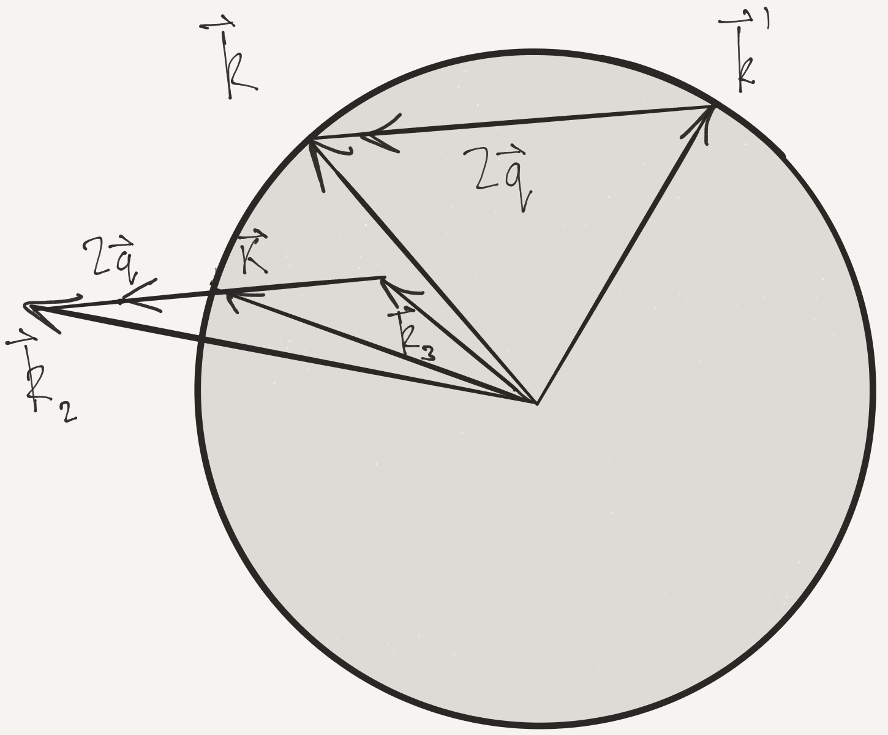

---
slides:
  # Choose a theme from https://github.com/hakimel/reveal.js#theming
  theme: white
  # Choose a code highlighting style (if highlighting enabled in `params.toml`)
  #   Light style: github. Dark style: dracula (default).
  highlight_style: github
scripts: []

---

# Fermi Gas

- We'll study Fermi gas with weak interactions (perturbation theory)

- Illustrates Landau's <strong>Fermi liquid</strong> theory, a 'standard model' of condensed matter 

- Landau's theory applies more generally, even when interactions not weak

$$
\nonumber
\newcommand{\cE}{\mathcal{E}}
\newcommand{\cH}{\mathcal{H}}
\newcommand{\cN}{\mathcal{N}}
\newcommand{\br}{\mathbf{r}}
\newcommand{\bp}{\mathbf{p}}
\newcommand{\bk}{\mathbf{k}}
\newcommand{\bq}{\mathbf{q}}
\newcommand{\bv}{\mathbf{v}}
\newcommand{\pop}{\psi^{\vphantom{\dagger}}}
\newcommand{\pdop}{\psi^\dagger}
\newcommand{\Pop}{\Psi^{\vphantom{\dagger}}}
\newcommand{\Pdop}{\Psi^\dagger}
\newcommand{\Phop}{\Phi^{\vphantom{\dagger}}}
\newcommand{\Phdop}{\Phi^\dagger}
\newcommand{\phop}{\phi^{\vphantom{\dagger}}}
\newcommand{\phdop}{\phi^\dagger}
\newcommand{\aop}{a^{\vphantom{\dagger}}}
\newcommand{\adop}{a^\dagger}
\newcommand{\bop}{b^{\vphantom{\dagger}}}
\newcommand{\bdop}{b^\dagger}
\newcommand{\cop}{c^{\vphantom{\dagger}}}
\newcommand{\cdop}{c^\dagger}
\newcommand{\Nop}{\mathsf{N}^{\vphantom{\dagger}}}
\newcommand{\bra}[1]{\langle{#1}\rvert}
\newcommand{\ket}[1]{\lvert{#1}\rangle}
\newcommand{\inner}[2]{\langle{#1}\rvert #2 \rangle}
\newcommand{\braket}[3]{\langle{#1}\rvert #2 \lvert #3 \rangle}
\DeclareMathOperator{\sgn}{sgn}
\DeclareMathOperator{\tr}{tr}
\newcommand{\abs}[1]{\lvert{#1}\rvert}
\newcommand{\brN}{\br_1, \ldots, \br_N}
\newcommand{\xN}{x_1, \ldots, x_N}
\newcommand{\zN}{z_1, \ldots, z_N}
$$

---

## Weakly Interacting Fermi Gas

- Fermi gas with short-ranged interactions

$$
H = \int d\br\left[ \sum_{s=\uparrow,\downarrow}\frac{1}{2m}\nabla\pdop_s\cdot\nabla\pop_s + U_0 \pdop_\uparrow\pdop_\downarrow\pop_\downarrow\pop_\uparrow\right].
$$

- Work in momentum space
$$
H =\sum_{\bk,s} \epsilon(\bk)\adop_{\bk,s}\aop_{\bk,s} + \overbrace{\frac{U_0}{V}\sum_{\bk_1+\bk_2=\bk_3+\bk_4} \adop_{\bk_1,\uparrow}\adop_{\bk_2,\downarrow}\aop_{\bk_3,\downarrow}\aop_{\bk_4,\uparrow}}^{\equiv H_\text{int}},
$$
with $\epsilon(\bk)=\bk^2/2m$, and $V$ the volume. 

---

- $U_0=0$: eigenstates are product states $\ket{\mathbf{N}}$ of single particle momentum states specified by the occupancies $N_{s}(\bk) = 0,1$

- Ground state is Fermi sphere of radius $k_\text{F}$ in momentum space with $N_{s}(\bk) = \theta(k_F-\abs{\bk})$. 

- Low energy excited states will have $N_{s}(\bk)=1$ for $\abs{\bk}\ll k_\text{F}$ and $N_{s}(\bk)=0$ for $\abs{\bk}\gg k_\text{F}$. 

- In perturbation theory we can still _label_ eigenstates by these occupation numbers even though eigenstates $\neq\ket{\mathbf{N}}$

---

- Without interactions energy of a state $\ket{\mathbf{N}}$ is

$$
E^{(0)}(\mathbf{N}) = \sum_{\bk,s} \epsilon(\bk)N_{s}(\bk).
$$

- For $U_0\neq 0$ energy $E(\mathbf{N})$ is function of labels, but no longer linear

- Second order expansion of energy in terms of _deviation_ of occupancies from ground state values is key ingredient of Landau's theory

---

### Perturbation Theory to Second Order

- Second order perturbation theory for the energies

`$$
\begin{align}
E^{(1)}(\mathbf{N}) &= \braket{\mathbf{N}}{H_\text{int}}{\mathbf{N}}\\
E^{(2)}(\mathbf{N}) &= \sum_{\mathbf{N}'\neq \mathbf N}\frac{\abs{\braket{\mathbf{N'}}{H_\text{int}}{\mathbf{N}}}^2}{E^{(0)}(\mathbf{N})-E^{(0)}(\mathbf{N}')}.
\label{fermi_2nd}
\end{align}
$$`

- First order correction is easy
$$
E^{(1)}(\mathbf{N}) = \frac{U_0}{V} \sum_{\bk,\bk'} N_{\uparrow}(\bk)N_{\downarrow}(\bk') = \frac{U_0}{V}N_\uparrow N_\downarrow.
$$
(energy used in Stoner criterion in [Lecture 6]())

---

- For second order we need $\braket{\mathbf{N}'}{H_\text{int}}{\mathbf{N}}$, nonzero if
`$$
\begin{align}
N'_{\bk_1,\uparrow} = N_{\uparrow}(\bk_1) + 1, \quad N'_{\downarrow}(\bk_2) = N_{\downarrow}(\bk_2) + 1\\
N'_{\downarrow}(\bk_3) = N_{\downarrow}(\bk_3) - 1, \quad N'_{\uparrow}(\bk_4) = N_{\uparrow}(\bk_4) - 1,
\end{align}
$$`
for $\bk_i$ satisfying $\bk_1+\bk_2=\bk_3+\bk_4$
$$
\braket{\mathbf{N}'}{H_\text{int}}{\mathbf{N}} = \frac{U_0}{V} \left(1-N_{\uparrow}(\bk_1)\right)\left(1-N_{\downarrow}(\bk_2)\right)N_{\downarrow}(\bk_3)N_{\uparrow}(\bk_4),
$$
(ignoring any coinciding momenta; occupancies 0 or 1) 

$$
E^{(2)}(\mathbf{N}) = \left(\frac{U_0}{V}\right)^2 \sum_{\bk_1+\bk_2=\bk_3+\bk_4}\frac{\left(1-N_{\uparrow}(\bk_1)\right)\left(1-N_{\downarrow}(\bk_2)\right)N_{\downarrow}(\bk_3)N_{\uparrow}(\bk_4)}{\epsilon(\bk_3)+\epsilon(\bk_4)-\epsilon(\bk_1)-\epsilon(\bk_2)}.
\label{fermi_E2}
$$

---

### Landau $f$ function

- $E^{(2)}(\mathbf{N})$ has three independent momentum sums! 🙀

- We are after _excitation energies_, so expand

$$
N_{s}(\bk) = \theta(k_F-\abs{\bk}) + n_{s}(\bk)+\cdots.
$$

- `$n_\bk$` is _mean_ deviation from Fermi sphere in continuum limit: 

---

- Excitation energy expanded in $n_\bk$

$$
\Delta E = \sum_{\bk,s} \varepsilon_s(\bk)n_{s}(\bk) + \frac{1}{2V}\sum_{\bk, s,\bk', s'} f_{s^{}s'}(\bk,\bk')n_{s}(\bk)n_{s'}(\bk').
\label{fermi_fdef}
$$

- This is Landau's __key idea__, not restricted to perturbation theory

- At first order
`$$
\begin{align}
\varepsilon_s(\bk) &= \epsilon(\bk) + \frac{U_0 N_{\bar s}}{V}+\cdots\\
f_{\uparrow\downarrow} &= f_{\downarrow\uparrow} = U_0+\cdots,\quad f_{\uparrow\uparrow}=f_{\downarrow\downarrow}=0+\cdots,
\label{fermi_first}
\end{align}
$$`
$\bar s$ is $\bar\uparrow=\downarrow$, $\bar\downarrow=\uparrow$ 🥱

---

- Second order contributions to $f$-function more interesting

`$$
\begin{align}
f_{\uparrow\uparrow}(\bk,\bk') = -\frac{U_0^2}{V}\left[\sum_{\bk+\bk_3=\bk'+\bk_2} \frac{N_{\downarrow}(\bk_3)(1-N_{\downarrow}(\bk_2))}{\epsilon(\bk)+\epsilon(\bk_3)-\epsilon(\bk')-\epsilon(\bk_2)}\right.\nonumber\\
\left.+\sum_{\bk'+\bk_3=\bk+\bk_2}\frac{N_{\downarrow}(\bk_3)(1-N_{\downarrow}(\bk_2))}{\epsilon(\bk')+\epsilon(\bk_3)-\epsilon(\bk)-\epsilon(\bk_2)}\right].
\end{align}
$$`

- $n_{s}(\bk)\neq 0$ in energy window of size $k_\text{B} T$ around Fermi surface

- At low $T$ take $\abs{\bk}=\abs{\bk'}=k_\text{F}$
`$$
\begin{align}
f_{\uparrow\uparrow}(\bk,\bk') = -\frac{U_0^2}{V}&\left[\sum_{\bk+\bk_3=\bk'+\bk_2} \frac{N(\bk_3)(1-N(\bk_2))}{\epsilon(\bk_3)-\epsilon(\bk_2)}\\
\qquad+\sum_{\bk'+\bk_3=\bk+\bk_2}\frac{N(\bk_3)(1-N(\bk_2))}{\epsilon(\bk_3)-\epsilon(\bk_2)}\right].
\end{align}
$$`
(assume ground state unpolarized, i.e. $N_{s}(\bk)$ independent of $s$)

---

- Expression for $f_{\uparrow\downarrow}(\bk,\bk')$ more complicated
`$$
\begin{align}
f_{\uparrow\downarrow}(\bk,\bk') = U_0 + f_{\uparrow\uparrow}(\bk,\bk') +\frac{U_0^2}{V}\left[\sum_{\bk+\bk'=\bk_3+\bk_4}\frac{N(\bk_3)N(\bk_4)}{\epsilon(\bk_3)+\epsilon(\bk_4)-2E_\text{F}}\right.\nonumber\\
\left.\sum_{\bk+\bk'=\bk_1+\bk_2}\frac{(1-N(\bk_1))(1-N(\bk_2))}{2E_\text{F}-\epsilon(\bk_1)-\epsilon(\bk_2)}\right].
\end{align}
$$`
(only have one independent momentum 😀)

- _New feature_ at second order is nontrivial dependence of $f_{s^{}s'}(\bk,\bk')$ on angle between $\bk$ and $\bk'$.

---

> It's a bit fiddly to get at, but let's work it out for the simpler case of $f_{\uparrow\uparrow}(\bk,\bk')$!

- Continuum limit

`$$
\begin{align}
f_{\uparrow\uparrow}(\bk,\bk') = \frac{U_0^2}{(2\pi)^3}\left[\int_{\substack{\abs{\bk_3}<k_\text{F},\abs{\bk_2}>k_\text{F}\\ \bk+\bk_3=\bk'+\bk_2 }} \frac{d\bk_3}{\epsilon(\bk_2)-\epsilon(\bk_3)}\right.\nonumber\\
\left.+\int_{\substack{\abs{\bk_3}<k_\text{F},\abs{\bk_2}>k_\text{F}\\ \bk'+\bk_3=\bk+\bk_2 }}\frac{d\bk_3}{\epsilon(\bk_2)-\epsilon(\bk_3)}\right].
\label{fermi_fcont}
\end{align}
$$`

- Need integral 

`$$
\int_{\substack{\abs{\bk_3}<k_\text{F},\abs{\bk_2}>k_\text{F}\\ \bk+\bk_3=\bk'+\bk_2 }} \frac{d\bk_3}{\epsilon(\bk_2)-\epsilon(\bk_3)}.
$$`

---

- Denominator can be written ($\bk-\bk'$ is fixed)
$$
\epsilon(\bk_2)-\epsilon(\bk_3)= \frac{1}{2m}\left(\bk_2+\bk_3\right)\cdot\left(\bk_2-\bk_3\right) = \frac{1}{2m}\left(\bk_2+\bk_3\right)\cdot\left(\bk-\bk'\right),
$$

- Notation $\mathbf{K} = \frac{1}{2}\left(\bk_2+\bk_3\right),\quad \bq = \frac{1}{2}\left(\bk_2-\bk_3\right)$

---

- Denominator becomes (for fixed $\bq$)
$$
\epsilon(\bk_2)-\epsilon(\bk_3) = \frac{2}{m}\mathbf{K}\cdot\bq,
$$

- Only angle $\theta$ between $\mathbf{K}$ and $\bq$ enters integral

- Conditions $\abs{\bk_2}>k_\text{F}$ and $\abs{\bk_3}<k_\text{F}$ become
$$
\begin{align}
\left(\mathbf{K}+\bq\right)^2>k_\text{F}^2,\quad \left(\mathbf{K}-\bq\right)^2<k_\text{F}^2,
\end{align}
$$
which gives range of $K_-(\theta)<\abs{\mathbf{K}}<K_+(\theta)$
$$
K_{\pm}(\theta)=\pm q\abs{\cos\theta}+\sqrt{k_\text{F}^2-q^2\sin^2\theta},
$$
$\theta<\pi/2$

---

- In terms of these variables

`$$
\begin{align}
\int_{\substack{\abs{\bk_3}<k_\text{F},\abs{\bk_2}>k_\text{F}\\ \bk+\bk_3=\bk'+\bk_2 }} \frac{d\bk_3}{\epsilon(\bk_2)-\epsilon(\bk_3)}&=
\pi m\int_0^{\pi/2} d\theta \int_{K_-(\theta)}^{K_+(\theta)} \frac{K\sin\theta}{q\cos\theta} dK\nonumber\\
&=2\pi m\int_0^{\pi/2} d\theta \sin\theta \sqrt{k_\text{F}^2-q^2\sin^2\theta}.
\end{align}
$$`

- Other integral is same but in interval $(\pi/2,\pi)$. Finally...
`$$
\begin{align}
f_{\uparrow\uparrow}(\bk,\bk') &= \frac{U_0^2 m}{(2\pi)^2} \int_0^{\pi} d\theta \sin\theta \sqrt{k_\text{F}^2-q^2\sin^2\theta}\nonumber\\
&=\frac{U_0^2 m k_\text{F}}{(2\pi)^2}\left[1 - \frac{\cos^2\phi/2}{2\sin\phi/2}\log\left(\frac{1-\sin\phi/2}{1+\sin\phi/2}\right)\right].
\end{align}
$$`
$\phi$ is the angle between $\bk$ and $\bk'$ i.e. $\abs{\bk-\bk'}=2q=2k_\text{F}\sin\phi/2$

---

- Our definition of $f$ implied quantization axis for spin

- To write things in invariant way, think of occupation number $N(\bk)$ as $2\times 2$ matrix

$$
\mathsf{N}(\bk)=\begin{pmatrix}
N_{\uparrow\uparrow}(\bk) & N_{\uparrow\downarrow}(\bk) \\
N_{\downarrow\uparrow}(\bk) & N_{\downarrow\downarrow}(\bk).
\end{pmatrix}
$$

- $f$-function then has _four_ spin indices

`$$
\frac{1}{2V}\sum_{\bk, s_1,s_2,\bk', s_3,s_4} f_{s_1s_2,s_3s_4}(\bk,\bk')n_{s_1s_2}(\bk)n_{s_3s_4}(\bk'),
$$`

`$$
\begin{align}
f_{s_1s_2,s_3s_4}(\bk,\bk') = \frac{U_0}{2}\left[\left(1+ \frac{mU_0 k_\text{F}}{2\pi^2}\left[2+\frac{\cos\phi}{2\sin\phi/2}\log\frac{1+\sin\phi/2}{1-\sin\phi/2}\right]\right)\delta_{s_1s_3}\delta_{s_2s_4}\right.\nonumber\\
\left.\left(1+ \frac{mU_0 k_\text{F}}{2\pi^2}\left[1-\frac{1}{2}\sin\phi/2\log\frac{1+\sin\phi/2}{1-\sin\phi/2}\right]\right)\boldsymbol{\sigma}_{s_1s_3}\cdot\boldsymbol{\sigma}_{s_2s_4}\right]
\label{fermi_ffinal}
\end{align}
$$`

---

> Key message: interaction between quasiparticles in an interacting Fermi gas is defined in terms of a pair of functions
>$$
>\nu(E_F)f_{s_1s_2,s_3s_4}(\bk,\bk') = F(\phi) \delta_{s_1s_3}\delta_{s_2s_4} + G(\phi)\boldsymbol{\sigma}_{s_1s_3}\cdot\boldsymbol{\sigma}_{s_2s_4}.
> $$
>$F(\phi)$ and $G(\phi)$ made dimensionless by scaling by density of states at Fermi surface $\nu(E_F)\equiv k_{\text{F}}m/\pi^2$.

