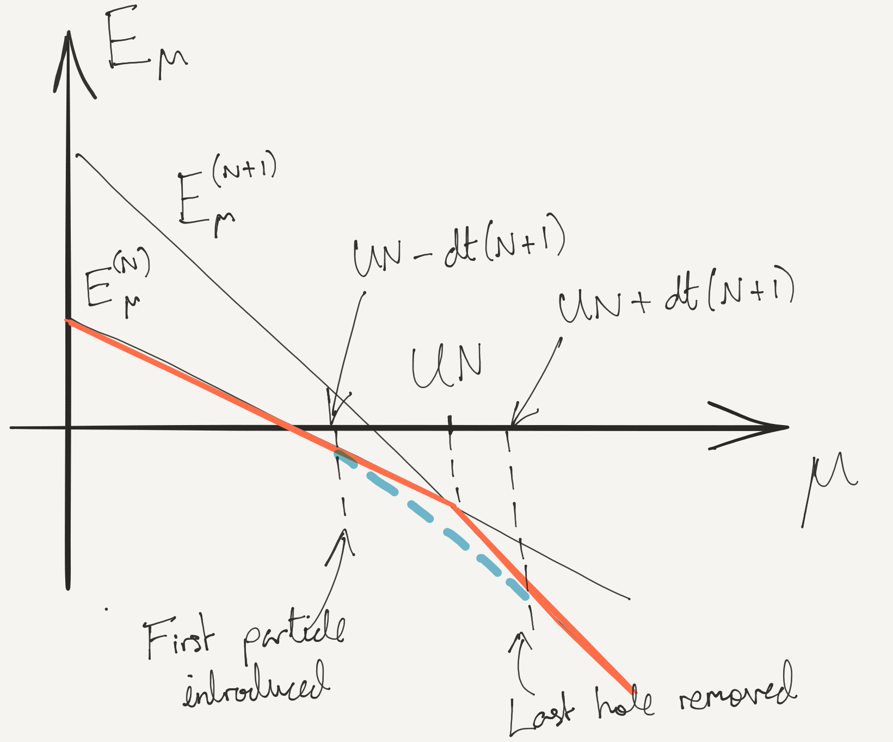

---
slides:
  # Choose a theme from https://github.com/hakimel/reveal.js#theming
  theme: white
  # Choose a code highlighting style (if highlighting enabled in `params.toml`)
  #   Light style: github. Dark style: dracula (default).
  highlight_style: github
scripts: []

---

# Lattice Models

- Defined on a discrete lattice
- Apply to __deep periodic potentials__: few states / site are enough
- Capture physics of __strong correlations__

$$
\nonumber
\newcommand{\cE}{\mathcal{E}}
\newcommand{\cH}{\mathcal{H}}
\newcommand{\cN}{\mathcal{N}}
\newcommand{\br}{\mathbf{r}}
\newcommand{\bp}{\mathbf{p}}
\newcommand{\bk}{\mathbf{k}}
\newcommand{\bq}{\mathbf{q}}
\newcommand{\bv}{\mathbf{v}}
\newcommand{\pop}{\psi^{\vphantom{\dagger}}}
\newcommand{\pdop}{\psi^\dagger}
\newcommand{\Pop}{\Psi^{\vphantom{\dagger}}}
\newcommand{\Pdop}{\Psi^\dagger}
\newcommand{\Phop}{\Phi^{\vphantom{\dagger}}}
\newcommand{\Phdop}{\Phi^\dagger}
\newcommand{\phop}{\phi^{\vphantom{\dagger}}}
\newcommand{\phdop}{\phi^\dagger}
\newcommand{\aop}{a^{\vphantom{\dagger}}}
\newcommand{\adop}{a^\dagger}
\newcommand{\bop}{b^{\vphantom{\dagger}}}
\newcommand{\bdop}{b^\dagger}
\newcommand{\cop}{c^{\vphantom{\dagger}}}
\newcommand{\cdop}{c^\dagger}
\newcommand{\Nop}{\mathsf{N}^{\vphantom{\dagger}}}
\newcommand{\bra}[1]{\langle{#1}\rvert}
\newcommand{\ket}[1]{\lvert{#1}\rangle}
\newcommand{\inner}[2]{\langle{#1}\rvert #2 \rangle}
\newcommand{\braket}[3]{\langle{#1}\rvert #2 \lvert #3 \rangle}
\DeclareMathOperator{\sgn}{sgn}
\DeclareMathOperator{\tr}{tr}
\newcommand{\abs}[1]{\lvert{#1}\rvert}
\newcommand{\brN}{\br_1, \ldots, \br_N}
\newcommand{\xN}{x_1, \ldots, x_N}
\newcommand{\zN}{z_1, \ldots, z_N}
$$

---

## Tight Binding Models

- Noninteracting Hamiltonian with periodic potential $V(x+a)=V(x)$
`$$
H = \sum_{j=1}^N \left[-\frac{1}{2m}\partial_i^2 +V(x_i)\right] = \int \left[\frac{1}{2m}\partial_x\pdop\partial_x\pop + V(x)\pdop\pop\right] dx,
$$`

- [Bloch's theorem](https://en.wikipedia.org/wiki/Bloch_wave): eigenstates labelled by continuous index $k$ (__crystal momentum__) and discrete index $n$ (__band index__)
`$$
\psi_{k,n}(x) = e^{ikx} \varphi_{k,n}(x),
\label{latt_bloch}
$$`
`$\varphi_{k,n}$` is periodic; $k$ lies in __Brillouin zone__ $(-\pi/a,\pi/a]$

- The eigenvalues $E_n(k)$ give the __energy bands__.

---

- When lattice potential _deep_ wavefunctions in lowest band(s) highly localized

- Introduce $\adop_j$, $\aop_j$ describing localized state $\varphi_j(x)$ at site $j$

- $\varphi_j(x)$ not eigenstates: coupling between sites described by 
 __tight binding Hamiltonian__

$$
H_t = -t \sum_{j} \left[\adop_j\aop_{j+1}+\adop_{j+1}\aop_j\right],
\label{latt_tb}
$$

- Plays role of kinetic energy in our models (c.f. magnon in spin chain in [Lecture 4]()

---

## Bose Hubbard Model

- Simplest interacting lattice model
`$$
H = H_t + H_U = -t \sum_{\langle j\,k\rangle}  \left[\adop_j\aop_{k}+\adop_{k}\aop_j\right] + \frac{U}{2}\sum_j \Nop_j(\Nop_j-1),
$$`
$\Nop_j=\adop_j\aop_j$, sum over all nearest neighbours

- On-site interaction $\Nop_j(\Nop_j-1)=\adop_j\adop_j\aop_j\aop_j$

- First introduced to describe electrons in solids; boson version widely used in ultracold atomic physics

---

### The Mott State

- $U=0$ limit easy (no interactions); what about $U/t\to\infty$?

$$
E(\mathbf{N}) = \frac{U}{2} \sum_j N_j(N_j-1).
$$

- Ground state: fill $N_\text{sites}$ sites as uniformly as possible

- Easy if filling $\nu \equiv N_{\text{particles}}/N_\text{sites}$ is integer

---

- Notation: __ceiling__ $\lceil \nu\rceil$ is smallest integer bigger than $\nu$, __floor__ $\lfloor \nu\rfloor$ is largest integer smaller than $\mu$

- Number of sites with occupancy $\lceil \nu\rceil$ is $N_\text{sites}\left(\nu - \lfloor \nu\rfloor\right)$

- Ground state energy is piecewise linear in $\nu$
`$$
\frac{E_0}{N_\text{sites}} = \left(\nu - \lfloor \nu\rfloor\right)e(\lceil \nu\rceil) + \left(\lceil \nu\rceil - \nu\right)e(\lfloor \nu\rfloor),
$$`
$e(N) = \frac{U}{2}N(N-1)$

- Chemical potential $\mu = \frac{\partial E_0}{\partial N_\text{particles}}$ is piecewise constant

$$
\mu = e(\lceil \nu\rceil) -e(\lfloor \nu\rfloor)=U\lfloor \nu\rfloor,
$$

---

- Think about varying $\mu$: values between $UN$ and $U(N-1)$ correspond to integer filling $\nu=N$

- States of integer filling are __Mott states__, after [Nevill Mott](https://en.wikipedia.org/wiki/Nevill_Francis_Mott)

---

### Effect of hopping: Mott states

- Do Mott states survive when $t\neq 0$? Treat $t$ as perturbation

- Unperturbed eigenstates of have fixed occupation $N_j$ on site $j$

$$
\ket{\mathbf{N}} = \bigotimes_j \ket{N_j}_j.
$$

- Applying $H_t$ gives a superposition of states, each with one particle moved to an adjacent site.

---

> How is a Mott state (all sites with the same occupation) affected by $H_t$ in first order perturbation theory?

---

### Effect of hopping: away from Mott state

- Mott state of filling $\nu=N$ + 1 extra particle

- Place particle on one of $N_\text{sites}$ sites: degnerate ground state when $t=0$

- $H_t$ mixes these states: __degenerate perturbation theory__ (other states separated by energies of order $U$)

---

- Ground state multiplet

$$
\ket{i,+}\equiv \frac{\adop_i}{\sqrt{N+1}}\bigotimes_{j} \ket{N}_j.
$$

- Only states $\ket{i\pm 1,+}$ are coupled by $H_t$, with matrix elements

$$
\braket{j}{H_t}{k} = -t(N+1).
$$

- Within degnerate multiplet, $H_t$ corresponds to tight binding model

$$
H_t\rvert_{+} = -t(N+1) \sum_{\langle j\,k\rangle} \left[\ket{j,+}\bra{k,+}+\text{h.c.}\right].
\label{latt_tbp}
$$

---

$$
H_t\rvert_{+} = -t(N+1) \sum_{\langle j\,k\rangle} \left[\ket{j,+}\bra{k,+}+\text{h.c.}\right].
$$

- Only many body effect is factor of $N$ due to Bose statistics

- Splitting of degenerate states given by dispersion ($d$ dimensions)

$$
\omega_+(\boldsymbol{\eta}) = -2t(N+1)\sum_{n=1}^d\cos\eta_n
\label{latt_pband}
$$

--- 

- Alternatively _remove_ a particle from Mott state

$$
\ket{i,-}\equiv \frac{\aop_i}{\sqrt{N}}\bigotimes_{j} \ket{N}_j.
$$

- Within these states, $H_t$ takes form

$$
H_t\rvert_{-}=-tN \sum_{\langle j\,k\rangle} \left[\ket{j,-}\bra{k,-}+\text{h.c.}\right],
\label{latt_tbh}
$$

$$
\omega_-(\boldsymbol{\eta}) = -2tN\sum_{n=1}^d\cos\eta_n.
$$

---

### Changes to phase diagram

- Introduce the grand canonical Hamiltonian

$$
\cH_\mu = H - \mu N_\text{particles},
$$

- At $t=0$ the energies of Mott states with filling $\nu=N$ are
`$$
\frac{\cE^{(N)}_\mu}{N_\text{sites}} = \frac{U}{2}N(N-1)-\mu N.
$$`
`$\cE^{(N)}_\mu$` and `$\cE^{(N+1)}_\mu$` degenerate when $\mu=UN$ for $t=0$

---

- Compare with ground state with one extra particle on top of $N$ Mott state

- Particle at bottom of tight binding band has energy $-2td(N+1)$

- Together with extra energy of interaction we have overall

$$
\cE^{(N)}_\mu + UN - \mu -2dt(N+1).
$$

- For $t>\frac{UN-\mu}{2d(N+1)}$ state with an extra particle actually has a _lower_ energy: Mott state not the ground state

---

- Energy of ground state with one 'hole' in $N+1$ Mott state is

$$
\cE^{(N+1)}_\mu - UN + \mu -2dt(N+1).
$$

- Introducing a hole is thus favoured for $t>\frac{\mu-UN}{2d(N+1)}$.

---

---

- Our analysis applies only at small $t/U$

- If $t/U\to\infty$ we have a __Bose condensate__: all the particles can sit in the $\eta=0$ Bloch state

- When interactions are finite but small, we will see in the next lecture that the result is a __superfluid__. 

- The boundaries that we have have found can be connected ([Problem Set 2]() for a variational approach)

---

- Note diminishing size of Mott lobes: consequence of enhanced hopping in the effective tight binding models

---

- Mott wedding cake (Source: Cheng Chin, University of Chicago)

---

## Fermi Hubbard Model

- Have to introduce _spin_ to get something interesting (__why?__)

$$
H=-t \sum_{\substack{\langle j\,k\rangle\\ s=\uparrow,\downarrow}}  \left[\adop_{j,s}\aop_{k,s}+\adop_{k,s}\aop_{j,s}\right] + U\sum_j N_\uparrow N_\downarrow,
$$

- Application __cuprates__: high temperature superconductors

- 2D model describes strong correlations in the CuO$_2$ layers 

- Much harder to understand than Bose case...

---

### Two Sites, Large $U/t$

- Think about $U/t\to\infty$ as in Bose case

- Three Mott staes to 0, 1, or 2 particles per site

- 2 particles on site make a spin singlet $\frac{1}{\sqrt{2}}(\ket{\uparrow}\ket{\downarrow}-\ket{\downarrow}\ket{\uparrow})$

- At __half filling__ (1 particle / site) can have $\ket{\uparrow/\downarrow}$.

---

, we can have either spin. Thus the $\nu=1$ Mott state is _massively_ degenerate, with a ground state multiplet consisting of $2^{N_\text{sites}}$ possible spin configurations. $U/t\to\infty$ is therefore a rather singular limit, and to understand the true ground state at large $U$ we'll need to work bit harder.

---

### Two Sites, Large $U/t$

Start by thinking about two sites and two particles. There are 6 states altogether in the Hilbert space.

$$
\begin{align}
\adop_{1,\uparrow}\adop_{1,\downarrow} \ket{\text{VAC}},\quad\adop_{2,\uparrow}\adop_{2,\downarrow} \ket{\text{VAC}}\\
\adop_{1,s}\adop_{2,s'} \ket{\text{VAC}},\quad s,s'=\uparrow,\downarrow.
\end{align}
$$

The top two states have energy $U$ when $t=0$; the bottom 4 have energy 0.

>[Try this before continuing!] How does the degeneracy of these states get lifted at finite $t$? Try writing down the Hamiltonian restricted to these states.

### Effective Hamiltonian

As the number of sites increases, it becomes harder to say what happens to the ground state multiplet. We now modify our strategy by splitting the problem in two: we are going to find an _effective Hamiltonian_ that acts only on the half filled Mott states and describes their splitting when $t/U$ is finite but small. Whether we can subsequently solve that Hamiltonian we leave until later.

As I'm sure you realized when you thought about two sites, this is a qualitatively different degenerate perturbation problem than the one we solved when we added a single particle or hole to the bosonic Mott states. The reason is that $H_t$ has no matrix elements among the degenerate states: when acting on one of them it always takes us into a state with one site doubly occupied and the neighouring site empty. We have to think about _second order_ degenerate perturbation theory to find out what happens. To handle this we divide the Hamiltonian into block form, according to whether its matrix elements act on the Mott state or not.

$$
H = \begin{pmatrix}
H_{\text{Mott}} & V^{} \\
V^\dagger & H_\text{Not} \\
\end{pmatrix}
$$

Denoting by $P_\text{Mott}$ the projection operator on to the $2^{N_\text{sites}}$ Mott states, and $P_\text{Not}\equiv 1-P_\text{Mott}$, we have

$$
\begin{align}
H_\text{Mott}= P_\text{Mott} H P_\text{Mott},\quad H_\text{Not}= P_\text{Not}H P_\text{Not}\\
V^{} = P_\text{Mott} H P_\text{Not},\qquad V^\dagger = P_\text{Not} H P_\text{Mott}.
\end{align}
$$

In the case of the Hubbard model, we have

$$
\begin{align}
H_\text{Mott}= P_\text{Mott} H_U P_\text{Mott},\quad H_\text{Not}= P_\text{Not}H_U P_\text{Not}\\
V^{} = P_\text{Mott} H_t P_\text{Not},\qquad V^\dagger = P_\text{Not} H_t P_\text{Mott}.
\end{align}
$$

We write the eigenvalue equation in block form

$$
\begin{pmatrix}
H_{\text{Mott}} & V^{} \\
V^\dagger & H_\text{Not} \\
\end{pmatrix}
\begin{pmatrix}
\ket{\Psi}\\
\ket{\Phi}
\end{pmatrix} = E
\begin{pmatrix}
\ket{\Psi}\\
\ket{\Phi}
\end{pmatrix}.
$$

We eliminate $\ket{\Phi}$ to obtain

$$
\left[H_{\text{Mott}} -V^{}\left(H_\text{Not}-E\right)^{-1}V^\dagger\right]\ket{\Psi} = E\ket{\Psi}.
$$

So far we have made no approximation. While this looks like an eigenvalue equation, we can't yet interpret the operator in the square brackets as an effective Hamiltonian because it depends on the eigenvalue $E$. However, we now focus on energies much smaller than the eigenvalues of $H_\text{Not}$, which are $O(U)$. In this way we can neglect this energy dependence and arrive at the effective Hamiltonian acting only on the Mott state

$$
H_\text{eff} = H_{\text{Mott}} -V^{} H^{-1}_\text{Not}V^\dagger.
$$

What form does $H_\text{eff}$ take? $H_{\text{Mott}}=0$, and $V^\dagger$ creates states with an adjacent hole and __doublon__ (doubly occupied site). $H_\text{Not}$ acting on these states is just $U$, and $V$ has to remove the hole and doublon. Thus,

$$
H_\text{eff} = -\frac{V^{}V^\dagger}{U} = -\frac{t^2}{U} \sum_{\substack{\langle j\,k\rangle\\s,s'}} \adop_{j,s}\aop_{k,s} \adop_{k,s'}\aop_{j,s'}.
$$

We can write this in a more familiar way by first reordering the operators (not forgetting the anticommutation relations!)

$$
 \adop_{j,s}\aop_{k,s} \adop_{k,s'}\aop_{j,s'} = -\adop_{j,s}\aop_{j,s'}\adop_{k,s'}\aop_{k,s} + \delta_{s^{}s'}\adop_{j,s}\aop_{j,s'},
$$

and then using the identity

$$
\delta_{ab}\delta_{cd} = \frac{1}{2}\left[\boldsymbol{\sigma}_{a d}\cdot \boldsymbol{\sigma}_{c b} + \delta_{ad}\delta_{cb}\right].
$$

Finally, in $d$ dimensions ($d=1$, chain; $d=2$ square lattice; $d=3$ cubic lattice) we get

$$
H_\text{eff} = -\frac{dN_\text{sites}t^2}{2U}+J\sum_{\langle j\,k\rangle} \mathbf{s}_j\cdot \mathbf{s}_k
$$

with $J=\frac{2t^2}{U}$ and

$$
\mathbf{s}_j=\frac{1}{2}\sum_{s,s'}\adop_{j,s}\boldsymbol{\sigma}_{s^{}s'}\aop_{j,s'}.
$$

The effective Hamiltonian is nothing but the spin-1/2 antiferromagnetic Heisenberg model!

> Note that there is something slightly sly about this derivation. We assumed that the energy scale $U$ was the largest scale in the problem, in order to arrive at the effective Hamiltonian. However, typical excited state energies of the Heisenberg Hamiltonian are $\frac{N_\text{sites}t^2}{U}$. Thus for $N_\text{sites}\gtrsim \left(\frac{t}{U}\right)^2$ there isn't actually a separation between these two energies. Not a very useful condition! Physically, it's enough to have a small <strong>density </strong> $n$ of doublons and holes, with overall energy $\sim nU$, when $t/U$ is small.

### Doping

Antiferromagnetism and the Mott phenomenon are seen to go hand in hand in fermion systems. This explains the common ocurrence of antiferromagnetism in transition metal compounds, especially oxides. The cuprate superconductors mentioned earlier are a famous example.



At half filling, the cuprates are antiferromangetic Mott insulators. Superconductivity emerges when the materials are doped by changing their stoichiometry. This introduces electrons or holes into the CuO$_2$ planes that are modeled by the Hubbard Hamiltonian. Antiferromagnetic order is believed to be destroyed by freely moving holes -- think how the Néel ordering is disrupted -- and indeed superconductivity appears where antiferromagnetism dies. The precise relationship between the two phenomena is -- like much of the physics of the cuprates -- not clear.

References
----------


