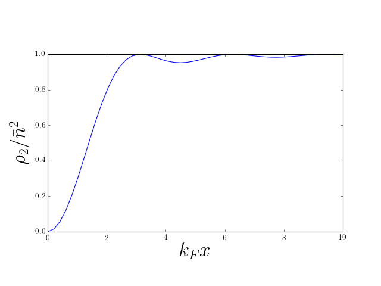

---
slides:
  # Choose a theme from https://github.com/hakimel/reveal.js#theming
  theme: white
  # Choose a code highlighting style (if highlighting enabled in `params.toml`)
  #   Light style: github. Dark style: dracula (default).
  highlight_style: github
scripts: []

---

# More Second Quantization

- [Lecture 1](): density correlations in ground state of 1D Fermi gas

$$
\rho_2(x,y) = n^2\left[1 - \left(\frac{\sin[k_\text{F}(x-y)]}{k_\text{F}(x-y)}\right)^2\right].
\label{more_rho2evalFermi}
$$

- How to find this using second quantization?

- What can these correlations tell us about interactions?

$$
\nonumber
\newcommand{\cN}{\mathcal{N}}
\newcommand{\br}{\mathbf{r}}
\newcommand{\bp}{\mathbf{p}}
\newcommand{\bk}{\mathbf{k}}
\newcommand{\bq}{\mathbf{q}}
\newcommand{\bv}{\mathbf{v}}
\newcommand{\pop}{\psi^{\vphantom{\dagger}}}
\newcommand{\pdop}{\psi^\dagger}
\newcommand{\Pop}{\Psi^{\vphantom{\dagger}}}
\newcommand{\Pdop}{\Psi^\dagger}
\newcommand{\Phop}{\Phi^{\vphantom{\dagger}}}
\newcommand{\Phdop}{\Phi^\dagger}
\newcommand{\phop}{\phi^{\vphantom{\dagger}}}
\newcommand{\phdop}{\phi^\dagger}
\newcommand{\aop}{a^{\vphantom{\dagger}}}
\newcommand{\adop}{a^\dagger}
\newcommand{\bop}{b^{\vphantom{\dagger}}}
\newcommand{\bdop}{b^\dagger}
\newcommand{\cop}{c^{\vphantom{\dagger}}}
\newcommand{\cdop}{c^\dagger}
\newcommand{\Nop}{\mathsf{N}^{\vphantom{\dagger}}}
\newcommand{\bra}[1]{\langle{#1}\rvert}
\newcommand{\ket}[1]{\lvert{#1}\rangle}
\newcommand{\inner}[2]{\langle{#1}\rvert #2 \rangle}
\newcommand{\braket}[3]{\langle{#1}\rvert #2 \lvert #3 \rangle}
\DeclareMathOperator{\sgn}{sgn}
\DeclareMathOperator{\tr}{tr}
\newcommand{\abs}[1]{\lvert{#1}\rvert}
\newcommand{\brN}{\br_1, \ldots, \br_N}
\newcommand{\xN}{x_1, \ldots, x_N}
\newcommand{\zN}{z_1, \ldots, z_N}
$$

---

## $\rho_2$ from Second Quantization

- From [Lecture 1](): __pair distribution function__
$$
\rho_2(x_1,x_2) = N(N-1) \int dx_3\ldots dx_N \,\left|\Psi(x_1,x_2,\ldots,x_N)\right|^2,
\label{more_pdf}
$$
measures likelihood of finding particles at $x_1$ and $x_2$

- For 1D Fermi gas ground state we found
`$$
\rho_2(x,y) = n^2\left[1 - \left(\frac{\sin[k_\text{F}(x-y)]}{k_\text{F}(x-y)}\right)^2\right]
$$`
recall: Slater determinant, $P$ and $P'$ differ by transposition, etc.

- Let's calculate using second quantization!

---

`$$
\begin{align}
\rho_2(x_1,x_2) &= N(N-1) \int dx_3\ldots dx_N \,\left|\Psi(x_1,x_2,\ldots,x_N)\right|^2,\\
 &=\braket{\Psi}{\sum_{j\neq k}\delta(x-x_j)\delta(y-x_k)}{\Psi}.
\end{align}
$$`

- Recognize expectation value of two particle operator

$$
B_{jk}=\delta(x-x_j)\delta(y-x_k)
$$

- Second quantized form

$$
\rho_2(x,y) =\braket{\Psi}{\pdop(x)\pdop(y)\pop(y)\pop(x)}{\Psi}.
\label{more_rho22ndquant}
$$

---

$$
\rho_2(x,y) =\braket{\Psi}{\pdop(x)\pdop(y)\pop(y)\pop(x)}{\Psi}.
$$

- Operators in which all annihilation operators stand to the right of all creation operators are said to be __normal ordered__

- Here, normal ordering serves to ensure that a term with $j=k$ does not appear in $\rho_2(x,y)$

- Two particle terms in the Hamiltonian are normal ordered for the same reason

---

$$
\rho_2(x,y) =\braket{\Psi}{\pdop(x)\pdop(y)\pop(y)\pop(x)}{\Psi}.
$$

- Insert expansion

`$$
\begin{align}
	\pop(x)=\sum_{\beta}  \varphi^{}_{\beta}(x)\aop_{\beta},\\
  \pdop(x)=\sum_{\beta}  \varphi^*_{\beta}(x)\adop_{\beta}.
\end{align}
$$`

- This gives

$$
	\label{2nd_quant_CEval}
	\rho_2(x,y)=\sum_{\alpha, \beta, \gamma, \delta}\varphi^{*}_{\alpha}(x)\varphi^{*}_{\beta}(y)\varphi^{}_{\gamma}(y)\varphi^{}_{\delta}(x)\braket{\Psi}{\adop_{\alpha}\adop_{\beta}\aop_{\gamma}\aop_{\delta}}{\Psi}.
$$

- 

---

$$
\braket{\Psi}{\adop_{\alpha}\adop_{\beta}\aop_{\gamma}\aop_{\delta}}{\Psi}
$$

- When $\ket{\Psi}=\ket{\mathbf{N}}$ (product state using $\adop_\alpha$) have two possibilities
`$$
\begin{align}
	&\alpha =\delta,\, \beta=\gamma, \text{ or }\\
  &\alpha=\gamma,\, \beta=\delta,
\end{align}
$$`
which give rise to two groups of terms
`$$
\begin{align}
\braket{\mathbf{N}}{\adop_{\alpha}\adop_{\gamma}\aop_{\gamma}\aop_{\alpha}}{\mathbf{N}}&=N_{\alpha}N_{\gamma}\nonumber\\
	\braket{\mathbf{N}}{\adop_{\alpha}\adop_{\gamma}\aop_{\alpha}\aop_{\gamma}}{\mathbf{N}}&=\pm N_{\alpha}N_{\gamma}\qquad\text{if }\alpha\neq\gamma,
\end{align}
$$`  
$\pm$ corresponding to bosons and fermions

---

`$$
\begin{align}
\rho_2(x,y)&=\sum_{\alpha, \beta, \gamma, \delta}\varphi^{*}_{\alpha}(x)\varphi^{*}_{\beta}(y)\varphi^{}_{\gamma}(y)\varphi^{}_{\delta}(x)\braket{\Psi}{\adop_{\alpha}\adop_{\beta}\aop_{\gamma}\aop_{\delta}}{\Psi}\\
&=\sum_{\alpha, \beta}N_\alpha N_\beta\left[\abs{\varphi_{\alpha}(x)}^2\abs{\varphi_{\beta}(y)}^2 \pm \varphi^*_\alpha(x)\varphi^{}_\alpha(y)\varphi^*_\beta(y)\varphi^{}_\beta(x) \right].
\end{align}
$$`

- Notice $\alpha=\beta=\gamma=\delta$ has a factor $2N_\alpha^2$

-  __Should have__ $N_\alpha(N_\alpha-1)$ for bosons; zero for fermions

-  Involves sum over a _single index_, general case is sum over two indices. Often not important in thermodynamic limit. 

---

- For plane wave states we have the usual prescription
`$$
\sum_\alpha(\cdots) \longrightarrow L\int (\cdots)\frac{dk}{2\pi}
$$`
assuming integrand smooth

- Error from "wrong" terms has extra $L^{-1}$

- Careful with Bose condensates, where one state has finite fraction of particles

---

`$$
\begin{align}
\rho_2(x,y)&=\sum_{\alpha, \beta, \gamma, \delta}\varphi^{*}_{\alpha}(x)\varphi^{*}_{\beta}(y)\varphi^{}_{\gamma}(y)\varphi^{}_{\delta}(x)\braket{\Psi}{\adop_{\alpha}\adop_{\beta}\aop_{\gamma}\aop_{\delta}}{\Psi}\\
&=\sum_{\alpha, \beta}N_\alpha N_\beta\left[\abs{\varphi_{\alpha}(x)}^2\abs{\varphi_{\beta}(y)}^2 \pm \varphi^*_\alpha(x)\varphi^{}_\alpha(y)\varphi^*_\beta(y)\varphi^{}_\beta(x) \right].
\end{align}
$$`

- Can express using density $\rho_1(x)$ and density matrix as $g(x,y)$
`$$
\rho_2(x,y) = \rho_1(x)\rho_1(y) \pm g(x,y)g(y,x),
\label{more_rho2compact}
$$`
for ground state of the Fermi gas, reproduces
`$$
\rho_2(x,y) = n^2\left[1 - \left(\frac{\sin[k_\text{F}(x-y)]}{k_\text{F}(x-y)}\right)^2\right].
$$`

---

- 'Hole' set by $\lambda_\text{F}$ or mean particle separation

- Decaying  __Friedel oscillations__, indicating liquid-like correlations

---

- For bosons 
`$$
\rho_2(x,y) = \rho_1(x)\rho_1(y) + g(x,y)g(y,x),
$$`

- If $g(x,y)\to 0$ as $\abs{x-y}\to\infty$ $\rho_2(x,x)$ is _twice_ the value at $\abs{x-y}\to\infty$. 

---

`$$
\rho_2(x,y) = \rho_1(x)\rho_1(y) \pm g(x,y)g(y,x),
$$`

- For different occupations can recalculate $\rho_1(x)$ and $g(x,y)$

- Applies to __product states__ only

---

## Hanbury Brown and Twiss Effect

- $\rho_2(x,y)$ can show __interference__, as can $\rho_1(x)$ ('intensity')

- Classic BEC experiment of [Andrews et al.](https://science.sciencemag.org/content/275/5300/637)

- Earlier demonstrations of HBT in astro, see [Wikipedia](https://en.wikipedia.org/wiki/Hanbury_Brown_and_Twiss_effect) for more

---

- $N$ noninteracting bosons occupying in ground state $\varphi_{0}(\br)$ of some potential: a __Bose condensate__

- $N$-body wavefunction is
`$$
	\Psi(\br_1,\br_2,\ldots,\br_N)=\prod_i^N \varphi_0(\br_i),
  \label{2nd_quant_BoseGroundState}
$$`
`$$
	\ket{\Psi}=\frac{1}{\sqrt{N!}}\left(\adop_0\right)^N\ket{\text{VAC}},
$$`
where $\adop_0$ creates particle in state $\varphi_0(\br)$

---

### Experiment of [Andrews et al.](https://science.sciencemag.org/content/275/5300/637)

- Two identical BECs side by side 

- Switch off potentials: particles fly out

- After some time wavefunctions overlap. What do we see?

---

### A simpler situation..

- One BEC, each atom in superposition of $\varphi_L(\br)$ and $\varphi_R(\br)$
`$$
	\ket{\bar N_L,\bar N_R}_\theta\equiv\frac{1}{\sqrt{N!}}\left[\sqrt{\frac{\bar N_L}{N}}e^{-i\theta/2}
	\adop_L+\sqrt{\frac{\bar N_R}{N}}e^{i\theta/2}\adop_R\right]^N\ket{\text{VAC}},
  \label{more_two}
$$`
$\bar N_{L,R}$ are average particle number ($N=\bar N_L+\bar N_R$)

- System evolves for time $t$. Field operator obeys 
`$$
i\frac{\partial \pop(\br,t)}{\partial t} = -\frac{1}{2m}\nabla^2\pop(\br,t)
$$`
(no potential)

---

- Write the field operator
`$$
\pop(\br)=\varphi_L(\br,t)\aop_L+\varphi_R(\br,t)\aop_R+\cdots,
$$`
where wavefunctions $\varphi_{L/R}(\br,t)$ obey free particle Schrödinger

`$$
	\begin{align}
	\rho_1(\br,t)=\bar N_L|\varphi_L(\br,t)|^2+\bar N_R|\varphi_R(\br,t)|^2+\overbrace{2\sqrt{\bar N_L \bar
	N_R}\mathrm{Re}\,e^{i\theta}\,\varphi^*_L(\br,t)\varphi_R(\br,t)}^{\equiv\rho_{\mathrm{int}(
	\br,t)}}.
  \label{dens_int}
	\end{align}
$$`

- If clouds begin overlap, last term can give interference fringes

-  _Relative phase_ has real physical effect.

---

> Consider a Gaussian wavefunction of width $R_0$ at time $t=0$. Show (by substitution into the Schrödinger equation is fine) that this function evolves as
>
>$$
>	\varphi(\br,t)=\frac{1}{\left(\pi R_t^{2}\right)^{3/4}}\exp\left[-\frac{\br^2\left(1+i t/m R_0^2)\right)}{2R_t^2}\right],
>  \label{Gaussian}
>$$
>
>where
>
>$$
> R_t^2=R_0^2+\left(\frac{ t}{mR_0}\right)^2.
>$$

---

### Back to Andrews...

- Do same thing with two condensates of _fixed particle number_

- System is in product state (often __Fock state__ in this context)
`$$
	\ket{N_L,N_R}\equiv\frac{1}{\sqrt{N_L! N_R!}}\left(\adop_L\right)^{N_L}\left(\adop_R\right)^{N_R}\ket{\text{VAC}}
$$`

- Compute density as before
`$$
	\rho_1(\br,t)=N_L|\varphi_L(\br,t)|^2+N_R|\varphi_R(\br,t)|^2,
\label{dens_fock}  
$$`
which differs from the previous result by the absence of the interference term.

---

- But a single image is __not an expectation value__!

- Correlation function can tell us about fluctuations between images

- Our result for $\rho_2$ gives

`$$
\begin{align}
	\rho_2(\br,\br')&=\rho_1(\br)\rho_1(\br')
	+N_LN_{R}\varphi_L^*(\br)\varphi_R^*(\br')\varphi_L(\br')\varphi_R(\br)	\nonumber\\
	&\qquad+N_{L}N_R\varphi_R^*(\br)\varphi_L^*(\br')
	\varphi_R(\br')\varphi_L(\br).
  \label{dens_corr}
\end{align}
$$`

- Second line contains interference fringes!

---

- $\rho_2$ gives probability of finding an atom at $\br'$ if there is one at $\br$

- __Conclusion:__ in each measurement of density, fringes are present but with _random phase_

---

- Expectations in Fock state can be obtained using relative phase state, but with subsequent averaging over phase.

> Prove this by showing that the density matrix
>
> `$$
> \rho=\int_0^{2\pi}\frac{d\theta}{2\pi}\ket{\bar N_L,\bar N_R}_\theta\bra{\bar N_R,\bar N_L}_\theta
> $$`
>
>coincides with that of a mixture of Fock states with binomial distribution of atoms into states $\varphi_{L}$, $\varphi_{r}$. At large $N$ this distribution becomes sharply peaked at occupations $\bar N_L$, $\bar N_R$.

---

## Hartree--Fock Theory

- Recall from [Lecture 5]()

`$$
\hat H_\text{int.} = \sum_{j<k} U(\br_j-\br_k)=\frac{1}{2}\int d\br_1 d\br_2\, U(\br_1-\br_2)\pdop(\br_1)\pdop(\br_2)\pop(\br_2)\pop(\br_1).
$$`

- Since

`$$
\sum_{j<k} U(\br_j-\br_k) = \frac{1}{2}\int \sum_{j\neq k}\delta(\br_1-\br_j)\delta(\br_2-\br_k)U(\br_1-\br_2) d\br_1 d\br_2,
$$`

---

- Find expectation value of interaction energy in a product state

`$$
\begin{align}
	\label{2nd_quant_HartreeFock}
	\langle \hat V\rangle &= \overbrace{\frac{1}{2}\int d\br\, d\br'\, \rho_1(\br) U(\br-\br')\rho_1(\br')}^{\equiv E_\text{Hartree}} \\
	&\qquad\overbrace{\pm \frac{1}{2}\int d\br\, d\br'\,  U(\br-\br')g(\br,\br')g(\br',\br)}^{\equiv E_\text{Fock}}.
\end{align}
$$`

- The two terms are __Hartree__ and __Fock__ (or __exchange__) contributions

- Basis of variational __Hartree--Fock method__ for many body systems: approximate ground state by product state

---

### Hartree--Fock for Electron Gas

- What about spin?

- Use field operators $\pop_\sigma(\br)$, $\pdop_\sigma(\br')$ satisfying 

`$$
\begin{gather}
	\left\{\pop_{\sigma_1}(\br_1),\pdop_{\sigma_2}(\br_2)\right\}=\delta_{\sigma_1\sigma_2}\delta(\br_1-\br_2)\nonumber\\
	\left\{\pop_{\sigma_1}(\br_1),\pop_{\sigma_2}(\br_2)\right\}=\left\{\pdop_{\sigma_1}(\br_1),\pdop_{\sigma_2}(\br_2)\right\}=0.
	\label{2nd_quant_PositionRelationsAnti}
\end{gather}
$$`

---

- Density matrix is a matrix in spin space as well as real space

$$
g_{\sigma_1\sigma_2}(\br_1,\br_2) = \braket{\Psi}{\pdop_{\sigma_1}(\br_1)\pop_{\sigma_2}(\br_2)}{\Psi}.
$$

- From `$g_{\sigma_1\sigma_2}(\br_1,\br_2)$` we get density _and_ spin density

$$
\mathbf{\rho}(\br) = \tr\left[g(\br,\br)\right],\quad \mathbf{s}(\br) = \frac{1}{2}\tr\left[\boldsymbol{\sigma}g(\br,\br)\right].
$$

---

- Spin-independent interaction

$$
\hat H_\text{int.} = \frac{1}{2}\sum_{\sigma_1,\sigma_2}\int d\br_1 d\br_2\, U(\br_1-\br_2)\pdop_{\sigma_1}(\br_1)\pdop_{\sigma_2}(\br_2)\pop_{\sigma_2}(\br_2)\pop_{\sigma_1}(\br_1).
$$

- Hartree--Fock energy then

`$$
\begin{align}
	\langle \hat H_\text{int.}\rangle &=\frac{1}{2}\int d\br\, d\br'\, \rho(\br) U(\br-\br')\rho(\br')\\
	&- \frac{1}{2}\int d\br\, d\br'\,  U(\br-\br')\tr\left[g(\br,\br')g(\br',\br)\right].
  \label{2nd_quant_HFSpin}
\end{align}
$$`

---

- Fock term can be rewritten using identity
`$$
\delta_{ab}\delta_{cd} = \frac{1}{2}\left[\boldsymbol{\sigma}_{a c}\cdot \boldsymbol{\sigma}_{d b} + \delta_{ac}\delta_{db}\right],
$$`
which gives
`$$
\begin{align}
E_{\text{Fock}} &=-\frac{1}{4} \int d\br\, d\br'\,  U(\br-\br')\tr\left[g(\br,\br')\right]\tr\left[g(\br',\br)\right]\\&-\frac{1}{4}\int d\br\, d\br'\,  U(\br-\br')\tr\left[\boldsymbol{\sigma}g(\br,\br')\right]\cdot\tr\left[\boldsymbol{\sigma}g(\br',\br)\right].
\end{align}
$$`

---

Suppose $U(\br)=U_0 \delta(\br)$

`$$
\begin{align}
E_{\text{Fock}} =-\frac{V_0}{4} \int d\br\, \rho(\br)^2-V_0\int d\br\, \mathbf{s}(\br)\cdot\mathbf{s}(\br)
\end{align}
$$`

- Second term favours ferromagnetism for repulsive interactions (c.f. Hund's rules)

