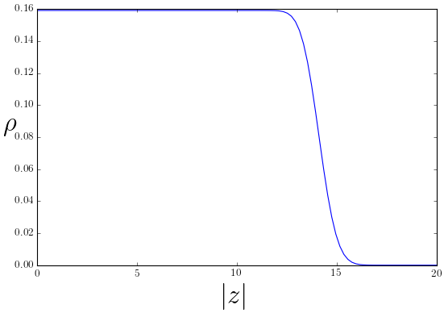
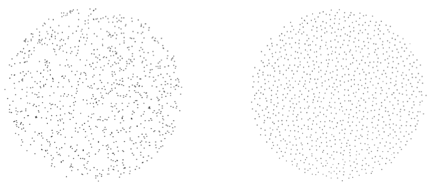

---
slides:
  # Choose a theme from https://github.com/hakimel/reveal.js#theming
  theme: white
---

# Quantum Hall Effect

- A quantum state in _two dimensions_

- 2D electron gas in _strong perpendicular magnetic fields_.

- Can exist for bosons too!

$$
\nonumber
\newcommand{\br}{\mathbf{r}}
\newcommand{\bp}{\mathbf{p}}
\newcommand{\bk}{\mathbf{k}}
\newcommand{\bq}{\mathbf{q}}
\newcommand{\bv}{\mathbf{v}}
\newcommand{\pop}{\psi^{\vphantom{\dagger}}}
\newcommand{\pdop}{\psi^\dagger}
\newcommand{\Pop}{\Psi^{\vphantom{\dagger}}}
\newcommand{\Pdop}{\Psi^\dagger}
\newcommand{\Phop}{\Phi^{\vphantom{\dagger}}}
\newcommand{\Phdop}{\Phi^\dagger}
\newcommand{\phop}{\phi^{\vphantom{\dagger}}}
\newcommand{\phdop}{\phi^\dagger}
\newcommand{\aop}{a^{\vphantom{\dagger}}}
\newcommand{\adop}{a^\dagger}
\newcommand{\bop}{b^{\vphantom{\dagger}}}
\newcommand{\bdop}{b^\dagger}
\newcommand{\cop}{c^{\vphantom{\dagger}}}
\newcommand{\cdop}{c^\dagger}
\newcommand{\bra}[1]{\langle{#1}\rvert}
\newcommand{\ket}[1]{\lvert{#1}\rangle}
\newcommand{\inner}[2]{\langle{#1}\rvert #2 \rangle}
\newcommand{\braket}[3]{\langle{#1}\rvert #2 \lvert #3 \rangle}
\newcommand{\sgn}{\mathrm{sgn}}
\DeclareMathOperator{\tr}{tr}
\DeclareMathOperator{\E}{\mathbb{E}}
\newcommand{\brN}{\br_1, \ldots, \br_N}
$$

---

## Landau Levels

- Single particle Hamiltonian with vector potential

$$
H = -\frac{1}{2m}\left(\nabla -i q \mathbf{A}\right)^2,
\label{Landau}
$$

- For perpendicular field

$$
\partial_x A_y - \partial_y A_x = B.
$$

- We choose __symmetric gauge__

$$
A_x = -\frac{1}{2} B y,\quad A_y = \frac{1}{2} B x.
$$

---

## $H$ in complex coordinates

`$$
\begin{align}
z = x + i y \quad \bar z  = x - iy,\\
\partial_z = \frac{1}{2}\left(\partial_x - i\partial_y\right) \quad \partial_{\bar z} = \frac{1}{2}\left(\partial_x + i\partial_y\right).\\
H = -\frac{2}{m}\left(\partial_z -\frac{qB \bar z}{4}\right)\left(\partial_{\bar z} +\frac{qB z}{4}\right) + \frac{\omega_c}{2}
\end{align}
$$`
- $\omega_c = \frac{qB}{m}$ is the __cyclotron frequency__

- States that satisfy
`$$
\left(\partial_{\bar z} +\frac{qB z}{4}\right)\psi(z,\bar z) = 0
$$`
have energy $\omega_c/2$ and belong to the __lowest Landau level__ (LLL).

---

> Show that these states have the form
>
>$$
>\psi(z,\bar z) = f(z) \exp\left(-\frac{qB}{4}\left|z\right|^2\right),
>$$
>
>where $f(z)$ is an arbitrary analytic function.

- $f(z)=a_0 + a_1z + a_2 z^2+\ldots$ for arbitrary $a_n$

- Landau levels highly degenerate

---

## Notation 

- Write LLL wavefunction as $f(z)$, leaving Gaussian in inner product

$$
\bra{f_1}f_2\rangle = \int \frac{d^2z}{2\pi} \overline{f_1(z)}f_2(z) \exp\left(-\left|z\right|^2/2\right),
$$

- Units with __magnetic length__ $\ell \equiv (qB)^{-1/2}=1$

- A possible orthonormal basis is $f_n(z) = \frac{z^n}{\sqrt{2^n n!}}$

> Show this

---

## Filled LLL of Fermions

- Lift degeneracy by adding harmonic potential
$$
V_\text{harm}(x,y) = \frac{v}{2}\left(x^2+y^2\right) = \frac{v}{2}\left|z\right|^2.
\label{many_HarmonicRound}
$$

- Problem: $V_\text{harm}(z,\bar z)f(z)$ is not in LLL

- Consider only the action of $V$ in the LLL subspace.

---

>By considering matrix elements $\bra{f_1}V\ket{f_2}$ between LLL states, show (by integrating by parts) that it is possible to replace any occurrence of $\bar z$ in $V$ with $2\partial_z$ _acting on the analytic part of the wavefunction_.
>
>Note that the order is important: all the $\partial_z$ must stand to the left of the $z$, Thus
>$$
>V_\text{harm}\longrightarrow v\partial_z z =  v\left(1+z \partial_z\right).
>\label{many_HarmonicProject}
>$$

- Applied to $f_n(z)$, $V$ just counts the degree: $V_\text{harm} f_n = v(1+n)f_n$. 

---

- Fill states $n=0,1,\ldots N-1$

- As for 1D fermions, single particle states are powers $z^n$.

- Identical arguments imply

$$
\Psi(z_1,\ldots, z_N) = \prod_{j<k}^N (z_j-z_k) \exp\left(-\frac{1}{4}\sum_{j=1}^N\left|z_j\right|^2\right)
\label{many_nu1}
$$

---

> Show that the density is
> $$
> \rho_1(z,\bar z) = \frac{e^{-|z|^2/2}}{2\pi}\sum_{n=0}^{N-1} \frac{\left|z\right|^{2n}}{2^n n!} = \frac{1}{2\pi} \frac{\Gamma(N,|z|^2/2)}{(N-1)!}.
>\label{many_LLLdensity}
>$$
>$\Gamma(s,x) = \int^\infty_x t^{s-1}e^{-t}dt$ is <a href="https://en.wikipedia.org/wiki/Incomplete_gamma_function">incomplete gamma fn.</a>

---

- At small $\left\|z\right\|$, approximate by infinite sum, and $\rho_1\to \frac{1}{2\pi}$

- The density is fixed at this value until we reach $\sim\sqrt{2N}$, then falls to zero on scale of $\ell_B$.

- The filled LLL is described by a circular droplet of fixed density $\rho_1 = 1/(2\pi)$: one state per flux quantum $\Phi_0=2\pi/q$

- Changing confining potential causes the droplet to deform, but density to remain constant

---

## The Laughlin Wavefunction

- In 1983 Robert Laughlin proposed the generalization
$$
\Psi_m(z_1,\ldots, z_N) = \prod_{j<k}^N (z_j-z_k)^{m} \exp\left(-\frac{1}{4}\sum_{j=1}^N\left|z_j\right|^2\right).
\label{many_nu}
$$

- $m$ odd / even for fermions / bosons. $m\neq 1$ __not__ a product state!

> This Letter presents variational ground-state and excited-state wave functions which describe the condensation of a two-dimensional electron gas into a new state of matter.

---

## $m=2$ boson state

- With the repulsive potential
$$
H_{\text{int}} = g\sum_{j<k}\delta(\br_j-\br_k),\qquad g>0
\label{many_delta}
$$
$m=2$ state has zero interaction energy

- Any state with zero interaction energy must have $\Psi_2(z_1,\ldots, z_N)$ as a factor

- If wavefunction has higher degree, then in the presence of potential $V_\text{harm}$ it will have higher energy, so $\Psi_2$ is ground state

--- 

## Particle distribution

- Monte Carlo samples from uncorrelated (uniform) distrubution vs. the Laughlin probability distribution $\lvert\Psi_3(z_1,\ldots z_N)\rvert^2$.

- Note _uniformity_ of particle distribution, in contrast with the sample of uncorrelated particles on the left

---

## The Plasma Analogy

- Probability distribution $\lvert\Psi_m(z_1,\ldots, z_N)\rvert^2$ of particles interpreted as Boltzmann distribution of particles in a classical 2D plasma

$$
\nabla^2 V = -q\delta(\br).
$$
- In 2D the solution describing a point charge is
$$
V_\text{point}(\br) = -\frac{q}{2\pi}\log\left|\br\right|,
$$
- Constant background charge density $-\rho_0$ gives rise to a potential
$$
V_\text{bg}(\br) = \frac{\rho_0}{4} \left|\br\right|^2.
$$

---

- System of identical charges in a background charge has overall electrostatic energy
$$
V(\br_1,\ldots,\br_N) = -\frac{q^2}{2\pi} \sum_{j<k}\log\left|\br_j-\br_k\right| + \frac{q\rho_0}{4}\sum_j \left|\br_j\right|^2.
$$

- At finite temperature (unnormalized) probability of finding particles at locations $\br_1, \ldots, \br_N$ is
$$
\exp[-\beta V(\brN)] = \left|\Psi_m(\brN)\right|^2,
$$
where we set $\beta q^2/(2\pi) = 2m$ and $\beta q\rho_0 = 2$. 

- __These are not _physical_ electrostatic fields!__

---

## $N\to\infty$ limit

- Introduce a continuum charge density $\rho(\br)$ and write the energy as a functional
`$$
\begin{align}
\beta V[\rho] = -m\int d^2\br\, d^2\br'\rho(\br)\log\left|\br-\br'\right|\rho(\br') + \frac{1}{2}\int d^2\br\left|\br\right|^2\rho(\br).
\end{align}
$$`

>Show that minimizing the energy with respect to $\rho(\br)$ -- corresponding to finding the most likely configuration -- leads to the condition
>$$
>-2m\int d^2\br'\log\left|\br-\br'\right|\rho(\br') + \frac{1}{2}\left|\br\right|^2 = 0.
>$$

---

>Show that applying $\nabla^2$ to both sides gives
>$$
>\rho(\br) = \frac{1}{2\pi m}.
>$$

- Conclusion: density is fixed at $1/m$ of value for $m=1$ case

- Result applies where density is non-zero, so we get a uniform droplet of radius $\sqrt{2Nm}$

- $1/m$ is called the __filling fraction__ of the state.

---

## Excited states: fractional charge

- Simplest excited state is __quasihole__ 
`$$
\begin{align}
\Psi_\text{hole}(z_1,\ldots, z_N|Z) &= \left(\prod_j (Z-z_j)\right)\Psi_m(z_1,\ldots, z_N)\\
V(\brN)&=-\frac{q^2}{2\pi m}\sum_j \log\left|\br_j-\mathbf{R}\right|-\frac{q^2}{2\pi} \sum_{j<k}\log\left|\br_j-\br_k\right|\\
 &+ \frac{\rho q_0}{4}\sum_j \left|\br_j\right|^2.
\end{align}
$$`

- Charge $q/m$ at point $\mathbf{R} = (X, Y)$, where $Z=X+iY$

- Plasma will screen this charge, leaving a 'hole' in density distribution of charge $-q/m$

---

## Hole state

- 20 holes with charge $-20/m$ for clarity

<figure align="center">

</figure>

---

## Fractional Statistics

- Two quasihole wavefunction

$$
\Psi_\text{2 hole}(z_1,\ldots, z_N|Z_1,Z_2) = \left(\prod_j (Z_1-z_j)(Z_2-z_j)\right)\Psi_m(z_1,\ldots, z_N).
$$

- $\vert\Psi_\text{2 hole}(z_1,\ldots, z_N\vert Z_1,Z_2)\rvert^2$ is plasma with two $1/m$ charges at positions $\mathbf{R}_{1,2}$

-  Each surrounded by depleted density of $-1/m$ of a particle

- (See notes) Quasiholes are __anyons__, particles with fractional statistics!

