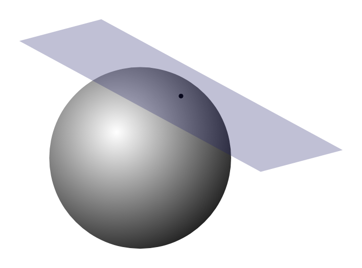

---
slides:
  # Choose a theme from https://github.com/hakimel/reveal.js#theming
  theme: white
scripts: []

---

# Spin Models

- Up to now our degrees of freedom have been __particles__

- In this lecture: systems of interacting __spins__

$$
\nonumber
\newcommand{\cN}{\mathcal{N}}
\newcommand{\br}{\mathbf{r}}
\newcommand{\bp}{\mathbf{p}}
\newcommand{\bk}{\mathbf{k}}
\newcommand{\bq}{\mathbf{q}}
\newcommand{\bv}{\mathbf{v}}
\newcommand{\pop}{\psi^{\vphantom{\dagger}}}
\newcommand{\pdop}{\psi^\dagger}
\newcommand{\Pop}{\Psi^{\vphantom{\dagger}}}
\newcommand{\Pdop}{\Psi^\dagger}
\newcommand{\Phop}{\Phi^{\vphantom{\dagger}}}
\newcommand{\Phdop}{\Phi^\dagger}
\newcommand{\phop}{\phi^{\vphantom{\dagger}}}
\newcommand{\phdop}{\phi^\dagger}
\newcommand{\aop}{a^{\vphantom{\dagger}}}
\newcommand{\adop}{a^\dagger}
\newcommand{\bop}{b^{\vphantom{\dagger}}}
\newcommand{\bdop}{b^\dagger}
\newcommand{\cop}{c^{\vphantom{\dagger}}}
\newcommand{\cdop}{c^\dagger}
\newcommand{\bra}[1]{\langle{#1}\rvert}
\newcommand{\ket}[1]{\lvert{#1}\rangle}
\newcommand{\inner}[2]{\langle{#1}\rvert #2 \rangle}
\newcommand{\braket}[3]{\langle{#1}\rvert #2 \lvert #3 \rangle}
\newcommand{\sgn}{\mathrm{sgn}}
\newcommand{\brN}{\br_1, \ldots, \br_N}
\newcommand{\xN}{x_1, \ldots, x_N}
\newcommand{\zN}{z_1, \ldots, z_N}
$$

---

## Ising Model

$$
H = J\sum_{\langle j\,k\rangle} \sigma_j \sigma_k,
\label{spin_ising}
$$

- 'spin' variables $\sigma_j=\pm 1$ 

-  ${\langle j\,k\rangle}$ indicates sum over nearest neighbour pairs

- $J<0$ favours aligned spins, leading to __ferromagnetism__

__But__... not really a quantum model

---

## $N$ spin-1/2: states and operators

- 1 spin-1/2: $\psi_{\pm}$ in $s^z$ basis (say). $N$-spins: $\Psi_{\sigma_1,\ldots \sigma_N}$ has $2^N$ components

- Product states $\ket{\sigma_1}\ket{\sigma_2}\cdots \ket{\sigma_N}$ form a basis

$$
\ket{\Psi}=\sum_{\{\sigma_j=\pm\}}\Psi_{\sigma_1\cdots \sigma_N}\ket{\sigma_1}\ket{\sigma_2}\cdots \ket{\sigma_N}
$$

---

## Tensor product

- For (distinguishable) particles product states were

$$
 \label{quantum_statistics_disting}
 \Psi_{\alpha_{1}\alpha_{2}\cdots \alpha_{N}}(\br_1,\ldots \br_N)=\varphi_{\alpha_{1}}(\mathbf{r_{1}})\varphi_{\alpha_{2}}(\mathbf{r_{2}})\cdots\varphi_{\alpha_{N}}(\mathbf{r_{N}})
$$

- Abstract form

$$
 \ket{\Psi_{\alpha_{1}\alpha_{2}\cdots \alpha_{N}}}=\ket{\varphi_{\alpha_{1}}}\ket{\varphi_{\alpha_{2}}}\cdots\ket{\varphi_{\alpha_{N}}}
$$

- This is a [tensor product](https://en.wikipedia.org/wiki/Tensor_product), normally denoted

$$
\ket{\Psi_{\alpha_{1}\alpha_{2}\cdots \alpha_{N}}}=\ket{\varphi_{\alpha_{1}}}\otimes\ket{\varphi_{\alpha_{2}}}\cdots\otimes\ket{\varphi_{\alpha_{N}}}
$$

- We drop the $\otimes$ for brevity

---

## Operators

- Spin operators obey $[s^a,s^b]=i\epsilon_{abc}s^c$

- A spin operator $s^a_j$ acts on $j^\text{th}$ spin

$$
s^a_j\ket{\sigma_1}\ket{\sigma_2}\cdots \ket{\sigma_N} = \ket{\sigma_1}\ket{\sigma_2}\cdots \ket{\sigma_{j-1}} (s^a \ket{\sigma_j}) \ket{\sigma_{j+1}}\cdots\ket{\sigma_N}
$$

- Which is the same as

$$
s^a_j = \overbrace{\mathbb{1}\otimes \cdots \mathbb{1}}^{j-1}\otimes s^a \otimes \overbrace{\mathbb{1} \otimes\cdots \mathbb{1}}^{N-j}
$$

> What is $[s^a_j,s^b_k]$ for $j\neq k$?

---

- Ising model Hamiltonian

$$
H = 4J\sum_{\langle j\,k\rangle} s^z_j s^z_k
$$

- Eigenstates are product states $\ket{\sigma_1}\ket{\sigma_2}\cdots \ket{\sigma_N}$ with energy 

$$
E_{\sigma_1\cdots \sigma_N} = J\sum_{\langle j\,k\rangle} \sigma_j \sigma_k
$$

- Fine for statistical mechanics but a bit boring for QM!

---

## Heisenberg Model

- More realistic

$$
H = J \sum_{\langle j\,k\rangle} \mathbf{s}_j \cdot \mathbf{s}_k.
\label{spin_Hberg}
$$

- $\left[s^a_j,s^b_k\right]=i\delta_{jk}\epsilon_{abc}s^c_j$

- Unlike the elastic lattice, not possible to solve _in general_

- Captures many of the dynamical features (e.g. spin waves) of real magnetic materials.

---

## Heisenberg Ferromagnetic Chain

- Begin with the 1D case

`$$
H = J \sum_{j=1}^N \mathbf{s}_j \cdot \mathbf{s}_{j+1},
$$`

- As usual $\mathbf{s}\_j=\mathbf{s}_{j+N}$ (periodic boundary conditions). 

- Some anisotropic materials have magnetic atoms arranged in weakly coupled chains

---

- It's often useful to write
`$$
\mathbf{s}_j \cdot \mathbf{s}_{j+1} = s^z_js^z_{j+1} + \frac{1}{2}\left(s^+_js^-_{j+1} +s^-_js^+_{j+1}\right),
$$`
where $s^\pm = s^x\pm i s^y$
`$$
s^+ = \begin{pmatrix}
0 & 1 \\
0 & 0
\end{pmatrix},\qquad s^- = \begin{pmatrix}
0 & 0 \\
1 & 0
\end{pmatrix}
$$`
are the spin raising and lowering operators

---

## Ground state for $J<0$

$$
\ket{\text{FM}} \equiv \ket{+}_1 \ket{+}_2 \cdots \ket{+}_N 
$$

> Show that this is eigenstate of $H$ with $E_0\equiv JN/4$

- Also eigenstate of $S^z$ and $\mathbf{S}^2$, where $\mathbf{S}$ is total spin

$$
\mathbf{S} = \sum_{j=1}^N \mathbf{s}_j=(S^x, S^y, S^z)
$$

- Eigenvalues are $S^z = N/2$ and $\mathbf{S}^2 = \frac{N}{2}\left(\frac{N}{2}+1\right)$.

---

## Ground state multiplet

 - Rotational invariance implies that $\ket{\text{FM}}$ is member of multiplet of $N+1$ degenerate eigenstates related by rotations
 
- These states can be generated by acting with $S^-=S^x-iS^y$
`$$
S^-\ket{\text{FM}} = \sum_{j=1}^N s^-_j\ket{\text{FM}} = \sum_{j=1}^N \ket{+}_1\ket{+}_2\cdots \ket{+}_{j-1} \ket{-}_j\ket{+}_{j+1}\cdots \ket{+}_N.
\label{spin_Lowered}
$$`

> $S^z = N/2-1$, but $\mathbf{S}^2$ and $H$ unchanged.

- $\left(S^-\right)^2\ket{\text{FM}}$ is constant amplitude superposition of states with two spins flipped, etc.

---

## First Excited States

- What about?

`$$
\ket{j} = \ket{+}_1\ket{+}_2\cdots \ket{+}_{j-1} \ket{-}_j\ket{+}_{j+1}\cdots \ket{+}_N.
$$`

- Is this an eigenstate? Act with Hamiltonian, using

`$$
 \mathbf{s}_j \cdot \mathbf{s}_{j+1} = s^z_js^z_{j+1} + \frac{1}{2}\left(s^+_js^-_{j+1} +s^-_js^+_{j+1}\right),
$$`

- Now note that 

`$$
\left(s^+_j s^-_{j+1} +s^-_js^+_{j+1}\right)\ket{+}_j\ket{-}_{j+1} = \ket{-}_j\ket{+}_{j+1}.
$$`

--- 

- Action of $H$ on $\ket{j}$ is
`$$
H\ket{j} = (1-N/4) \ket{j} - \frac{1}{2}\left(\ket{j-1}+\ket{j+1}\right).
$$`
(set $J=-1$ from now)

- Leaves us in subspace spanned by states $\ket{j}$: this is subspace with $S_z=N/2-1$

- Flips are like _particles_ (__magnons__), with Hamiltonian conserving number

---

- Eigenstates are plane waves
`$$
H\ket{j} = (1-N/4) \ket{j} - \frac{1}{2}\left(\ket{j-1}+\ket{j+1}\right).
$$`
`$$
\begin{equation}
\ket{\eta} = \frac{1}{\sqrt{N}}\sum_{j=1}^N e^{i\eta j}\ket{j}, \qquad \eta = \frac{2\pi n}{N}
\end{equation}
$$`

- Eigenvalues $E = E_0 + \omega(\eta)$

$$
\omega(\eta) = 2\sin^2\eta/2.
\label{spin_dispersion}
$$

- Dispersion is periodic, as for elastic chain, but quadratic, rather than linear, at small $\eta$

- $\eta=0$ corresponds to the state $S^-\ket{\text{FM}}$

---

## $N$-Magnon States

- A magnon has energy $\propto J$

- System with extensive energy / finite temperature must have _many_ magnons

- Dimension of subspace of $n$ flipped spins is $\binom{N}{n}$

- Magnons can't sit on the same site. Things get difficult!

---

## Antiferromagnets Are Different!

- Let's try and _guess_ the ground state for $J>0$

- Since anti-aligning spins should be favoured, we might try
`$$
\ket{\text{AFM}}  \equiv \ket{+}_1\ket{-}_{2}\cdots \ket{+}_{N-1}\ket{-}_{N},
\label{spin_AFM}
$$`

- What does $H$ do? Remember 
`$$
 \mathbf{s}_j \cdot \mathbf{s}_{j+1} = s^z_js^z_{j+1} + \frac{1}{2}\overbrace{\left(s^+_js^-_{j+1} +s^-_js^+_{j+1}\right)}^{\text{swaps }\ket{+}_j\ket{-}_{j+1}},
$$`
spin flip terms cause spins to move about. Ground state is more complicated!

---

- For the AFM chain, quantum fluctuations too strong for AFM order

- __Antiferromagnets__ do exist in higher dimensions, and [Néel](https://en.wikipedia.org/wiki/Louis_N%C3%A9el) state $\ket{\text{AFM}}$ is good starting approximation

---

## Large $s$ Expansion

- Generalize model to $s>1/2$ (magnetic ions can have higher spin)

- Develop approximations that work for $s\gg 1/2$

- Hope that the _qualitative_ behaviour we find holds for $s=1/2$

---

## Holstein--Primakoff Representation

- Represent spins as oscillators!

- Coupled spins becomes coupled oscillators

- Representation not linear, so we get anharmonic chain

- Harmonic approximation justified when spin large

---

`$$
\begin{align}
s^+ &=\sqrt{2s}\sqrt{1-\frac{\adop\aop}{2s}}\aop \\
s^- &= \sqrt{2s}\adop\sqrt{1-\frac{\adop\aop}{2s}} \\
s^z &= \left(s - \adop \aop\right).
\end{align}
$$`

> Show that $[\aop,\adop]=1$ reproduces the spin commutation relations $[s^a,s^b]=i\epsilon_{abc}s^c$

---

## One way to think of it...

- $s^{\pm}$ and $\aop$, $\adop$ both shift us up and down a ladder of states.
$$
s^\pm\ket{s,m} = \sqrt{s(s+1)-m(m\pm 1)}\ket{s,m\pm 1}
$$
Relation between $s^z$ and number of quanta $n$ is simple: $s^z = s - n$

- Difference: $2s+1$ spin states, but infinite oscillator states

- $s^+\propto \aop$, $s^-\propto \adop$ doesn't work. Something needed to stop us lowering beyond $s^z=-s$
$$
s^- = \sqrt{2s}\adop\sqrt{1-\frac{\adop\aop}{2s}}
$$

---

## Another way...

- Classical spin described by point on sphere of radius $\sim s$

- Large $s$: approximate locally by plane

- Near north pole $[s^x,s^y]=is^z\sim is$ resembles $[x,p]=i$

- Therefore $s^\pm$ resemble $\aop$, $\adop$

---

## Harmonic Spin Waves

- Large $s$ approximation
`$$
\begin{align}
s^+ &\sim \sqrt{2s}\aop \qquad s^- \sim  \sqrt{2s}\adop \qquad s_z = \left(s - \adop \aop\right).
\label{spin_HPapprox}
\end{align}
$$`
neglecting terms of order $s^{-1/2}$. 

- Heisenberg Hamiltonian becomes quadratic oscillator Hamiltonian
`$$
\begin{align}
s^x &\sim \sqrt{s}x \nonumber\\
s^y &\sim  \sqrt{s}p\nonumber\\
s_z &= \left(s - \frac{1}{2}[x^2 + p^2 - 1] \right),
\end{align}
$$`
where $x = \frac{1}{\sqrt{2}}(\aop+\adop)$ and $p = \frac{i}{\sqrt{2}}(\adop-\aop)$

---

`$$
\begin{align}
s^x &\sim \sqrt{s}x \nonumber\\
s^y &\sim  \sqrt{s}p\nonumber\\
s_z &= \left(s - \frac{1}{2}[x^2 + p^2 - 1] \right),
\end{align}
$$`

`$$
H = J \sum_{j=1}^N \mathbf{s}_j \cdot \mathbf{s}_{j+1}
$$`

$$
H\sim NJ s^2 + sNJ+ \overbrace{sJ \sum_{j=1}^N \left[x_j x_{j+1} + p_j p_{j+1}-x_j^2 - p_j^2\right]}^{\equiv H^{(2)}} + \ldots,
\label{spin_Harmonic}
$$

---

- Use Fourier expansion of the position and momentum
`$$
\begin{align}
x_j(t) &= \frac{1}{\sqrt{N}}\sum_{|n| \leq (N-1)/2} q_n(t) e^{i\eta_n j},\nonumber\\
p_j(t) &= \frac{1}{\sqrt{N}}\sum_{|n| \leq (N-1)/2} \pi_n(t) e^{-i\eta_n j}\\
H^{(2)} &= -2sJ \sum_{|n| \leq (N-1)/2} \sin^2(\eta_n/2)\left[q_n q_{-n} + \pi_n\pi_{-n}\right]
\end{align}
$$`

- We can read off dispersion
`$$
\omega_{\text{FM}}(\eta) = 4s\left|J\right|\sin^2(\eta/2)
$$`
c.f. $\omega(\eta) = 2\sin^2\eta/2$ that we found for $s=1/2$

---

$$
H\sim NJ s^2 + sNJ+ \overbrace{ -2sJ \sum_{|n| \leq (N-1)/2} \sin^2(\eta_n/2)\left[q_n q_{-n} + \pi_n\pi_{-n}\right]}^{\equiv H^{(2)}} + \ldots,
$$

- Ground state energy of $H^{(2)}$ is 

$$
-2sJ\sum_{|n| \leq (N-1)/2} \frac{1}{2}\sin^2(\eta_n/2) = -sJN
$$

- Overall $E_0 = NJs^2$, which is exact energy of $\ket{FM}$

---

## AFM case

- Close to $\ket{\text{FM}}$ few oscillator quanta; harmonic approximation OK

- Classically, small amplitude nonlinear oscillations treated as linear

- What about AFM case? Make it _look_ like FM

- Rotate every other spin through $\pi$ about the $y$ axis, so that

$$
(s^x_j,s^y_j,s^z_j)\longrightarrow (-s^x_j,s^y_j,-s^z_j),\quad j\text{ odd}.
$$

- The Heisenberg chain Hamiltonian becomes
`$$
H = -J \sum_{j=1}^N \left[s^x_j s^x_{j+1} - s^y_j s^y_{j+1} + s^z_j s^z_{j+1}\right].
$$`

---

- Harmonic approximation means: close to AFM in original variables

- Oscillator Hamiltonian is now
`$$
H^{(2)} = 2sJ \sum_{|n| \leq (N-1)/2} \left[\sin^2(\eta/2)q_n q_{-n} + \cos^2(\eta/2)\pi_n\pi_{-n}\right],
\label{spin_H2AFM}
$$`
corresponding to a dispersion relation

$$
\omega_{\text{AFM}}(\eta) = 2sJ\left|\sin(\eta)\right|.
\label{spin_AFMDispersion}
$$

---

$$
\omega_{\text{AFM}}(\eta) = 2sJ\left|\sin(\eta)\right|.
$$

- Vanishes at both $\eta=0$ and Brillouin zone boundary $\eta=\pi$

- Linear near both points, c.f. quadratic for FM

- Compare
`$$
H_\text{FM}^{(2)} = -2sJ \sum_{|n| \leq (N-1)/2} \sin^2(\eta_n/2)\left[q_n q_{-n} + \pi_n\pi_{-n}\right]
$$`
In FM both position and momentum terms vanish at $\eta=0$. This is the origin of quadratic dispersion at small $\eta$

- In AFM position term vanishes at $\eta=0$, with momentum term vanishing at $\eta=\pi$. This gives linear dispersion at these points

---

$$
\omega_{\text{AFM}}(\eta) = 2sJ\left|\sin(\eta)\right|.
$$

- We know (by other means) exact dispersion relation for lowest excited state of momentum $\eta$ (__des Cloiseaux--Pearson__ mode)
`$$
\omega_{\text{dCP}}(\eta) = \frac{\pi J}{2}\left|\sin(\eta)\right|,
\label{spin_dCP}
$$`
Same functional form, but with a different overall scale

---

## Ground state fluctuations

- Crudest approximation

$$
\bra{\text{FM}}s_j^z \ket{\text{FM}} = s, \qquad \bra{\text{AFM}}s_j^z \ket{\text{AFM}} = s(-1)^j
$$

- However, in Holstein--Primakoff representation

$$
s^z_j = s - \adop_j\aop_j.
$$

- How does second term effect $\bra{0}s^z_j \ket{0}$ in ground state of $H^{(2)}$? 

- We know it _doesn't_ for FM, because $\ket{\text{FM}}=\ket{0}$ 

---

$$
s^z_j = s - \adop_j\aop_j.
$$

- Why doesn't second term contribute? By translational invariance

`$$
\begin{align}
\bra{0}\adop_j \aop_j\ket{0} &= \bra{0}\frac{1}{N}\sum_{j=1}^N \adop_j \aop_j\ket{0}\\
\sum_{j=1}^N \adop_j \aop_j &= \frac{1}{2} \sum_{j=1}^N \left(x_j^2 + p_j^2 - 1\right) = -\frac{N}{2} + \frac{1}{2}\sum_n \left(q_n q_{-n} + \pi_n\pi_{-n}\right).
\end{align}
$$`

- commutes with 
`$$
H_\text{FM}^{(2)} = -2sJ \sum_{|n| \leq (N-1)/2} \sin^2(\eta_n/2)\left[q_n q_{-n} + \pi_n\pi_{-n}\right]
$$`
and is zero in the ground state (c.f. ground state energy)

---

## AFM case

$$
s^z_j = (-1)^j(s-\adop_j\aop_j)
$$

- $q_n q_{-n} + \pi_n\pi_{-n}$ doesn't commute with $\sin^2(\eta/2)q_n q_{-n} + \cos^2(\eta/2)\pi_n\pi_{-n}$

- Express both in oscillator variables

`$$
\begin{align}
&\aop_\eta = \sqrt{\frac{|\tan(\eta /2)|}{2}}\left(q_n + \frac{i}{|\tan(\eta /2)|}\pi_{-n}\right)\nonumber\\
&\adop_\eta = \sqrt{\frac{|\tan(\eta /2)|}{2}}\left(q_{-n} - \frac{i}{|\tan(\eta /2)|}\pi_{n}\right),\qquad \eta=2\pi n/N \\
&\sin^2(\eta/2)q_n q_{-n} + \cos^2(\eta/2)\pi_n\pi_{-n}=\frac{\omega(\eta)}{2}\left[\adop_\eta\aop_\eta+\aop_\eta\adop_\eta\right].
\end{align}
$$`

---

- To evaluate $\Delta s = \bra{0}\adop_j\aop_j\ket{0}$ write in terms of $\adop_\eta$, $a_\eta$

`$$
\begin{align}
\frac{1}{N}\sum_{j=1}^N \adop_j \aop_j = \frac{1}{2N} \sum_{j=1}^N \left(x_j^2 + p_j^2 - 1\right) = -\frac{1}{2} + \frac{1}{2N}\sum_n \left(q_n q_{-n} + \pi_n\pi_{-n}\right)
\end{align}
$$
$$
\begin{align}
\Delta s &= -\frac{1}{2}+\frac{1}{4N}\sum_n \left[|\tan(\eta_n/2)| + |\cot(\eta_n/2)|\right].\\
 &= -\frac{1}{2}+\frac{1}{4}\int_{-\pi}^\pi \frac{d\eta}{2\pi} \left[|\tan(\eta_n/2)| + |\cot(\eta_n/2)|\right].
\end{align}
$$`

- Integral diverges logarithmically at $\eta=0$ and $\eta=\pi$. 

---

- What went wrong? Our replacement 
`$$
\sum_n (\ldots) \longrightarrow \frac{N}{2\pi}\int_{-\pi}^\pi (\ldots)d\eta
$$`
failed us because the summand is singular (c.f. $\langle (u_i-u_j)^2\rangle$ in the elastic chain)

- At finite $N$ the sums are all finite if $\eta=0, \pi$ are excluded

$$
\Delta s \propto \log N
$$

- No AFM in 1D at zero temperature in $N\to\infty$ limit

---

>Repeat the analysis on a 2D square lattice. You should find an integral over the two-dimensional Brillouin zone. Do you find divergences?

