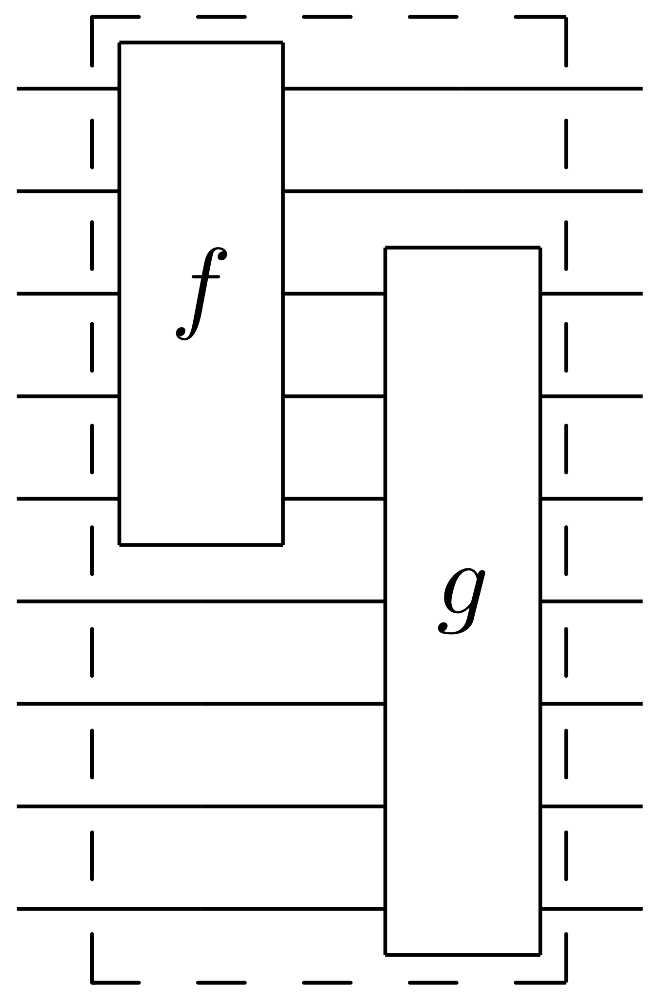
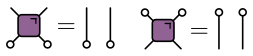

**This post is based on the colloquium I gave at the [Aspen Center for Physcs](https://www.aspenphys.org/) on July 7, 2022** 

## Introduction

Many of you will have encountered [Conway's Game of Life](https://en.wikipedia.org/wiki/Conway%27s_Game_of_Life), a system obeying a few simple rules from which rather complicated behavior can emerge.

<figure align="center">

<figcaption>Conway's Game of Life. Click to restart </figcaption>
</figure>

Conway's game takes place on a (potentially infinite) square lattice, where each site is in one of two possible states (alive or dead in the original interpretation, though we'll mostly refer to these states as 1 and 0 in the following). The evolution of the board proceeds in discrete time steps, with the state of each site at a given instant being determined by the states of the surrounding eight sites (generally this is known as a site's **neighborhood**) in the preceeding instant. The rules, which are intended to resemble a living ecosystem (hence the name), are:

1. Any live cell with two or three live neighbours survives.
2. Any dead cell with three live neighbours becomes a live cell.
3. All other live cells die in the next generation. Similarly, all other dead cells stay dead.

From these three simple rules highly complicated behaviors can emerge. The Game of Life is an example of a [cellular automaton](https://en.wikipedia.org/wiki/Cellular_automaton) (CA), a dynamical system in which *space*, *time*, and the *degrees of freedom* are all discrete, while the extent of the system in space and time may be taken to infinity. Cellular automata are therefore interesting model systems from the perspective of statistical physics, since one can ask questions about the generic types of dynamics that may occur, and how these determine the behavior of the system in the thermodynamic limit.

Though discrete, CAs are *classical* systems, since they have a definite state at any instant. Is there a natural notion of a *quantum cellular automaton*? Motivated by quantum computation, physicists have in recent years begun to study *quantum circuits*, and we'll see that in many ways these are quantum analogues of cellular automata. In this talk I'll discuss some of the similarities and differences between these two classes of systems, and what they can teach us about classical and quantum dynamics more generally. Although I won't have much to say about quantum computation *per se*, it's clear that this is one of the main drives of the field, and ideas from quantum information have constantly been injected into many body physics over the past decades.

{}
Note that there are several different constructions which go by the name *quantum cellular automaton*
{}

## Elementary cellular automata: Wolfram's rules

The [elementary cellular automata](https://en.wikipedia.org/wiki/Elementary_cellular_automaton) are the simplest class of CAs. "Space" is one dimensional: each cell is labelled by an integer $n$ and takes value $x_n=0,1$. The neighborhood that determines the fate of a cell in the next time step consists of that cell and its two neighbors. The updates are therefore defined by a function that maps the value of these three cells to the new value

$$
f:\\{0,1\\}^3\longrightarrow \\{0,1\\}.
$$

The update rule is then

$$
x^{t+1}_{n} = f(x^{t}\_{n-1},x^{t}\_{n},x^{t}\_{n+1})
$$

Since the domain of $f$ consists of the $2^3=8$ possible assignments of the three cells there are $2^8=256$ possible choices for the function $f$. Interpreting the inputs as binary numbers it's conventional, following [Stephen Wolfram](https://en.wikipedia.org/wiki/Stephen_Wolfram), to arrange them in descending order: 111, 110, ... 000 and interpret the corresponding outputs as an eight bit binary number that is used to label the function, or "rule". Thus, Rule 110 corresponds to the function with table

|111	| 110 |	101	| 100 |	011 |	010 |	001 |	000	|
|---	| --- |	---	| --- |	--- |	--- |	--- |	---	|
| 0   |	1   | 	1 | 	0 | 	1	|   1 | 	1 | 	0 |	

<figure align="center">

<figcaption>Elementary cellular automata starting from either a single 1 or a random row. Try them out by changing the number on the right from 0 to 255. </figcaption>
</figure>

By playing with the above simulation you'll quickly realise that this simple set of rules encompasses quite a variety of behavior, from ordered (the Sierpinski triangle produced by Rule 18) to chaotic (Rule 30). Surprisingly, Rule 110 is capable of universal computation. Many of the rules are not interesting at all.

The other important point I'd like to make is that the rules, being *local*, give rise to a notion of *causality* in the dynamics. That is, there is a *maximal speed* at which influences can propagate, corresponding to 45 degree lines in our pictures. With only a small abuse of terminology, we'll often speak of a "light cone" in these systems.

### Adding complexity

Pokemon and multidomain

WANKS

## Chaos 

*Chaos* in a dynamical system is characterized by the rapid growth of initially small differences between two trajectories $x_t$ and $y_t$. Since the degrees of freedom of CAs are discrete, the smallest change we can make is to toggle the value of a single site. By tracking the difference between the two trajectories we can observe the degree of chaos present in the system. More precisely, since are talking about binary variables, the natural quantity to monitor is the exclusive or – XOR – of the two variables, denoted $x_t\oplus y_t$ (although we'll frequently refer to it as the "difference" in the following). Instead of the exponential growth typical of chaotic behavior in continuous systems (characterized by a [Lyapunov exponent](https://en.wikipedia.org/wiki/Lyapunov_exponent)), the degree of chaos is naturally characterized by the number of differing sites, or [Hamming distance](https://en.wikipedia.org/wiki/Hamming_distance) between two trajectories. Compare the behavior of the chaotic Rule 30 with Rule 15, for example.

<figure align="center">

<figcaption>Evolving two copies starting from the same random initial conditions except for a single altered cell. The red and white colors indicate where the two copies differ.</figcaption>
</figure>

The propagation of the "front" that marks the difference between two copies cannot exceed the maximum speed I mentioned before, and may be less. For Rule 30, for example, the left front meanders and generally moves slower than the right front, which moves at the maximum speed.

## Randomness as a tool

Although the behavior of even the elementary CAs is intriguing, it's not at all clear how we can go about analyzing them, or uncovering generic patterns of behavior. For this reason, may early studies of CAs were therefore rather qualitative.

One way forward that is often used in theoretical physics is to give up on the prospect of solving any one system in particular, and instead try to make statements about *statistical ensembles* of systems. In the case of CAs there are two natural ways to introduce such ensembles: by taking a distribution of initial conditions and / or a distribution over rules that govern the dynamics. The latter strategy gives rise to a [probabilistic cellular automaton](https://en.wikipedia.org/wiki/Stochastic_cellular_automaton). An obvious ensemble corresponds to choosing the rules independently for each site and each instant, uniformly from all possible rules. Once the rules are fixed we can investigate chaos as before: by evolving two copies of the system with the *same* rules. 

<figure align="center">

<figcaption>$x_t\oplus y_t$ for two PCAs starting from initial conditions that are random but only differ on one site ("site") or are random and independent ("row"). The number in the bottom right is the probability $p$ introduced in the text. Note that in this case the neighborhood includes next nearest neighbors.</figcaption>
</figure>

If we look at the dynamics of one of the copies things look very boring: since the output of each rule is chosen at random we just get white noise. Because the two copies are evolved with the same – albeit random – rules, the dynamics of $x_t\oplus y_t$ is still nontrivial: we see a propagating front, just as for many of the individual rules. The fluctuations of the front are larger and the average speed is definitely less than the maximal value.

An interesting variation in behavior emerges if we introduce an extra parameter into our ensemble. With a uniform distribution on rules each possible input to an update function outputs 0 or 1 with equal probability. We can instead choose to output 1 with probability $0\leq p\leq 1$, with the uniform distribution corresponding to $p=1/2$. Deviating from $p=1/2$ tends to make the dynamics more boring. It also makes it less *injective*: distinct cell values within a neighborhood are more likely to be mapped to the same value.

By exploring the effect of changing $p$ you can see that something interesting happens around $p=0.25$ (or $p=0.75$: the behavior is symmetric around $p=1/2$). We go from a situation where the front propagates without limit to one where it becomes sparse and tends to die out, meaning that over time the two trajectories begin to coincide and eventually merge completely. This corresponds to a *phase transition*, as we'll see shortly. 

Note that in a finite system the two copies will *always* merge after a sufficiently long time. This is because there will always come an unlucky moment when all the rules conspire to map the two trajectories to the same state. In the "chaotic" phase, this time will be exponentially large in the system size, however.

### Markov chain on differences

The power of the probabilistic approach is that is possible to understand the above behavior in terms of a Markov chain on the difference $z_t\equiv x_t\oplus y_t$ *alone*, without reference to the individual configurations ([Derrida and Stauffer (1986)](https://iopscience.iop.org/article/10.1209/0295-5075/2/10/001/meta)). When $z_t=0$ on a neighborhood that provides an input to a rule, we have $z_t=0$ for the output. If the inputs differ on a least one site, however, $z_t=1$ at the output with probability $2p(1-p)$. 

Let's modify the rules slightly for a moment, so that the rules $f$ that determine how a site is updated depend only on the two neighboring sites, and not the site itself. The graph of dependencies then takes the form of a square lattice

**TODO: figure**

A given site has $z_t=1$ with probability $2p(1-p)$ only if one of its two antecedents did. It turns out this is a well known statistical mechanics model called (site) [directed percolation](https://en.wikipedia.org/wiki/Directed_percolation), in which one looks for a connected cluster of sites that are occupied with probability $x=2p(1-p)$. For nearest neigbor neighborhoods this probability $x\leq 1/2$ and is never high enough to reach the percolating phase where an infinite cluster is present, which occurs for $x\sim 0.706$. Thus in the experiment of the previous section we had to use next nearest neighbors.

Parenthetically, directed percolation is one of the few phase transitions in which the critical exponents are unknown in the usually tractable case of two dimensions (i.e. one space and one time dimension). Part of the reason is the lack of symmetry between space and time, which means that conformal field theory is of no use, for instance.

## Reversibility and block CAs

We saw that the directed percolation phase transition in the dynamics of PCAs was a direct consequence of the breakdown of injectivity (one-to-oneness) in the rules. Given a CA, it's natural to ask whether it describes an invertible map (i.e. a bijection) on the state space, in which case two distinct trajectories can never merge. This is a [reversible cellular automaton](https://en.wikipedia.org/wiki/Reversible_cellular_automaton).

Somewhat surprisingly, none of the elementary CAs are reversible (ignoring trivial cases where the output depends on only one of the inputs)! There are alternative constructions that do give rise to reversible CA, however: the simplest, and the most relevant for our later discussion of quantum circuits, is the [block cellular automaton](https://en.wikipedia.org/wiki/Block_cellular_automaton). The idea is to divide the cells into blocks (known as Margolus neighborhoods) and apply invertible mappings to each block. By alternating between two overlapping partitions at even and odd time steps, one obtains a dynamical system in which distant sites can become casually connected after enough steps.

<figure align="center">

<figcaption>Two dimensional block celluar automaton with Margolus neighborhoods consisting of overlapping $2\times 2$ blocks. Source: David Eppstein, <a src="https://en.wikipedia.org/wiki/File:Margolus_block_neighborhood.svg">Wikipedia </a>.</figcaption>
</figure>

A useful way to picture what is going, at least in the case of one spatial dimension, is via a spacetime representation, in which the blocks describing the invertible mappings form a brickwork pattern.

<figure align="center">

<figcaption>Spacetime representation of a block celluar automaton in one space and one time dimension (running vertically). The blue squares with two inputs and two outputs represent an invertible mapping on the possible states of two sites: 00, 01, 10, 11.</figcaption>
</figure>

A more creative way to picture the mechanics of block CAs is provided by this tweet from Matt Henderson.

<blockquote class="twitter-tweet" align="center">
given these four jigsaw pieces, there is only one way to fill in the rest of the puzzle. The solution ends up drawing a Sierpinski triangle. Can you see why? <a href="https://t.co/OvxVz2oehy">pic.twitter.com/OvxVz2oehy</a>
&mdash; Matt Henderson (@matthen2) <a href="https://twitter.com/matthen2/status/1529552315337818112?ref_src=twsrc%5Etfw">May 25, 2022</a>

How many possible blocks are there in this construction? Evidently a block must describe a permutation of the four possible states of two sites 1: 00, 2: 01, 3: 10, 4: 11. Thus there are $4!=24$ possibilities. It's convenient to order them lexicographically:

0. (1234)
1. (1243)
2. (1324), and so on

Thus block 2 is the map

$$
(00, 01, 10, 11) ⟶ (00, 10, 01, 11)
$$

i.e an exchange of the two sites, known as the SWAP gate in quantum information.

As before it's useful to plot the look at two trajectories that initially differ by a single site.

<figure align="center">

<figcaption>All possible blocks (0-23) for a two-cell Margolus neighborhood. </figcaption>
</figure>

Again we can play the game of introducing an ensemble over blocks. The results are qualitatively the same as for the PCA in the chaotic phase that we discussed previously: a propagating front with average speed less than the maximal speed. Because all the blocks are reversible, there is no possibility of a phase transition. 

### Dual reversibility

Can we find an ensemble where the chaotic front propagates at maximal speed? It turns out that this is possible using a slightly roundabout argument. Our blocks describe bijections between the present and future. What if they also described bijections moving left to right i.e. in a spatial direction? It turns out that 12 of the 24 possible blocks have this property: we'll call them **dual reversible**, which perhaps isn't a great name but is chosen by analogy with the classical case. 

If we draw each block in an iid fashion from the 12 dual reversible blocks, then the dynamics can be regarded as a Markov process in *either* the time or space directions. It's therefore inevitable that in this ensemble the front propagates at the maximum possible velocity: it it moved slower, it would exceed the speed of light when viewed at 90 degrees!

### Dynamics of mutual information

Looking at pairs of trajectories is only one possible way to characterize the dynamics of a CA. An alternative, recently suggested by [Pizzi *et al.* (2022)](https://arxiv.org/abs/2204.03016) by analogy (as we'll see) with the quantum case, is to look at the [mutual information](https://en.wikipedia.org/wiki/Mutual_information) of two disjoint spatial regions. 

The mutual information is a measure of the non-independence of two random variables $X$ and $Y$, and is defined as

$$
I(X;Y) \equiv S(X) + S(Y) - S(X,Y)
$$

where:

- $S(X)$ is the entropy of $p_X(x)$, the marginal distribution of $X$
- $S(Y)$ is the entropy of $p_Y(y)$, the marginal distribution of $Y$
- $S(X,Y)$ is the entropy of the joint distribution $p(X,Y)$ of $X$ and $Y$. 

$I(X;Y)$ is zero when the joint distribution factorizes i.e. $p_{(X,Y)}(x,y)=p_X(x)p_Y(y)$ and is positive otherwise.

As a simple example, suppose that $X=0,1$, $Y=0,1$, with 0 and 1 equally likely but with $X$ and $Y$ always equal. The joint distribution is then $p_{(X,Y)}(0,0)=p_{(X,Y)}(1,1)=1/2$ and $p_{(X,Y)}(1,0)=p_{(X,Y)}(0,1)=0$. All three constituent entropies are 1 (measured in bits), so $I(X;Y)=1+1-1=1$.

To get a feel for the dynamics of mutual information in a CA, consider the following toy model. Start with an initial distribution over states which factorizes over pairs $(x_0, x_1)$, $(x_2, x_3)$, and so on, each with the above distribution. Then apply a block CA consisting only of SWAPs (block 2 in our numbering scheme). 

**Picture**

Under this dynamics, the leftmost member of each correlated pair flies to the left; the rightmost to the right. Let's now consider the mutual information $I(A;\bar A)$ between a finite region $A$ and its complement $\bar A$. This is equal to 1 bit for every one of the initial pairs where one member is in $A$ and the other is in $\bar A$. Assuming we started out with a whole number of pairs in $A$ then after $t$ time steps we have

$$
I(A;\bar A) = \min(4\lfloor t/2\rfloor, |A|) \text{ bits},
$$

where $|A|$ is the (even) number of sites in $A$. The mutual information thus increases linearly with time to a maximum value set by the system size. 

A few of notes about this calculation:

1. Since the CA corresponds to a bijection on the state space, the total entropy is conserved, analogously to the conservation of entropy due to Liouville's theorem in classical Hamiltonian dynamics, or under unitary evolution in quantum mechanics.

2. Even though the entropy of the initial distribution was only *half* the maximal entropy of 1 bit per site for the whole system, and the entropy of the whole system is conserved, the entropy $S(A)$ saturates at the *maximal* value of $|A|$ bits. Stated differently, $p_A$ becomes uniform in a time $\sim |A|/2$ set by the subsystem size. Our toy model therefore captures the idea of *thermalization*, with the thermalization time determined by appearance of a causal connection between the sites in the middle of $A$ and $\bar A$.

3. It turns out that this model is not so special: any of the dual-unitary circuits described in the previous section will behave in the exact same way. 

## Quantum circuits

Block CAs have a natural quantum analog in **unitary quantum circuits**. In general, a quantum circuit is a map on the quantum state of a system composed of many identical subsystems. Usually these subsystems are *qubits* (spin-1/2 systems with Hilbert space $\mathbb{C}$) in analogy to the two states of an elementary cellular automaton. The two states 0 and 1 become two quantum states $\ket{0}$ and $\ket{1}$ that define the **computational basis**.

<figure align="center">

<figcaption>Schematic of a quantum circuit. Reading from left to right, $f$ acts on top five qubits, then $g$ acts on lower seven.</figcaption>
</figure>

The bijections that apply to each block in a block CA are replaced with unitary operators (other kinds of operations – measurements, for example – are possible). Quantum circuits are an important model of universal quantum computation, but we will mostly be interested in exploring them as systems with discrete time, many body quantum dynamics. We'll frequently borrow terminology from quantum computing, however: the unitary operators appearing in our circuits are called **gates**. The most concrete way to think about a $n$-qubit unitary is in terms of its matrix elements $U_{x_1\ldots x_n,x'_1,\ldots, x'_n}$ in the computational basis. The condition of unitarity then has the form

$$
\sum\_{x_1'\ldots x_N'}U_{x_1\ldots x_n,x'_1,\ldots, x'_n} U^\dagger\_{x'_1\ldots x'_n,x''_1,\ldots, x''_n}=\delta\_{x_1,x_1''}\ldots \delta\_{x_N,x_N''},
$$

but we'll shortly introduce a graphical notation to avoid such awful looking expressions.

### Everything is a tensor

A general state of $N$ qubits expressed in product basis as
  
$$
\ket{\Psi} = \sum_{x_{1:N}\in \{0,1\}^N} \Psi_{x_1\ldots x_N}\ket{x_1}_1\ket{x_2}_2\cdots \ket{x_N}_N
$$

where we write $\ket{x_1}\_1\ket{x_2}\_2\cdots \ket{x_N}\_N =\ket{x_1\cdots x_N}=\ket{x_{1:N}}$ for brevity. An operator on $N$ qubits has matrix elements

$$
\mathcal{O}\_{x_{1:N},x'_{1:N}} = \bra{x\_{1:N}}\mathcal{O}\ket{x'\_{1:N}}.
$$

To avoid writing multi-index expressions we'll often use [Penrose graphical notation](https://en.wikipedia.org/wiki/Penrose_graphical_notation), in which a quantity with $n$ indices – it's almost always called a "tensor", in the sense of algebra and not geometry – is represented by some kind of blog with $n$ legs. Note that the legs are distinguishable in general (unless the tensor is symmetric). The contraction of indices is indicated by joining legs appropriately. Some examples are shown below.

<figure align="center">

<figcaption>See <a href="https://github.com/ey3lock3r/MPS-Tutorial">Pan Zhang's tutorial</a> </figcaption>
</figure>

### Some gates

Let's look at some examples of two qubit gates. We'll work in the basis $\ket{00}$, $\ket{01}$, $\ket{10}$, $\ket{11}$. We've already met the simplest example, the [SWAP gate](https://en.wikipedia.org/wiki/Quantum_logic_gate#Swap_gate)

$$
\operatorname{SWAP}=\begin{pmatrix}
1 & 0 & 0 & 0 \\\
0 & 0 & 1 & 0 \\\
0 & 1 & 0 & 0 \\\
0 & 0 & 0 & 1
\end{pmatrix}
$$.

$\operatorname{SWAP}$ switches the occupancies of the two sites:

$$
\operatorname{SWAP}\ket{10} = \ket{01}.
$$

Note that it takes product states to product states. A slightly more complicated example is the square root of SWAP

$$
\sqrt{\operatorname{SWAP}}=\begin{pmatrix}
1 & 0 & 0 & 0 \\\
0 & \frac{1}{2}(1+i) & \frac{1}{2}(1-i) & 0 \\\
0 & \frac{1}{2}(1-i) & \frac{1}{2}(1+i) & 0 \\\
0 & 0 & 0 & 1
\end{pmatrix}.
$$

Unlike $\operatorname{SWAP}$ this generates _entanglement_. That is, it takes a product state to a non-product state.

$$
\sqrt{\operatorname{SWAP}}\ket{10} = \frac{1}{2}\left[(1+i)\ket{10}+(1-i)\ket{01}\right].
$$

$\sqrt{\operatorname{SWAP}}$ conserves number of 1s and 0s. In fact, it is fully rotationally invariant. $\sqrt{\operatorname{SWAP}}$ together with arbitrary single qubit unitary operators form __universal gate set__ that allows for universal quantum computation.

### Gate notation

One of the additional complexities of quantum circuits relative to CAs is that we have to consider both unitaries and their conjugates (when we evolve an operator in the Heisenberg picture, for example). For this reason it's convenient to introduce a color-coded notation 

<figure align="center">

<figcaption> Notation for gates and their conjugates </figcaption>
</figure>

Putting all these notational elements together, it's possible to express the condition of unitarity of a two qubit gate in purely graphical form:

<figure align="center">

<figcaption> Unitarity of a two qubit gate expressed in graphical notation </figcaption>
</figure>

Much better!

### Locality 

In analogy with block CAs, we are going to be concerned with *brickwork unitary circuits*, in which a sequence of two qubit gates is applied in an alternating fashion. Just like their classical counterparts, we'll see that these systems come with an inbuilt notion of causality.

Aside from the intrinsic interest of exploring the analogy to CAs, there is a very good reason to explore circuits in which unitaries act locally, rather than between abitrarily separated qubits. Namely, locality is often a feature of real quantum computing architectures, such as [Google's Sycamore processor](https://en.wikipedia.org/wiki/Sycamore_processor), where qubits are arranged in a square lattice with coupling between nearest neighbors. 

<figure align="center">

<figcaption> (top) a schematic view of the Google Sycamore processor and (bottom) the real thing.</figcaption>
</figure>

The propagation of causal influences characeristic of local quantum circuits is therefore very much a feature of real quantum computing platforms, as we'll see in more detail later.

### Computational complexity

One big difference between a quantum circuit and a CA is the difficulty of simulating each on a (classical) computer. The state of a CA consists of a single bitstring giving the value of each cell, and the state at the next instant is obtained by applying a series of deterministic maps, which could easily be parallelised if necessary. On the other hand, the state of the qubits at an instant is a vector in $2^N$ dimensional space, which will become difficult to store when $N$ is not too large. Updating the state involves acting on this vector with a unitary matrix. Naive matrix-vector multiplication takes a number of operations $O(\operatorname{dim}^2)=2^{2N}$. Since our gates amount to *sparse* matrices, it is possible to instead accomplish this in $O(\operatorname{dim})=2^{N}$, but this is _still exponentially hard in the number of qubits_. The difficulty of performing such calculations on a classical computer is the basis of ["quantum supremacy"](https://en.wikipedia.org/wiki/Quantum_supremacy) demonstrations based on sampling the output of quantum circuits. Roughly, the idea is to measure (approximately) the distribution of bitstrings outputted by a quantum circuit from a fixed initial state, in a regime where a classical simulation of the same circuit is intractable.

The total number of (time) steps $T$ taken is often referred to as the *depth* of the circuit. For low depth $T<N$ it pays to move  _horizontally_ instead (i.e. in the spatial direction). Note that the problem of finding the best way to contract a general tensor network is NP-hard.

## Dynamics of quantum information

We now turn to some of the features of dynamics in quantum circuits, beginning with the simplest question: computing the expectation value of a (local) operator

### Expectation values

Here the goal is to evaluate $\bra{\Psi}\mathcal{O}\ket{\Psi}=\bra{\Psi_0}\mathcal{U}^\dagger\mathcal{O}\mathcal{U}\ket{\Psi_0}$ for a local operator $\mathcal{O}$, where $\mathcal{U}$ is the *overall* unitary operator describing the whole circuit. The simplest example of such an operator is a Pauli operator $X$, $Y$, or $Z$ for one of the qubits. 

This calculation has the diagrammatic representation
 

 
<object data="assets/expectation.svg" type="image/svg+xml" width='600'></object>

where we leave the initial state unspecified at the moment. 

Since every $U$ is accompanied by a $U^\dagger$, it's extremely convenient to introduce a notation that includes them both in a single unit, by "folding" one on top of the other

<figure align="center">

<figcaption> The folded picture. The purple box represents both $U$ and $U^\dagger$ for a gate.</figcaption>
</figure>

In this folded representation, lines correspond to two indices, and therefore $2^2=4$ dimensions. The unitarity condition takes the form:

<figure align="center">

<figcaption> Unitarity condition in the folded representation. A circle denotes contraction a Kronecker delta $\delta_{aa'}$.</figcaption>
</figure>

In the folded picture the expectation value $\bra{\Psi}\mathcal{O}\ket{\Psi}$ looks like this

<object data="assets/folded-expectation.svg" type="image/svg+xml"></object>

If you click on the picture to apply the unitarity condition you will see the emergence of a "light cone", reflecting the region of the circuit that affects the expectation value.

### Reduced density matrix

Any expectation value of an operator in a region $A$ can be computed in terms of the *reduced density matrix* $\rho_A$ for region $A$, defined by

$$
\rho_A = \operatorname{tr}\_{\bar A}\left[\ket{\Psi}\bra{\Psi}\right]=\operatorname{tr}_{\bar A}\left[\mathcal{U}\ket{\Psi_0}\bra{\Psi_0}\mathcal{U}^\dagger\right]
$$

$\rho_A$ has the diagrammatic representation

<object data="assets/reduced-density-matrix.svg" type="image/svg+xml"></object>

### Entanglement entropy

The reduced density matrix $\rho_A$ is also very useful for quantifying the degree of entanglement between subsystem $A$ and its complement. If the state $\ket{\Psi}$ has the form of a product state

$$
\ket{\Psi} = \ket{\psi}\_A \otimes \ket{\bar\psi}\_{\bar A}
$$

then it's not hard to see that $\rho_A = \ket{\psi}_A\bra{\psi}_A$: a pure state. Any deviation from a product state will lead to a mixed reduced density matrix. The degree of entanglement can then be quantified by the von Neumann entropy of $\rho_A$ – called the **entanglement entropy** – defined by

$$
S_A \equiv -\operatorname{tr}\left[\rho_A\log \rho_A\right].
$$

$S_A$ vanishes for a product state, and is otherwise positive.

### Toy model revisited

We can get some intuition for the growth of entanglement from a toy model that is essentially identical to the one we considered in the classical context. As before, the circuit consists of the repeated application of SWAP gates. The initial state of the system, now corresponding to a quantum state of the qubits, is a product state over pairs $(x_0, x_1)$, $(x_2, x_3)$, and so on, with each pair in the [Bell state](https://en.wikipedia.org/wiki/Bell_state)

$$
\ket{\Phi^+}\_{2n, 2n+1} = \frac{1}{\sqrt{2}}\left[\ket{0}\_{2n}\ket{0}\_{2n+1}+ \ket{1}\_{2n}\ket{1}\_{2n+1}\right]
$$

The reduced density matrix for one member of a Bell pair is

$$
\operatorname{tr}\_{2}\left[\ket{\Phi^+}\_{12}\bra{\Phi^+}\_{12}\right] = \frac{1}{2}\mathbb{1}_1
$$

with an entanglement entropy of one bit. In our toy model the reduced density matrix $\rho_A$ has a factor $\mathbb{1}_n$ for each site $n\in A$ whose "partner" qubit is in $\bar A$. If both qubits of a Bell pair are at sites  $n,m\in A$ they contribute a factor $\ket{\Phi^+}\_{nm}\bra{\Phi^+}\_{nm}$, which is a pure state. The entanglement entropy has contributions from the former case only, and we get

$$
 S_A = \min(4\lfloor t/2\rfloor, |A|) \text{ bits},
$$

exactly as for the mutual information in the classical case. After time $\sim |A|/2$ the subsystem has thermalized. 

### Dual unitary gates

The toy model is illustrative but of course rather special. It turns out that we find **exactly the same behavior of the reduced density matrix** (starting from certain special initial states) for a much larger class of unitary circuits built out of **dual unitary** gates. These obey an additional condition, corresponding to unitarity in the spatial direction 

<figure align="center">

<figcaption> Dual unitarity condition in the folded representation.</figcaption>
</figure>

The proof is actually a relatively simple matter of writing down the circuit and carefully applying the unitarity and dual unitarity conditions, but I won't reproduce it here. The converse – that maximal growth of entanglement in a circuit implies that the gates are dual unitary – was recently proved by [Zhou and Harrow (2022)](https://arxiv.org/abs/2204.10341).

Despite being subject to additional conditions, the family of dual unitary gates is quite large. $4\times 4$ unitaries are 16-dimensional, while the family of dual unitaries is 14-dimensional. The dual unitaries encompass some previously studied models, including the kicked Ising model at particular values of the couplings. From a methodological viewpoint dual unitary circuits are interesting in that they have enough structure to allow many calculations to be made, without being "integrable" in the usual sense.

## Operator spreading

How does a local operator "look" as it evolves in the Heisenberg picture? Up until recently it seems people hadn't thought about this question too much. A local spin operator  $Z_n(t)=\mathcal{U}^\dagger(t)Z_n \mathcal{U}(t)$ may be used to calculate a correlation function such as $\langle Z_n(t)Z_m(0) \rangle$, but this is only one "component" of $Z_n(t)$. 

Let's be more explicit. Since the Pauli operators $X$, $Y$, $Z$, and the identity form a basis of hermitian operators at a site, any observable such as $Z_n(t)$ can be expressed as an expansion in products of these operators

$$
Z_n(t)= \sum_{\mu_{1:N}=\\{0,1,2,3\\}^N} \mathcal{C}\_{\mu_{1:N}}(t) \sigma_1^{\mu_1}\otimes\cdots \sigma_N^{\mu_N},\qquad \sigma^\mu = (\mathbb{1},X,Y,Z)
$$

As time progresses two things (tend to) increase:

  1.  The number of non-identity sites (known as __operator spreading__)
  2.  The number of different contributions  (or __operator entanglement__)

Operator spreading is closely analogous to the spreading of chaotic fronts that we saw in CAs. The resemblance clearer if we introduce an ensemble of unitary circuits, where the gate parameters are chosen iid from a certain distribution (a popular choice is the uniform distribution over the unitary matrices). The coefficients $\mathcal{C}\_{\mu_{1:N}}$ that appear in the expansion of $Z_n(t)$ then inherit this randomness. In particular, their signs can fluctuate, meaning that a correlation function such as $\langle Z_n(t)Z_m(0) \rangle$ will tend to average to zero. This is akin to the way that averaging over different rules led to a completely random state of a CA. 

One can still see some interesting dynamics, however, if one considers a quantity that is insensitive to these sign fluctuations.

### Out of time order correlator

The simplest such quantity is known (long-windedly) as the **out of time order correlator** (OTOC) and is defined as

$$
\operatorname{OTOC}_{jk}(t) \equiv \langle Z_j(t)Z_k(0)Z_j(t)Z_k(0)\rangle.
$$

This is not particular illuminating, though it explains the name. Things become a bit clearer when the OTOC is expressed in terms of the operator expansion:

$$
\operatorname{OTOC}\_{jk}(t)\propto \sum_{\mu_{1:N}}\mathcal{C}\_{\mu_{1:N}}^2(t)\left[\delta_{\mu_k,0}+\delta_{\mu_k,3}-\delta_{\mu_k,1}-\delta_{\mu_k,2}\right].
$$

We see that $\operatorname{OTOC}\_{jk}(t)\neq 1$ when operator $Z_j(t)$ spreads from site $j$ to site $k$ (the characteristic speed of propagation of the OTOC is known as the "butterfly velocity" $v_\text{B}$, after the [butterfly effect](https://en.wikipedia.org/wiki/Butterfly_effect)). Additionally, the OTOC depends on the *square* of the coefficients, so survives averaging over random circuits. 

The OTOC is a natural quantum analog of the bitstring differences $z_t=x_t\oplus y_t$ that we considered for CAs. In the same way, it can be understood in terms of the evolution of two identical copies of the system.

### Google's OTOC experiment

The OTOC was measured last year in a [groundbreaking experiment](https://www.science.org/doi/full/10.1126/science.abg5029?casa_token=TkmMj95XIYoAAAAA:NP67A_aYhL8lSDWtuG99i8oFfx1c79-Lz-UGKYsW1-bee3hQ7weJSxLLQwpPzfSEPvEqt6SPbB4UYA) from the Google Quantum team. The two qubit gates were either all $i\operatorname{SWAP}$ gates or all $\sqrt{i\operatorname{SWAP}}$. After averaging over single qubit gates very different behaviors were obtained for these two cases.

<figure align="center">

<figcaption> The measured OTOC for $i\operatorname{SWAP}$ gates (top) and $\sqrt{i\operatorname{SWAP}}$ (bottom) after averaging over single qubit gates.</figcaption>
</figure>

For $i\operatorname{SWAP}$ gates the OTOC has a front that moves at the maximal speed and remains sharp, whereas for $\sqrt{i\operatorname{SWAP}}$ the front moves more slowly and broadens with time. The former behavior is typical of dual unitary circuits ([Claeys and Lamacraft (2020)](https://link.aps.org/doi/10.1103/PhysRevResearch.2.033032)), while the latter is generic for unitary circuits.

The averaged OTOC can be expressed in terms of a Markov process, similarly to our discussion of chaotic fronts in CAs, and can therefore be efficiently calculated using Monte Carlo simulations, for example.

### Quantum advantage?

This all seems very classical. Aren't quantum computers supposed to do things that classical computers find hard? The key to efficient classical algorithms is the strategy we've been using throughout to arrive at a simple theoretical picture of these system, whether quantum or classical: *averaging*. If one asks about the OTOC in a *given* circuit, there is no simple probabilistic interpretation. As shown in the Appendix of the Googl paper, formulating the dynamics of the average OTOC fluctuations leads to model with negative matrix elements, so that Monte Carlo simulations would be afflicted with the [sign problem](https://en.wikipedia.org/wiki/Numerical_sign_problem). In fact, the same issue arises for the average OTOCC in models with number conservation ([Rowlands and Lamacraft (2018)](https://journals.aps.org/prb/abstract/10.1103/PhysRevB.98.195125)).

## Frontier: measurements

Up to now we've been exclusively concerned with quantum circuits made up of unitary gates. We all know that unitary evolution is not all there is to quantum mechanics, however: there's also the issue of *measurement*. How are the phenomena we've discussed so far – growth of entanglement, operator spreading, and so on – affected by measuring the system? For an extensive system probed over a long period of time, it's natural to imagine local measurements happening with a certain rate and a certain density in space. This problem has become incredibly popular with theorists since 2018, when two groups of authors suggested that a circuit could undergo a phase transition in terms of the behavior of the above quantities as a function of measurement rate.

Resemblance to CA models with directed percolation

## Acknowledgements

I'd like to express my thanks to my collaborators Sarang Gopalakrishnan, Jonah Herzog-Arbeitmann, and especially to Pieter Claeys for patiently explaining so many of his ideas.

## References