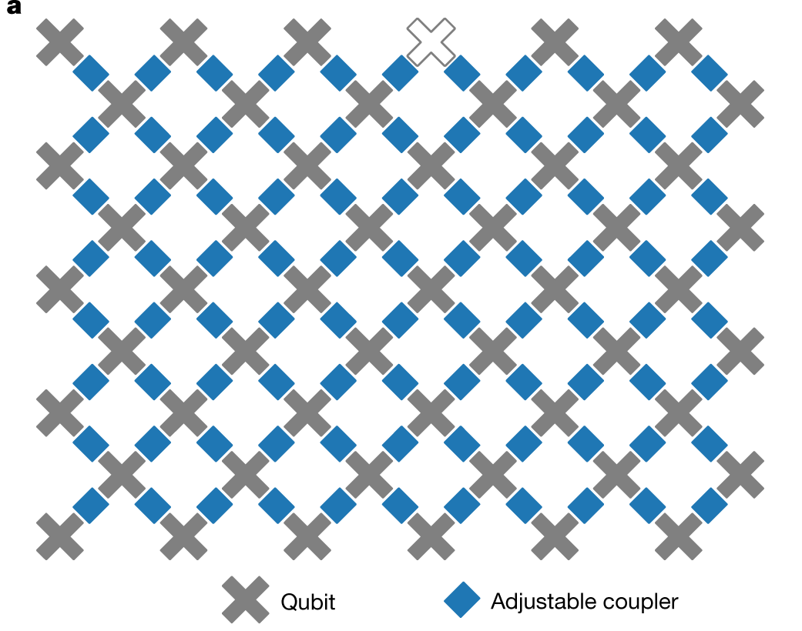
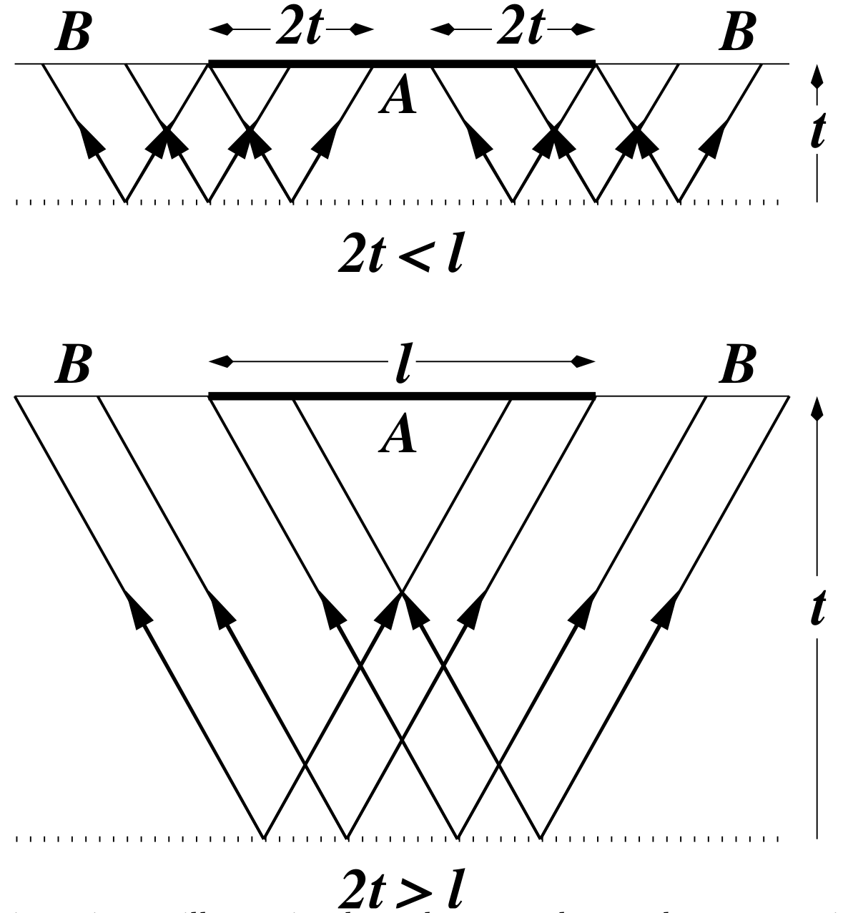
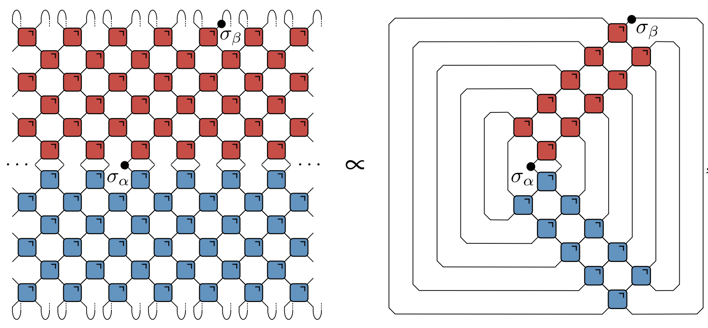
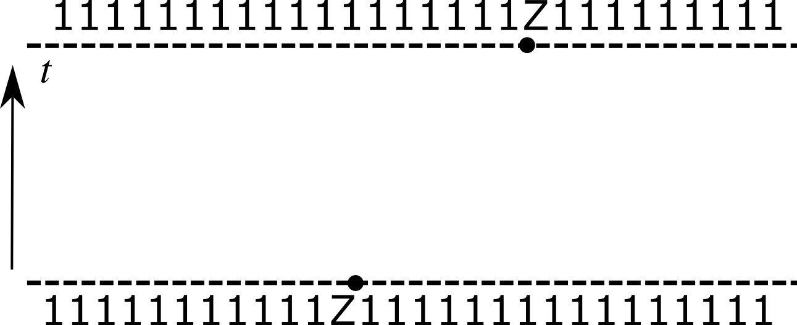
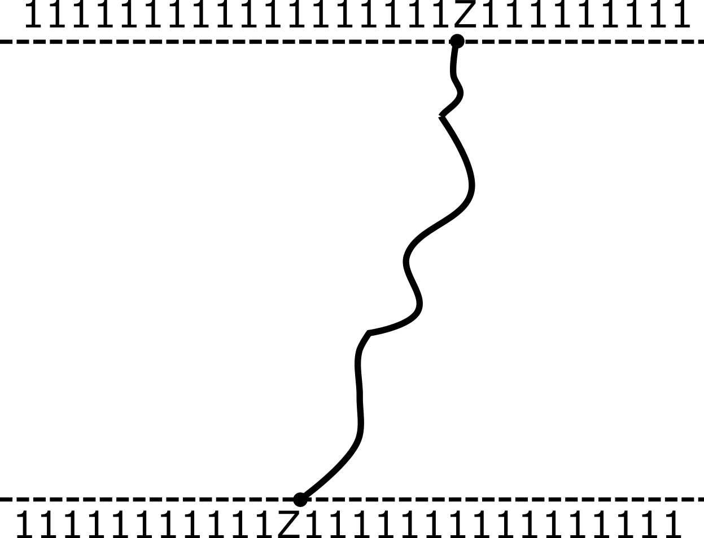

Here's my first lecture on quantum circuits.  

[Recent review](https://arxiv.org/abs/2111.08018)

Even more recent [Random Quantum Circuits
](https://www.annualreviews.org/doi/abs/10.1146/annurev-conmatphys-031720-030658)

Lots of other perspectives on circuits e.g. as quantum algorithms incl. variational quantum algos etc.

## What is a quantum circuit?

### Why consider circuits?

Google experiments. Locality as an important feature

The other important point I’d like to make is that the rules, being local, give rise to a notion of causality in the dynamics. That is, there is a maximal speed at which influences can propagate, corresponding to 45 degree lines in our pictures. With only a small abuse of terminology, we’ll often speak of a “light cone” in these systems.

Trotterization. Floquet systems. Example of kicked Ising

This will be an important example and we will return to it repeatedly.

### Notation

$X$, $Y$, $Z$ Paulis

Graphical notation. Simple examples of contraction

## Quantum circuits

In general, a quantum circuit is a map on the quantum state of a system composed of many identical subsystems. Usually these subsystems are *qubits* (spin-1/2 systems with Hilbert space $\mathbb{C}^2$) in analogy to the two states of an elementary cellular automaton. The two states 0 and 1 become two quantum states $\ket{0}$ and $\ket{1}$ that define the **computational basis**.

<figure align="center">

<figcaption>Schematic of a quantum circuit. Reading from left to right, $f$ acts on top five qubits, then $g$ acts on lower seven.</figcaption>
</figure>

The bijections that apply to each block in a block CA are replaced with unitary operators (other kinds of operations – measurements, for example – are possible). Quantum circuits are an important model of universal quantum computation, but we will mostly be interested in exploring them as systems with discrete time, many body quantum dynamics. We'll frequently borrow terminology from quantum computing, however: the unitary operators appearing in our circuits are called **gates**. The most concrete way to think about a $n$-qubit unitary is in terms of its matrix elements $U_{x_1\ldots x_n,x'_1,\ldots, x'_n}$ in the computational basis. 

### Everything is a tensor

A general state of $N$ qubits expressed in product basis as
  
$$
\ket{\Psi} = \sum_{x_{1:N}\in \{0,1\}^N} \Psi_{x_1\ldots x_N}\ket{x_1}_1\ket{x_2}_2\cdots \ket{x_N}_N
$$

where we write $\ket{x_1}\_1\ket{x_2}\_2\cdots \ket{x_N}\_N =\ket{x_1\cdots x_N}=\ket{x_{1:N}}$ for brevity. An operator on $N$ qubits has matrix elements

$$
\mathcal{O}\_{x_{1:N},x'_{1:N}} = \bra{x\_{1:N}}\mathcal{O}\ket{x'\_{1:N}}.
$$

To avoid writing multi-index expressions we'll often use [Penrose graphical notation](https://en.wikipedia.org/wiki/Penrose_graphical_notation), in which a quantity with $n$ indices – it's almost always called a "tensor", in the sense of algebra and not geometry – is represented by some kind of blob with $n$ legs. Note that the legs are distinguishable in general (unless the tensor is symmetric). The contraction of indices is indicated by joining legs appropriately. Some examples are shown below.

<figure align="center">

<figcaption>See <a href="https://github.com/ey3lock3r/MPS-Tutorial">Pan Zhang's tutorial</a> </figcaption>
</figure>

TODO Use Figures from Glen Evenbly's site

### Some gates

#### Unitary gates: one qubit

- Multiplication by a Pauli matrix: $X$, $Y$, or $Z$.

- General case $U = a_0\mathbb{1} + \vectorbold{a}\cdot(X,Y,Z)$ with $|a_0|^2+|\vectorbold{a}|^2=1$

- Other special cases used in quantum information e.g. [Hadamard gate](https://en.wikipedia.org/wiki/Quantum_logic_gate#Hadamard_gate)

$$
H = \frac{1}{\sqrt{2}}\begin{pmatrix}
1 & 1 \\\\
1 & -1
\end{pmatrix}
$$

#### Two qubits

Let's look at some examples of two qubit gates. We'll work in the basis $\ket{00}$, $\ket{01}$, $\ket{10}$, $\ket{11}$. We've already met the simplest example, the [SWAP gate](https://en.wikipedia.org/wiki/Quantum_logic_gate#Swap_gate)

$$
\operatorname{SWAP}=\begin{pmatrix}
1 & 0 & 0 & 0 \\\
0 & 0 & 1 & 0 \\\
0 & 1 & 0 & 0 \\\
0 & 0 & 0 & 1
\end{pmatrix}
$$.

$\operatorname{SWAP}$ switches the occupancies of the two sites:

$$
\operatorname{SWAP}\ket{10} = \ket{01}.
$$

Note that it takes product states to product states. A slightly more complicated example is the square root of SWAP

$$
\sqrt{\operatorname{SWAP}}=\begin{pmatrix}
1 & 0 & 0 & 0 \\\
0 & \frac{1}{2}(1+i) & \frac{1}{2}(1-i) & 0 \\\
0 & \frac{1}{2}(1-i) & \frac{1}{2}(1+i) & 0 \\\
0 & 0 & 0 & 1
\end{pmatrix}.
$$

Unlike $\operatorname{SWAP}$ this generates _entanglement_. That is, it takes a product state to a non-product state.

$$
\sqrt{\operatorname{SWAP}}\ket{10} = \frac{1}{2}\left[(1+i)\ket{10}+(1-i)\ket{01}\right].
$$

$\sqrt{\operatorname{SWAP}}$ conserves number of 1s and 0s. In fact, it is fully rotationally invariant. $\sqrt{\operatorname{SWAP}}$ together with arbitrary single qubit unitary operators form __universal gate set__ that allows for universal quantum computation.

TODO Conservation laws

#### General two qubit unitary

- Any two-qubit unitary $U\in \mathcal{U(4)}$ can be written

\begin{equation}
U = e^{i \phi} (u_+ \otimes u_-) V[J_x, J_y, J_z] (v_- \otimes v_+),
\end{equation} 

- $u_{\pm}, v_{\pm} \in SU(2)$

\begin{align}
 V[J_x, J_y, J_z] &= \exp \left[-i\left(J_x \sigma^x \otimes \sigma^x + J_y \sigma^y \otimes \sigma^y+ J_z \sigma^z \otimes \sigma^z\right)\right]\\
 &= \begin{bmatrix}
e^{-i J_z} \cos(J_-) & 0 & 0 & -i e^{-i J_z \sin(J_-)} \\\\
0 & e^{iJ_z} \cos(J_+) & -ie^{i J_z} \sin(J_+) & 0 \\\\
0 & -ie^{i J_z} \sin(J_+) & e^{iJ_z} \cos(J_+) & 0 \\\\
-i e^{-i J_z \sin(J_-)} & 0 & 0 & e^{-i J_z} \cos(J_-) \\\\
\end{bmatrix}
\end{align}

- 16 parameters!

### Time evolution

#### Single qubit gates

- Time evolution operator $U=\exp(-iHt)$

- If $H=\sum_j h_j$ a sum of single qubit terms

$$
\mathcal{U} = \exp(-iHt) = \prod_j \exp(-ih_j) = \prod_j U_j
$$
$$
U_j=\mathbb{1}\otimes \ldots \otimes\mathbb{1} \otimes \overbrace{u_j}^{j\text{th factor}} \ldots \otimes\mathbb{1}
$$

#### Two qubit gates

- Simplest example of two qubit interaction is __exchange Hamiltonian__

$$
\begin{align}\label{eq:exchange}
h_{12} &= J\left[X\otimes X+Y\otimes Y+Z\otimes Z\right] =J\left[X_1X_2+Y_1Y_2 + Z_1Z_2\right]\\\
&=2\operatorname{SWAP} - 1
\end{align}
$$
$$
U(J) = \exp(-ih_{12}) = e^{iJ}\left[\cos (2J) \mathbb{1} - i\sin (2J) \operatorname{SWAP}\right]
$$

- Special cases 

$$
U(\pi/4)=\operatorname{SWAP}
$$
$$
U(\pi/8)=\sqrt{\operatorname{SWAP}}
$$

- $H=\sum_{i,j} h_{i,j}$ a sum of two qubit terms with $[h_{i,j},h_{j,k}]\neq 0$

- $\mathcal{U}\neq \prod_{i,j} \exp(-ih_{i,j})$. More complicated!

- __Suzuki–Trotter__ expansion: decompose $H=H_A + H_B$

$$
\mathcal{U} = \exp(-iH) = \left[\exp\left(-\frac{iH}{n}\right)\right]^n \sim \left[e^{-iH_A/n} e^{-iH_B/n}\right]^n 
$$

$$
H = \sum_j h_{j,j+1}
$$
$$
H_A = \sum_j h_{2j, 2j+1}\qquad H_B = \sum_j h_{2j-1, 2j}
$$
$$
e^{-iH_A/n}=\prod_j U_{2j,2j+1}\qquad e^{-iH_B/n} = \prod_j U_{2j-1,2j}
$$

### Floquet theory: kicked Ising model

- Time dependent Hamiltonian with kicks at $t=0,1,2,\ldots$.

$$
\begin{aligned}
H_{\text{KIM}}(t) = H_\text{I}[\mathbf{h}] + \sum_{m}\delta(t-n)H_\text{K}\\
H_\text{I}[\mathbf{h}]=\sum_{j=1}^L\left[J Z_j Z_{j+1} + h_j Z_j\right],\qquad H_\text{K} &= b\sum_{j=1}^L X_j,
\end{aligned}
$$

- "Stroboscopic" form of $\mathcal{U}(t)=\mathcal{T}\exp\left[-i\int^t H_{\text{KIM}}(t') dt'\right]$

$$
\begin{aligned}
  \mathcal{U}(n_+) &= \left[\mathcal{U}(1_+)\right]^n,\qquad U(1_-) = K I_\mathbf{h}\\\
  I_\mathbf{h} &= e^{-iH_\text{I}[\mathbf{h}]}, \qquad K = e^{-iH_\text{K}}
\end{aligned}
$$

### KIM as a circuit

$$
\begin{aligned}
  \mathcal{K} &= \exp\left[-i b X\right]\\\
  \mathcal{I} &= \exp\left[-iJ Z_1 Z_2 -i \left(h_1 Z_1 + h_2 Z_2\right)/2\right].
\end{aligned}
$$

### Locality 

In analogy with block CAs, we are going to be concerned with *brickwork unitary circuits*, in which a sequence of two qubit gates is applied in an alternating fashion. Just like their classical counterparts, we'll see that these systems come with an inbuilt notion of causality.

Aside from the intrinsic interest of exploring the analogy to CAs, there is a very good reason to explore circuits in which unitaries act locally, rather than between abitrarily separated qubits. Namely, locality is often a feature of real quantum computing architectures, such as [Google's Sycamore processor](https://en.wikipedia.org/wiki/Sycamore_processor), where qubits are arranged in a square lattice with coupling between nearest neighbors. 

<figure align="center">

<figcaption> (top) a schematic view of the Google Sycamore processor and (bottom) the real thing.</figcaption>
</figure>

The propagation of causal influences characteristic of local quantum circuits is therefore very much a feature of real quantum computing platforms, as we'll see in more detail later.

### Computational complexity

One big difference between a quantum circuit and a CA is the difficulty of simulating each on a (classical) computer. The state of a CA consists of a single bitstring giving the value of each cell, and the state at the next instant is obtained by applying a series of deterministic maps, which could easily be parallelised if necessary. On the other hand, the state of the qubits at an instant is a vector in $2^N$ dimensional space, which will become difficult to store when $N$ is not too large. Updating the state involves acting on this vector with a unitary matrix. Naive matrix-vector multiplication takes a number of operations $O(\operatorname{dim}^2)=2^{2N}$. Since our gates amount to *sparse* matrices, it is possible to instead accomplish this in $O(\operatorname{dim})=2^{N}$, but this is _still exponentially hard in the number of qubits_. The difficulty of performing such calculations on a classical computer is the basis of ["quantum supremacy"](https://en.wikipedia.org/wiki/Quantum_supremacy) demonstrations based on sampling the output of quantum circuits. Roughly, the idea is to measure (approximately) the distribution of bitstrings output by a quantum circuit from a fixed initial state, in a regime where a classical simulation of the same circuit is intractable.

The total number of (time) steps $T$ taken is often referred to as the *depth* of the circuit. For low depth $T<N$ it pays to move  _horizontally_ instead (i.e. in the spatial direction). Note that the problem of finding the best way to contract a general tensor network is NP-hard.

TODO More stuff about supremacy and other methods...

e.g. [Pan and Zhang](https://arxiv.org/abs/2103.03074)

[Napp et al](https://journals.aps.org/prx/abstract/10.1103/PhysRevX.12.021021 )

Preview of quantum supremacy.

## Quantities of interest

We now turn to some of the features of dynamics in quantum circuits, beginning with the simplest question: computing the expectation value of a (local) operator

### Expectation values

Here the goal is to evaluate $\bra{\Psi}\mathcal{O}\ket{\Psi}=\bra{\Psi_0}\mathcal{U}^\dagger\mathcal{O}\mathcal{U}\ket{\Psi_0}$ for a local operator $\mathcal{O}$, where $\mathcal{U}$ is the *overall* unitary operator describing the whole circuit. The simplest example of such an operator is a Pauli operator $X$, $Y$, or $Z$ for one of the qubits.

#### Unitarity in graphical notation

One of the additional complexities in graphically representing thiese calculations is that we have to consider both unitaries and their conjugates. For this reason it's convenient to introduce a color-coded notation 

<figure align="center">

<figcaption> Notation for gates and their conjugates </figcaption>
</figure>

The condition of unitarity has the form

$$
\sum\_{x_1'\ldots x_N'}U_{x_1\ldots x_n,x'_1,\ldots, x'_n} U^\dagger\_{x'_1\ldots x'_n,x''_1,\ldots, x''_n}=\delta\_{x_1,x_1''}\ldots \delta\_{x_N,x_N''},
$$

but we'll shortly introduce a graphical notation to avoid such awful looking expressions.

Putting all these notational elements together, it's possible to express the condition of unitarity of a two qubit gate in purely graphical form:

<figure align="center">

<figcaption> Unitarity of a two qubit gate expressed in graphical notation </figcaption>
</figure>

Much better! (than what we had above)

#### Using unitarity

This calculation has the diagrammatic representation
 

 
<object data="assets/expectation.svg" type="image/svg+xml" width='600'></object>

where we leave the initial state $\ket{\Psi}$ unspecified at the moment. 

Since every $U$ is accompanied by a $U^\dagger$, it's extremely convenient to introduce a notation that includes them both in a single unit, by "folding" one on top of the other

<figure align="center">

<figcaption> The folded picture. The purple box represents both $U$ and $U^\dagger$ for a gate.</figcaption>
</figure>

In this folded representation, lines correspond to two indices, and therefore $2^2=4$ dimensions. The unitarity condition takes the form:

<figure align="center">

<figcaption> Unitarity condition in the folded representation. A circle denotes contraction a Kronecker delta $\delta_{aa'}$.</figcaption>
</figure>

In the folded picture the expectation value $\bra{\Psi}\mathcal{O}\ket{\Psi}$ looks like this

TODO Add the operator!!

<object data="assets/folded-expectation.svg" type="image/svg+xml"></object>

If you click on the picture you can toggle the effect of applying the unitarity condition. After unitarity has been used to eliminate as many gates as possible, a "light cone" emerges, reflecting the region of the circuit that affects the expectation value.

<object data="assets/contracted-density-matrix .svg" type="image/svg+xml"></object>

### Reduced density matrix

Any expectation value of an operator in a region $A$ can be computed in terms of the *reduced density matrix* $\rho_A$ for region $A$, defined by

$$
\rho_A = \operatorname{tr}\_{B}\left[\ket{\Psi}\bra{\Psi}\right]=\operatorname{tr}_{B}\left[\mathcal{U}\ket{\Psi_0}\bra{\Psi_0}\mathcal{U}^\dagger\right],
$$

where $B$ is the complement of $A$. $\rho_A$ has the diagrammatic representation (where $A$ consists of the four central sites):

<object data="assets/reduced-density-matrix.svg" type="image/svg+xml"></object>

Again, you can toggle the effect of using unitarity to remove gates.

TODO emphasize that even if you start from a complicated state, you only have to deal with the reduced density matrix of that state at the bottom

### Dynamics of entanglement

#### Quantifying entanglement

The reduced density matrix can be used to quantify the entanglement present in a quantum state describing a system composed of two subsystems A and B. A general state of such a system is a vector in $\mathcal{H}=\mathcal{H}\_A\otimes\mathcal{H}\_B$  and can be written in terms of basis vectors $\ket{a}\_A$ and $\ket{b}\_B$ for the A and B subsystems as

$$
\begin{equation}\label{gen_state}
\ket{\Psi}\_{AB} = \sum\_{a=1}^{n\_A}\sum\_{b=1}^{n\_B} \Psi\_{ab}\ket{a}\_A\ket{b}\_B 
\end{equation}
$$

where $n\_{A/B}=\operatorname{dim} \mathcal{H}\_{A/B}$. Now we regard the components $\psi_{ab}$ as a matrix and perform a singular value decomposition. This is equivalent to finding new orthonormal bases $\ket{u_n}\_{A}$ and $\ket{v\_n}\_B$ for the two spaces such that the  action of $\Psi\_{ab}$ maps between basis vectors of two subsystems (with rescaling)

{}

[Singular value decomposition](https://en.wikipedia.org/wiki/Singular_value_decomposition) (SVD) is an example of [matrix factorization](https://en.wikipedia.org/wiki/Matrix_decomposition), in which a matrix $M$ is written as a product of matrices of specific form. In particular, SVD corresponds to the factorization

$$
M = U\Sigma V
$$

where $U$ and $V$ unitary and $\Sigma$ is diagonal with non-negative real entries. SVD _completely general_, appying to all rectangular matrices. If $M$ is $m\times n$, then $U$ is $m\times m$, $V$ is $n\times n$, and $\Sigma$ is $m\times n$. The $\min(m,n)$ diagonal elements $\sigma\_i>0$ of $\Sigma$ are called the _singular values_. The number of nonzero singular values is the [rank](https://en.wikipedia.org/wiki/Rank_(linear_algebra)) of matrix, and is equal to number of independent rows or columns. For a general rectangular matrix the rank is $\min(m,n)$.

{}

In the new bases our state $\eqref{gen_state}$ is

$$
\ket{\Psi}\_{AB} = \sum\_{n=1}^{\min(n_A, n_B)} \sigma\_n \ket{u\_n}\_A\otimes\ket{v\_n}\_B.
$$

Note the _single sum_, to be compared with the double sum in $\eqref{gen_state}$. This is the [Schmidt decomposition](https://en.wikipedia.org/wiki/Schmidt_decomposition) (in this context $\sigma_n$ are called the Schmidt coefficients), though as we've seen it's really just a restatement of SVD.

If there is only one nonzero singular value state we have a _product state_ indicating no correlations between subsystems. Note that this might not have been evident in original representation $\eqref{gen_state}$.

The simplest example displaying nontrivial entanglement is the [Bell state](https://en.wikipedia.org/wiki/Bell_state) of a system consisting of two spin-1/2 subsystems:

$$
\begin{equation}
\left|\Psi^{+}\right\rangle=\frac{1}{\sqrt{2}}\left(|0\rangle_A \otimes|1\rangle_B+|1\rangle_A \otimes|0\rangle_B\right).
\end{equation}
$$

This state is already written in Schmidt form and the two singular values are both $\frac{1}{\sqrt{2}}$, indicating maximal entanglement. In general the Schmidt coefficients $\sigma_n$ provide the most complete characterization: they are often known as the __entanglement spectrum__. 

The Schmidt decomposition is closely related to the reduced density matrix, which we have met already. A simple calculation gives:

$$
\begin{align}
\rho_A &= \operatorname{tr}\_B\left[\ket{\Psi}\bra{\Psi}\right] 
= \sum\_n \sigma_n^2 \ket{u\_n}\bra{u\_n}
\end{align}
$$

The eigenvalues of the reduced density matrix are thus $p_n=\sigma_n^2$. The degree of entanglement can then be quantified by the von Neumann entropy of $\rho_A$ – called the **entanglement entropy** – defined by

$$
S^{(\text{vN})}_A \equiv -\operatorname{tr}\left[\rho_A\log \rho_A\right].
$$

$S_A$ vanishes for a product state, and is otherwise positive. The [Rényi entropies](https://en.wikipedia.org/wiki/R%C3%A9nyi_entropy) provide an alternative characterization of the entanglement spectrum 

$$
  S^{(\alpha)}\_A = \frac{1}{1-\alpha}\log \text{tr}\left[\rho^n\right]=\frac{1}{1-\alpha}\sum\_n p\_n^\alpha,
$$

where $\alpha\geq 0$. The von Neumann entropy is $S^{(\text{vN})}\_A=\lim\_{\alpha\to 1} S^{(\alpha)}\_A$. The zeroth Rényi entropy $S^{(0)}\_A$ is the number of nonzero Schmidt coefficients (aka [Schmidt rank](https://en.wikipedia.org/wiki/Schmidt_decomposition#Schmidt_rank_and_entanglement)). Finally, the second Rényi entropy $S^{(2)}\_A$ is

$$
S^{(2)}\_A = -\log \sum_n p_n^2 = -\log \gamma\tr \rho_A^2
$$

where $\gamma\equiv \tr \rho_A^2$ is the [purity](https://en.wikipedia.org/wiki/Purity_(quantum_mechanics)) of the reduced density matrix.

#### Toy model

We can get some intuition for the growth of entanglement from a toy model. We consider a circuit that consists of the repeated application of SWAP gates. 

<figure align="center">

<figcaption>Initially neighboring correlated pairs subject to a block CA consisting of SWAP operations. </figcaption>
</figure>

The initial state of the system, now corresponding to a quantum state of the qubits, is a product state over pairs $(x_0, x_1)$, $(x_2, x_3)$, and so on, with each pair in the [Bell state](https://en.wikipedia.org/wiki/Bell_state)

$$
\ket{\Phi^+}\_{2n, 2n+1} = \frac{1}{\sqrt{2}}\left[\ket{0}\_{2n}\ket{0}\_{2n+1}+ \ket{1}\_{2n}\ket{1}\_{2n+1}\right]
$$

The reduced density matrix for one member of a Bell pair is

$$
\operatorname{tr}\_{2}\left[\ket{\Phi^+}\_{12}\bra{\Phi^+}\_{12}\right] = \frac{1}{2}\mathbb{1}_1
$$

with an entanglement entropy of one bit. 

The reduced density matrix $\rho_A$ therefore has a factor $\mathbb{1}_n$ for each site $n\in A$ whose "partner" qubit is in $B$. If both qubits of a Bell pair are at sites  $n,m\in A$ they contribute a factor $\ket{\Phi^+}\_{nm}\bra{\Phi^+}\_{nm}$, which is a pure state. The entanglement entropy has contributions from the former case only, and we get

$$
 S_A = \min(4\lfloor t/2\rfloor, |A|) \text{ bits}
$$

After time $\sim |A|/2$ the subsystem has thermalized. 

<figure align="center">

<figcaption> 
TODO Caption goes here
</figcaption>
</figure>

This kind of behaviour has been found in many systems, beginning with the work of [Calabrese and Cardy (2005)](https://iopscience.iop.org/article/10.1088/1742-5468/2005/04/P04010/meta). In noninteracting systems or integrable systems, it is often explained in terms of the causal propagation of (quasi-)particles:

<figure align="center">

<figcaption> 
TODO Caption goes here
</figcaption>
</figure>

Our toy model with SWAP gates is arguably rather similar, with the qubits playing the role of "noninteracting particles". As we'll see next time, however, this picture remains true in circuits where there is no quasiparticle interpretation. 
TODO Page bound / Page curve

### Correlation functions

Entanglement is a rather difficult quantity to access experimentally, as it is not obviously related to observable quantities. In many body physics we are instead often concerned with correlation functions of observables. Although the calculation of correlation functions is usually ferociously difficult, we can actually obtain (albeit limited) results in unitary circuits quite easily.

#### Graphical representation

The natural correlation function to consider is

$$
c_{\alpha \beta}(x,t) = \frac{1}{2^N}\tr\left[\sigma_{\alpha}(x,t) \sigma_{\beta}(0,0) \right],\qquad \sigma_\alpha(x,t)=\mathcal{U}^\dagger(t)\sigma_\alpha(x)\mathcal{U}(t).
$$

That is, we average overall all possible initial states uniformly. This is often described as the "infinite temperature" situation, but temperature is not defined is this situation, as there is no Hamiltonian and thus no Boltzmann distribution. 

In the graphical representation the correlation function has the form shown below left (in the unfolded representation). This can be simplified using the unitarity condition to give the "skeleton" shown on the right. 

<figure align="center">

<figcaption> 
Graphical representation of the correlation function. (Left) the full circuit involving unitary gates and their conjugates. (Right) after simplifying using the unitarity condition. 
</figcaption>
</figure>

When $|x|>t$ the same condition leads to the removal of _all_ $U$s and $U^\dagger$s 

$$
c_{\alpha \beta}(x,t) = \frac{1}{4}\tr\left[\sigma_{\alpha}\right]\tr\left[\sigma_{\beta}\right]=0,
$$

and the correlations vanish (if the operators are traceless). On the light cone when $|x|=t$ the remaining tensor network is particularly simple:

<figure align="center">

</figure>

The graphical expression for the correlation function can be written in several ways, including in the folded representation:

<fig align="center">

</fig>

Here $q$ is the local Hilbert space dimension (we've been considering $q=2$ up to now). The normalization factor is most easily understood by comparing with the case $\sigma_\alpha=\sigma_\beta=\mathsf{1}$ (in the diagram $t=4$).

The best way to evaluate this expression is to iteratively apply the operator map $\mathcal{M}\_+$ or $\mathcal{M}\_-$ defined as:

<fig align="center">

</fig>

The correlations functions can then be expressed as

$$
\begin{align}\label{eq:CorrChannels}
\langle \sigma\_{\alpha}(t,t) \sigma\_{\beta}(0,0) \rangle &= \tr \left[\sigma\_{\beta}\mathcal{M}\_{-}^t(\sigma\_{\alpha})\right] / q \\\
&=  \tr \left[ \sigma\_{\alpha}\mathcal{M}\_{+}^{t}(\sigma\_{\beta})\right] / q
\end{align}
$$

$\mathcal{M}\_\pm$ are examples of [quantum channels](https://en.wikipedia.org/wiki/Quantum_channel): completely positive trace preserving maps between spaces of operators. $\mathcal{M}\_\pm$ have the additional property of being _unital_: $\mathcal{M}\_\pm(\mathsf{1})=\mathsf{1}$.

The typical behaviour of correlations is shown below. By fine tuning the choice of gates, less generic behaviour may be observed. A trivial example would be a circuit made of SWAP gates, in which case the correlations would not decay at all.

<fig align="center">

<figcaption>
Evolution of light cone correlations for a "typical" gate with no conservation laws. Exponential decay can be clearly observed after an initial transient regime, where all correlation functions decay at the same rate. Taken from <a href="https://journals.aps.org/prresearch/abstract/10.1103/PhysRevResearch.2.033032">Claeys and Lamacraft (2020)</a>.
</figcaption>
</fig>

We've argued that the dynamics of quantum circuits has the full complexity we'd expect of other problems in many-body quantum mechanics, so it can be a little surprising that we can calculate _particular_ correlations at long times without much difficulty. However, the proper notion of separation in a circuit is _Lorentzian_, and we have been considering points at zero Lorentzian separation. 

There's nothing to stop us using the same formalism to evaluate correlations inside the light cone. In our original diagram we had correlations "one step inside" the light cone. We can evaluate these in the same way, at the expense of introducing a larger quantum channel that acts on two-site operators: a space of dimension $q^4$. In general taking $s$ steps inside gives a quantum channel acting on a $q^{2s}$-dimensional space. So the general situation is really exponentially hard, as we'd expect.

Finally, note that the vanishing of correlations outisde the light cone is a consequence of averaging over all states: correlations can be nonzero outside the light cone for _particular_ states e.g. the ground state of some Hamiltonian. 

### Operator spreading

How does a local operator "look" as it evolves in the Heisenberg picture? Up until recently it seems people hadn't thought about this question too much. A local spin operator  $Z_n(t)=\mathcal{U}^\dagger(t)Z_n \mathcal{U}(t)$ may be used to calculate a correlation function such as $\langle Z_n(t)Z_m(0) \rangle$, but this is only one "component" of $Z_n(t)$. 

Let's be more explicit. Since the Pauli operators $X$, $Y$, $Z$, and the identity form a basis of hermitian operators at a site, any observable such as $Z_n(t)$ can be expressed as an expansion in products of these operators

$$
Z_n(t)= \sum_{\mu_{1:N}=\\{1,x,y,z\\}^N} \mathcal{C}\_{\mu_{1:N}}(t) \sigma_1^{\mu_1}\otimes\cdots \sigma_N^{\mu_N},
$$

with the coefficients $\mathcal{C}\_{\mu_{1:N}}(t)$ obeying the initial condition

$$
\begin{equation}
\mathcal{C}\_{\mu_{1:N}}(0)=\begin{cases}
1 & \mu_j=z, \mu_k=1,\forall k\neq j \\\\
0 & \text{otherwise},
\end{cases}
\end{equation}
$$

Since $\tr\left[\sigma_\alpha\sigma_\beta\right]=2\delta_{\alpha\beta}$ the spin correlations we considered earlier can be extracted from $\langle Z_j(t)Z_k(0)\rangle=C_{jk}(t) \equiv \mathcal{C}_{1\cdots \mu_k=z \cdots 1}(t)$. This represents only one component of the operator expansion, however.

<fig align="center">

</fig>

TODO change notation of coefficients to be in line with review paper.

#### Example: $SU(2)$ preserving gate

Let's see how the operator dynamics looks for a particular simple family of gates: those generated by the exchange Hamiltonian $\eqref{eq:exchange}$:

$$
U\_{j,j+1} = \cos\theta \mathbb{1}\_{j,j+1} + i\sin\theta \operatorname{\mathsf{S}}\_{j.j+1}.
$$

Here $\operatorname{\mathsf{S}}_{j,j+1}$ denotes $\operatorname{\mathsf{SWAP}}$ gate on sites $j$ and $j+1$. The action of this gate on an operator is

\begin{multline}
\mathcal{O} \longrightarrow U^\dagger\_{j,j+1}\mathcal{O}U\_{j,j+1} = \cos^2\theta \mathcal{O} + \sin^2\theta \operatorname{P}\_{j.j+1}\mathcal{O} \operatorname{P}\_{j.j+1} \\\
-i\sin\theta\cos\theta \left[\operatorname{P}\_{j.j+1}, \mathcal{O}\right]
\end{multline}

Now we are going to introduce the first example of what we'll see is a generally useful idea. We consider an _ensemble_ of _random circuits_ where the gates are chose iid from some distribution. We can then consider averages of quantities of interest —  in this case the correlation functions — over this ensemble. In the present family there is only one parameter and we take the simple distribution $\theta=\pm \theta_0$ with $p(\theta_0)-p(-\theta_0)\equiv \delta > 0$.

Averaging the evolved operator then gives

\begin{multline}
\overline{U^\dagger_{j,j+1}\mathcal{O}U_{j,j+1}} = \cos^2\theta_0 \\, \mathcal{O} + \sin^2\theta_0 \\, P_{j.j+1}\mathcal{O} P_{j.j+1} \\\\
+i\delta \sin\theta_0\cos\theta_0 \left[P_{j.j+1}, \mathcal{O}\right]
\end{multline}

The interpretation of this expression is the following. 

1. Operators on sites $j$ and $j+1$ switch with probability $\sin^2\theta_0$.
2. The asymmetry $\delta$ governs strength of "quantum" dynamics.

In the continuous time limit (see [Claeys, Lamacraft, and Herzog-Arbeitman](https://journals.aps.org/prl/abstract/10.1103/PhysRevLett.128.246603) for the details) this becomes

$$
\frac{d\bar{\mathcal{O}}}{dt} = \sum_j \left[iJ \left[P_{j,j+1},\bar{\mathcal{O}}\right]+\left(P_{j,j+1}\bar{\mathcal{O}}P_{j,j+1}-\bar{\mathcal{O}}\right)\right].
$$

where $J\propto \delta$. Computing the commutator in the first term gives

\begin{align}
i[P,\sigma^a\otimes 1]&=-\epsilon^{abc}\sigma^b\otimes\sigma^c\nonumber\\\\
i[P,1\otimes \sigma^a]&=\epsilon^{abc}\sigma^b\otimes\sigma^c\nonumber\\\\
i[P,\sigma^a\otimes \sigma^b]&=\epsilon^{abc}\left(\sigma^c\otimes 1- 1\otimes \sigma^c\right).
\label{eq:split-merge}
\end{align}

You can check that the total spin $\sum_j \sigma_j^a$ is conserved by virtue of the first two of these expressions. In general, the resulting equation of motion describes operator "splitting" ($1\to 2$) and "merging" ($2\to 1$). 

Let consider a simple limit: $J=0$, in which case there is no asymmetry between $\pm\theta$. In this case there is no splitting and merging and terms with different numbers of non-identity operators decouple from each other. Consider the single operator sector. Writing $\mathcal{C}^a_{0\cdots \mu_k=a\cdots 0}\equiv C^a_k$ we have equation of motion

$$
\partial_t C^a_k = C^a_{k+1} + C^a_{k-1} - 2 C^a_k\equiv \Delta_k C^a_k,
$$

which describes diffusion of a single $\sigma^a$ ($\Delta_k$ is 1D discrete Laplacian)

<figure align="center">

<figcaption> 
Simple diffusion of a single operator when $J=0$.
</figcaption>
</figure>

In general a set of non-identity operators diffuse with a hardcore constraint (we can only have one operator per site).

When $J\neq 0$ the equation of motion has the component form

$$
\begin{align}
\partial_t \mathcal{C}\_{\mu_{1:N}} = \sum_j \left[J\epsilon_{\alpha\beta \mu_j \mu_{j+1}} \mathcal{C}\_{\mu_1\cdots \alpha\beta \cdots \mu_N} + \mathcal{C}\_{\mu_1\cdots \mu_{j+1}\mu_j \cdots \mu_N} - \mathcal{C}\_{\mu_1\cdots \mu_{j}\mu_{j+1} \cdots \mu_N}\right].
\end{align}
$$

The first term leads to a single site operator at $t=0$ spreading over many sites as time passes.

<figure align="center">

<figcaption> 
Graphical representation of the perturbative solution to the equation of motion. See <a href="https://journals.aps.org/prresearch/abstract/10.1103/PhysRevResearch.2.033032">Claeys, Lamacraft, and Herzog-Arbeitman (2022)</a> for more details.
</figcaption>
</figure>

This qualitative behaviour is known as __operator spreading__ and is a generic feature of operator dynamics. The reason why spreading is suppressed at $J=0$ is because we considered the _average_ dynamics. In any sample from our random circuit, a single-site operator spreads to many sites, but the random signs of the coeffcients that describe this spreading mean that when we take the average we get zero: only the single site contributions remain. When $J\neq 0$ some contribution survives and this allows for a controlled expansion. 

To understand the operator spreading in more detail we'd like a measure that is insensitive to these random signs.

### Out of time order correlator

The simplest such quantity is known (long-windedly) as the **out of time order correlator** (OTOC) and is defined as

$$
\operatorname{OTOC}_{jk}(t) \equiv \langle Z_j(t)Z_k(0)Z_j(t)Z_k(0)\rangle.
$$

This is not particular illuminating, though it explains the name. Things become a bit clearer when the OTOC is expressed in terms of the operator expansion (starting from the same initial condition with $\mu_j=x$):

$$
\operatorname{OTOC}\_{jk}(t)\propto \sum_{\mu_{1:N}}\mathcal{C}\_{\mu_{1:N}}^2(t)\left[\delta_{\mu_k,0}+\delta_{\mu_k,3}-\delta_{\mu_k,1}-\delta_{\mu_k,2}\right].
$$

We see that $\operatorname{OTOC}\_{jk}(t)\neq 1$ when operator $Z_j(t)$ spreads from site $j$ to site $k$ (the characteristic speed of propagation of the OTOC is known as the "butterfly velocity" $v_\text{B}$, after the [butterfly effect](https://en.wikipedia.org/wiki/Butterfly_effect)). Additionally, the OTOC depends on the *square* of the coefficients, so survives averaging over random circuits. 

#### Google's OTOC experiment

The OTOC was measured in 2021 in a [groundbreaking experiment](https://www.science.org/doi/full/10.1126/science.abg5029?casa_token=TkmMj95XIYoAAAAA:NP67A_aYhL8lSDWtuG99i8oFfx1c79-Lz-UGKYsW1-bee3hQ7weJSxLLQwpPzfSEPvEqt6SPbB4UYA) from the Google Quantum AI team. The two qubit gates were either all $i\operatorname{\mathsf{SWAP}}$ gates or all $\sqrt{i\operatorname{\mathsf{SWAP}}}$. After averaging over single qubit gates very different behaviors were obtained for these two cases.

TODO How does the experiment work?

<figure align="center">

<figcaption> The measured OTOC for $i\operatorname{\operatorname{\mathsf{SWAP}}}$ gates (top) and $\sqrt{i\operatorname{\mathsf{SWAP}}}$ (bottom) after averaging over single qubit gates.</figcaption>
</figure>

For $i\operatorname{\mathsf{SWAP}}$ gates the OTOC has a front that moves at the maximal speed and remains sharp, whereas for $\sqrt{i\operatorname{\mathsf{SWAP}}}$ the front moves more slowly and broadens with time. In the next lecture we will develop a theoretical picture of the OTOC dynamics in random circuits that will allow us to understand these features

### Operator entanglement

The OTOC provides one measure of operator spreading, but this doesn't capture all the relevant features of the operator dynamics. In particular, the OTOC between sites $j$ and $k$ can differ from one if only a _single_ coefficient $\mathcal{C}\_{\mu_{1:N}}$ with $\mu\_k=x,y,z$ is nonzero. Such a situation is the operator analog of a product state, and we'd like some way of quantifying how close or how far we are from such a situation: i.e. roughly how many different contributions there are to the operator expansion. 

In the case of states we introduced entanglement measures based on the Schmidth decomposition, and we can do something entirely analogous for operators. Partitioning our system into A and B subsystems as before, we seek to express    

$$
\mathcal{O}\_{AB} = \sum\_{n=1}^{\min(n^2_A, n^2_B)} \Sigma\_n A_n\otimes B_n.
$$

where $\Sigma_n\geq 0$ are the operator Schmidt coefficients $A_n$ and $B_n$ are operators on $\mathcal{H}\_A$ and $\mathcal{H}\_B$ that are orthonormal under the Hilbert–Schmidt inner product i.e. $\tr\left[A^\dagger_m A_n\right]=\tr\left[B^\dagger_m B_n\right]=\delta_{mn}$.

There's really no difference between the two Schmidt decompositions. In the operator case we treat the operator as a $n_A^2\times n_B^2$ matrix and use SVD as before. The same entanglement measures as before can then be applied to evaluate the operator entanglement. 

The simplest example, analogous to the Bell states, is provided by the the SWAP operator. As we've already seen it can be written

$$
\operatorname{\mathsf{SWAP}}=\frac{1}{2}\left[X\otimes X+Y\otimes Y+Z\otimes Z + \mathsf{1}\otimes\mathsf{1}\right],
$$

which is Schmidt decomposed form, showing that all the Schmidt coefficients are equal.

TODO Magic and OTOC ([Jaffe resource theory](https://www.pnas.org/doi/10.1073/pnas.2217031120#sec-1-3) paper)

OTOC fluctuations

TODO The word "scrambling". Must clarify

TODO Look ahead to next lecture