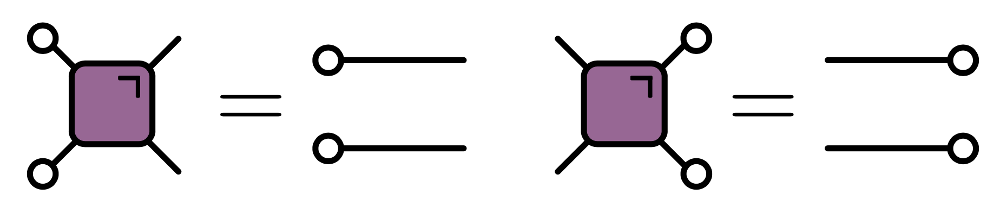
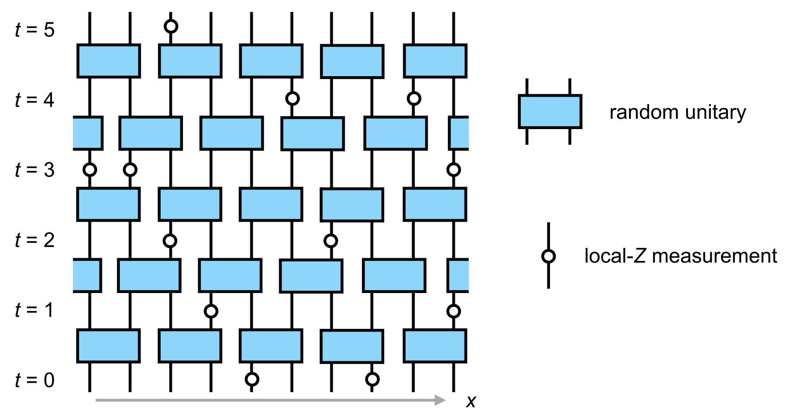

## Recap

Here's my second lecture on quantum circuits.  

Where we got to

$$
\operatorname{OTOC}_{jk}(t) \equiv \langle Z_j(t)Z_k(0)Z_j(t)Z_k(0)\rangle.
$$

This is not particular illuminating, though it explains the name. Things become a bit clearer when the OTOC is expressed in terms of the operator expansion:

$$
\operatorname{OTOC}\_{jk}(t)\propto \sum_{\mu_{1:N}}\mathcal{C}\_{\mu_{1:N}}^2(t)\left[\delta_{\mu_k,0}+\delta_{\mu_k,3}-\delta_{\mu_k,1}-\delta_{\mu_k,2}\right].
$$

## Random circuits

Map some things to Markov process

Why does Markov work? Include Kasia observation.

Connection to FA model. Add material from graduate lectures here

### $\overline{\operatorname{OTOC}}$: stochastic model

TODO Seems to have been redisovered several times. Originally due to Plenio (2007)

- See [Google's OTOC experiment](https://www.science.org/doi/full/10.1126/science.abg5029?casa_token=TkmMj95XIYoAAAAA:NP67A_aYhL8lSDWtuG99i8oFfx1c79-Lz-UGKYsW1-bee3hQ7weJSxLLQwpPzfSEPvEqt6SPbB4UYA) (supplementary material)

- Continuous time version in [Rowlands and Lamacraft](https://journals.aps.org/prb/abstract/10.1103/PhysRevB.98.195125)

- Main idea: OTOC extracted from 

$$
\hat{\mathcal{O}}^{(2)}(t)=\overline{\hat{O}(t) \otimes \hat{O}(t)} \equiv \overline{\hat{O}(t)^{\otimes 2}}
$$

---

$$
\hat{\mathcal{O}}^{(2)}(t)=\overline{\hat{O}(t) \otimes \hat{O}(t)} \equiv \overline{\hat{O}(t)^{\otimes 2}}
$$

- Invariant subspace that survives averaging built from $\mathsf{O} \equiv\mathbb{1}\otimes\mathbb{1}$ and $\mathsf{1}\equiv\frac{1}{3}\left[X\otimes X + Y\otimes Y+ Z\otimes Z\right]$ on each site

- Basis: $\mathsf{S}_{1:N}\equiv\mathsf{S}_1\otimes \mathsf{S}_2\otimes\cdots \mathsf{S}_N$, with $\mathsf{S}_j=0,1$

`$$
\hat{\mathcal{O}}^{(2)}(t) = \sum_{\mathsf{S}_{1:N}\in\{\mathsf{0},\mathsf{1}\}^N} P_{\mathsf{S}_{1:N}}\mathsf{S}_{1:N}
$$`

TODO Discuss Kasia basis?

---

`$$
\hat{\mathcal{O}}^{(2)}(t) = \sum_{\mathsf{S}_{1:N}\in\{\mathsf{0},\mathsf{1}\}^N} P_{\mathsf{S}_{1:N}}\mathsf{S}_{1:N}
$$`

- (Average of) gate provides update rule for $P_{\mathsf{S}_{1:N}}$
`$$
P_{\mathsf{S}_{1:N}}(t+1) = \sum_{\mathsf{S}'_j, \mathsf{S}'_k}  P_{\mathsf{S}_1\cdots \mathsf{S}_j  \mathsf{S}'_{j+1}\cdots \mathsf{S}'_N}(t)\Omega_{\mathsf{S}'_j \mathsf{S}'_k,\mathsf{S}_j \mathsf{S}_k}
$$`
`$$
\begin{gathered}
\Omega=\left(\begin{array}{cccc}
1 & 0 & 0 & 0 \\
0 & 1-a-b & a & b \\
0 & a & 1-a-b & b \\
0 & \frac{b}{3} & \frac{b}{3} & \left(1-\frac{2}{3} b\right)
\end{array}\right) \\
a=\frac{1}{3}\left(2 \sin ^{2} \theta+\sin ^{4} \theta\right) \qquad b=\frac{1}{3}\left(\frac{1}{2} \sin ^{2} 2 \theta+2\left(\sin ^{2} \theta+\cos ^{2} \theta\right)\right)
\end{gathered}
$$`
- $\theta=\pi/2$ for $i\operatorname{SWAP}$, $\theta=\pi/4$ for $\sqrt{i\operatorname{SWAP}}$

---

### Markov process

`$$
\begin{gathered}
\Omega=\left(\begin{array}{cccc}
1 & 0 & 0 & 0 \\
0 & 1-a-b & a & b \\
0 & a & 1-a-b & b \\
0 & \frac{b}{3} & \frac{b}{3} & \left(1-\frac{2}{3} b\right)
\end{array}\right) \\
\end{gathered}
$$`

- Rows sum to one: [Stochastic matrix](https://en.wikipedia.org/wiki/Stochastic_matrix)

- Possible transitions
  
$$\require{extpfeil} \Newextarrow{\xleftrightharpoon}{5,10}{0x21CB} 
\mathsf{10} \xleftrightharpoon[a]{a} \mathsf{01} \qquad \mathsf{11} \xleftrightharpoon[b/3]{b} \mathsf{10},\mathsf{01}
$$
- $\mathsf{00}$ is "inert"

---

### Fredrickson–Andersen model

- Stationary state: independent sites with $p_1=3/4$, $p_0=1/4$

---

### Butterfly velocity

- Front propagation characterised by finite velocity $v_\text{B}$

---

### Front broadening

- Front broadens unless $v_\text{B}$ maximal as for $i\operatorname{SWAP}$

<figure align="center">

<figcaption> $i\operatorname{SWAP}$ (left) vs. $\sqrt{i\operatorname{SWAP}}$ (right) </figcaption>
</figure>

---

-  _Diffusive_ in 1D $\propto \sqrt{t}$

-   KPZ dynamics in 2D

 - See [Nahum, Vijay, and Haah](https://journals.aps.org/prx/abstract/10.1103/PhysRevX.8.021014) for much more

---

### Classical simulation?

- Efficient simulation of averaged OTOC dynamics via Monte Carlo

- Appearance of Markov process a little surprising

---

### OTOC fluctuations

- Circuit-to-circuit fluctuations of OTOC from 

$$
\hat{\mathcal{O}}^{(4)}(t)=\overline{\hat{O}(t) \otimes \hat{O}(t) \otimes \hat{O}(t) \otimes \hat{O}(t)} \equiv \overline{\hat{O}(t)^{\otimes 4}}
$$

- Go through same procedure of identifying invariant states

- Evolution of average now involves _negative_ matrix elements

- Leads to [sign problem](https://en.wikipedia.org/wiki/Numerical_sign_problem) in Monte Carlo simulation

- Same problem for $\overline{\operatorname{OTOC}}$ in models with number conservation ([Rowlands and Lamacraft](https://journals.aps.org/prb/abstract/10.1103/PhysRevB.98.195125))

## Clifford circuits

No operator entanglment. Relation to cellular automata

## Dual unitary circuits

Discussion of some classes. General parameterization
Dual unitaries that are also Cliffords

Kicked Ising as particular example. Graphical proof of dual unitarity by Hadamard construction.

TODO Mention Free fermions / matchgates (see Josza paper)

The toy model is illustrative but of course rather special. It turns out that we find **exactly the same behavior of the reduced density matrix** (starting from certain special initial states) for a much larger class of unitary circuits built out of **dual unitary** gates. These obey an additional condition, corresponding to unitarity in the spatial direction 

<figure align="center">

<figcaption> Dual unitarity condition in the folded representation.</figcaption>
</figure>

The proof is actually a relatively simple matter of writing down the circuit and carefully applying the unitarity and dual unitarity conditions

TODO Add details of proof 

TODO Add discussion of Quantinuum paper [Holographic dynamics simulations with a trapped-ion quantum computer](https://www.nature.com/articles/s41567-022-01689-7)

### Entanglement membrane

Min cut

Easiest to do it here after we have seen it emerge in dual unitaries?

### Maximal entanglement velocity implies dual unitarity

The property of dual unitarity is equivalent
to maximal operator entanglement (entanglement hierarchy paper)

See also recent paper on [AME states](https://arxiv.org/pdf/2212.06737.pdf)

Recently proved by [Zhou and Harrow (2022)](https://arxiv.org/abs/2204.10341).

Despite being subject to additional conditions, the family of dual unitary gates is quite large. $4\times 4$ unitaries are 16-dimensional, while the family of dual unitaries is 14-dimensional. The dual unitaries encompass some previously studied models, including the kicked Ising model at particular values of the couplings. From a methodological viewpoint dual unitary circuits are interesting in that they have enough structure to allow many calculations to be made, without being "integrable" in the usual sense.

TODO General intial conditions [Growth of entanglement of generic states under dual-unitary dynamics](https://journals.aps.org/prb/abstract/10.1103/PhysRevB.107.174311)

TODO Influence matrix / process tensor. Temporal entanglement

## Frontiers

### The effect of measurements

### Quantum supremacy

## Frontier: measurements

Up to now we've been exclusively concerned with quantum circuits made up of unitary gates. We all know that unitary evolution is not all there is to quantum mechanics, however: there's also the issue of *measurement*. How are the phenomena we've discussed so far – growth of entanglement, operator spreading, and so on – affected by measuring the system? For an extensive system probed over a long period of time, it's natural to imagine local measurements happening with a certain rate and a certain density in space. This problem has become incredibly popular with theorists since 2018, when two groups of authors ([Y Li, X Chen, MPA Fisher (2019)](https://journals.aps.org/prb/abstract/10.1103/PhysRevB.100.134306), [B Skinner, J Ruhman, A Nahum (2019)](https://journals.aps.org/prx/abstract/10.1103/PhysRevX.9.031009)) suggested that a circuit could undergo a phase transition in terms of the behavior of the above quantities as a function of measurement rate.

<figure align="center">

<figcaption>
A unitary circuit interspersed with local projective measurements of the Pauli $Z$ operator (Source: Y Li, X Chen, MPA Fisher (2019))
</figcaption>
</figure>

While it's natural that measuring a system will reduce its quantum entanglement, perhaps the more surprising prediction was that extensive entanglement survives at a *finite* measurement rate, instead of being degraded to zero by repeated measurements. Roughly, this is because entanglement is continuously generated by the unitary dynamics of the circuit between measurements.

An alternative viewpoint appeared in [MJ Gullans and DA Huse (2020)](https://journals.aps.org/prx/abstract/10.1103/PhysRevX.10.041020). If the initial state of the system is mixed, it will be *purified* by (strong enough) measurements

<figure align="center">

<figcaption>
Phase diagram including the purification transition. Source: MJ Gullans and DA Huse (2020).
</figcaption>
</figure>

Note that all states of finite systems purify, but below the transition (low enough measurement rate) this will be on a timescale that is exponentially long in the system size.

Does that sound familiar? We encountered a very similar phenomenology in the dynamics of chaotic fronts in PCAs where there was some probability of non-injective rules. It seems to me that the merging of distinct trajectories in these classical systems is closely analogous to the purification transition in quantum systems. The same point of view was advanced recently in [Wilsher *et al.* (2022)](https://arxiv.org/abs/2203.11303). Whether there is more to this remains to be seen.

TODO Frontiers
   1. Measurement induced transitions
   2. Computational issues. [Computational power of one- and two-dimensional dual-unitary quantum circuits](https://quantum-journal.org/papers/q-2022-01-24-631/)
   3. Connections to cellular automata
   4. Codes. Code length (Sommers)
