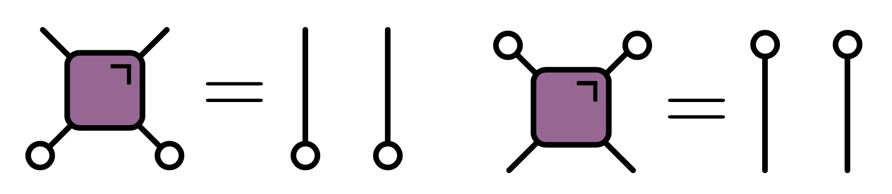
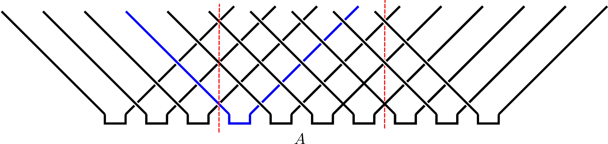
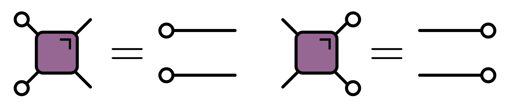
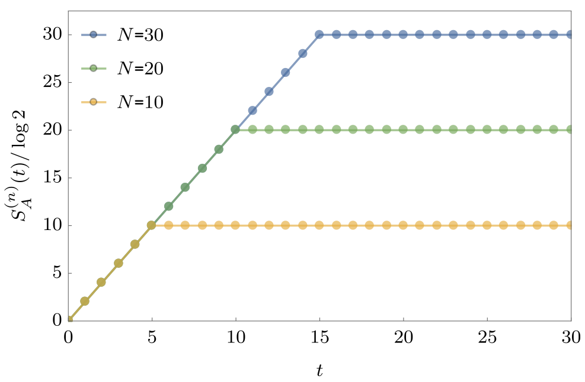
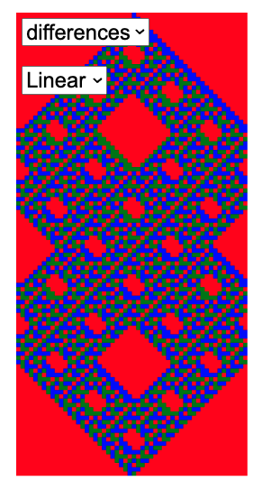

---
slides:

  # Choose a theme from https://github.com/hakimel/reveal.js#theming
  theme: white
  math_renderer: mathjax3
  reveal_options: {
    hash: true,
    katex: {
      macros: {
        "\\abs" : "\\left|#1\\right|",
        "\\tr" : "\\operatorname{tr}",
        "\\sgn" : "\\operatorname{sgn}",
      },
      throwOnError: false,
    }
  }
scripts: ['https://cdn.jsdelivr.net/npm/p5@1.6.0/lib/p5.js', 'https://cdn.jsdelivr.net/npm/mathjs@11.7.0/lib/browser/math.min.js']
---

## Chaos and information in 
## space-time dual classical circuits

Austen Lamacraft (Cambridge) and Pieter Claeys (Dresden)

[austen.uk/#talks](https://austen.uk/#talks) for slides

---
  
## Dual unitaries and their phenomenology 

<figure align="center">

</figure>

---

### Expectation values

- Evaluate $\bra{\Psi}\mathcal{O}\ket{\Psi}=\bra{\Psi_0}\mathcal{U}^\dagger\mathcal{O}\mathcal{U}\ket{\Psi_0}$ for local $\mathcal{O}$

 

 
<object data="../new-rules-tum/assets/expectation.svg" type="image/svg+xml" width='600'></object>

---

### Folded picture

<figure align="center">

</figure>

- After folding, lines correspond to two indices / 4 dimensions 

---

### Unitarity in folded picture

- Circle denotes $\delta_{ab}$

<figure align="center">

</figure>

---

### $\bra{\Psi}\mathcal{O}\ket{\Psi}$ in folded picture

- Emergence of "light cone"

<object data="../new-rules-tum/assets/folded-expectation.svg" type="image/svg+xml"></object>

---

### Reduced density matrix

- Expectation values in region $A$ evaluated using *reduced density matrix*

$$
\rho_A = \operatorname{tr}\_{\bar A}\left[\ket{\Psi}\bra{\Psi}\right]=\operatorname{tr}_{\bar A}\left[\mathcal{U}\ket{\Psi_0}\bra{\Psi_0}\mathcal{U}^\dagger\right]
$$

<object data="../new-rules-tum/assets/reduced-density-matrix.svg" type="image/svg+xml"></object>

---

### Toy model 

<figure align="center">

</figure>

- For a Bell pair consisting of qubits at sites $m$ and $n$:

  - If $n\in A$, $m\in\bar A$, $\rho_A$ has factor $\mathbb{1}_n$. 

  - If $m, n\in A$ they contribute a factor $\ket{\Phi^+}\_{nm}\bra{\Phi^+}\_{nm}$ (pure)

- Only first case contributes to `$
 S_A = \min(4\lfloor t/2\rfloor, |A|) 
$` bits

---
  

### Dual unitary gates

- Impose additional restriction

<figure align="center">

</figure>

- [Gopalakrishnan and Lamacraft (2019)](https://journals.aps.org/prb/abstract/10.1103/PhysRevB.100.064309), [Bertini, Kos, and Prosen (2019)](https://journals.aps.org/prl/abstract/10.1103/PhysRevLett.123.210601)

---

### $\rho_A$ via dual unitarity

- 8 sites; 4 layers

<object data="../new-rules-tum/assets/A-entropy-quantum.svg" type="image/svg+xml"></object>

- $\rho_A$ is unitary transformation of
  
$$
  \mathbb{1}\otimes\mathbb{1}\otimes\mathbb{1}\otimes\mathbb{1}\otimes\mathbb{1}\otimes\mathbb{1}\otimes\mathbb{1}\otimes\mathbb{1}
$$

---

### Shallower...

<object data="../new-rules-tum/assets/A-entropy-quantum-shallower.svg" type="image/svg+xml"></object>

- $\rho_A$ is unitary transformation of 
  
$$
\mathbb{1}\otimes\mathbb{1}\ket{\Phi^+}\bra{\Phi^+}\otimes\ket{\Phi^+}\bra{\Phi^+}\otimes\mathbb{1}\otimes\mathbb{1}
$$

---

### General case

- RDM is unitary transformation of 

$$
\rho_0=\overbrace{\frac{\mathbb{1}}{2}\otimes \frac{\mathbb{1}}{2} \cdots }^{t-1} \otimes\overbrace{\ket{\Phi^+}\bra{\Phi^+} \cdots }^{N_A/2-t+1 } \otimes \overbrace{\frac{\mathbb{1}}{2}\otimes \frac{\mathbb{1}}{2} \cdots }^{t-1}
$$

- RDM has $2^{\min(2t-2,N_A)}$ non-zero eigenvalues all equal to $\left(\frac{1}{2}\right)^{\min(2t-2,N_A)}$

- Converse – maximal entanglement growth implies dual unitary gates – recently proved by [Zhou and Harrow (2022)](https://arxiv.org/abs/2204.10341)

---

### Thermalization

- After $N_A/2 + 1$ steps, reduced density matrix is $\propto \mathbb{1}$

- All expectations (with $A$) take on infinite temperature value

---

### The dual unitary family

- $4\times 4$ unitaries are 16-dimensional

- Family of dual unitaries is 14-dimensional
 
- Includes *kicked Ising model* at particular values of couplings
  
- Dual unitaries not "integrable" but have enough structure to allow many calculations

---

### Floquet theory: kicked Ising model

- Time dependent Hamiltonian with kicks at $t=0,1,2,\ldots$.

`$$
\begin{aligned}
H_{\text{KIM}}(t) = H_\text{I}[\mathbf{h}] + \sum_{m}\delta(t-n)H_\text{K}\\
H_\text{I}[\mathbf{h}]=\sum_{j=1}^L\left[J Z_j Z_{j+1} + h_j Z_j\right],\qquad H_\text{K} &= b\sum_{j=1}^L X_j,
\end{aligned}
$$`

- "Stroboscopic" form of $U(t)=\mathcal{T}\exp\left[-i\int^t H_{\text{KIM}}(t') dt'\right]$

`$$
\begin{aligned}
  U(n_+) &= \left[U(1_+)\right]^n,\qquad U(1_-) = K I_\mathbf{h}\\
  I_\mathbf{h} &= e^{-iH_\text{I}[\mathbf{h}]}, \qquad K = e^{-iH_\text{K}}
\end{aligned}
$$`

---

### KIM as a circuit

`$$
\begin{aligned}
  \mathcal{K} &= \exp\left[-i b X\right]\\
  \mathcal{I} &= \exp\left[-iJ Z_1 Z_2 -i \left(h_1 Z_1 + h_2 Z_2\right)/2\right].
\end{aligned}
$$`

---

### Entanglement Growth for Self-Dual KIM

- [Bertini, Kos, Prosen (2019)](https://journals.aps.org/prx/abstract/10.1103/PhysRevX.9.021033) found that when $|J|=|b|=\pi/4$

$$
\lim_{L\to\infty} S_A =\min(2t-2,N_A)\log 2,
$$

- __Any $h_j$__; initial $Z_j$ product state

---

### Dual unitarity

- Recall KIM has circuit representation

`$$
\begin{aligned}
  \mathcal{K} &= \exp\left[-i b X\right]\\
  \mathcal{I} &= \exp\left[-iJ Z_1 Z_2 -i \left(h_1 Z_1 + h_2 Z_2\right)/2\right].
\end{aligned}
$$`

- At $|J|=|b|=\pi/4$ model is dual unitary

---

### 'KIM' property

- ($q=2$ here) Not satisfied by e.g. $\operatorname{SWAP}$

- Maps product states to maximally entangled (Bell) states

- Product initial states also work for KIM!

- [Piroli _et al_ (2020)](https://journals.aps.org/prb/abstract/10.1103/PhysRevB.101.094304) studied more general initial states

---

### Correlation functions

- Infinite temperature correlator $\tr\left[\sigma^\alpha_x(x,t)\sigma^\beta(y,0)\right]$

<figure align="center">

</figure>

- [Bertini, Kos, and Prosen (2019)](https://journals.aps.org/prl/abstract/10.1103/PhysRevLett.123.210601): dual unitarity means correlations vanish _inside_ light cone!

---

### Krajnik-Prosen model

- _Classical_ circuit

`$$
\begin{align*}
\Phi_{\tau}\left(\mathbf{S}_{1}, \mathbf{S}_{2}\right) &=\frac{1}{\sigma^{2}+\tau^{2}}\left(\sigma^{2} \mathbf{S}_{1}+\tau^{2} \mathbf{S}_{2}+\tau \mathbf{S}_{1} \times \mathbf{S}_{2}, \sigma^{2} \mathbf{S}_{2}+\tau^{2} \mathbf{S}_{1}+\tau \mathbf{S}_{2} \times \mathbf{S}_{1}\right) \\
\mathbf{S}_1^2&=\mathbf{S}_1^2=1\qquad \sigma^{2} =\frac{1}{2}\left(1+\mathbf{S}_{1} \cdot \mathbf{S}_{2}\right)
\end{align*}
$$`
<figure align="center">

<figcaption>
From <a href="https://link.springer.com/article/10.1007/s10955-020-02523-1">Krajnik and Prosen (2020)</a> 
<figcaption>
</figure>

---

### "Space-time duality" of KP model

<figure align="center">

<figcaption>
From <a href="https://link.springer.com/article/10.1007/s10955-020-02523-1">Krajnik and Prosen (2020)</a> 
<figcaption>
</figure>

- $\tilde\Phi_\tau$ coincides with $\Phi_\tau$ after flipping

$$
\mathbf{S}_x^t \longrightarrow \tilde{\mathbf{S}}_x^t = (-1)^{x+t+1}\mathbf{S}_x^t
$$

---

### Nonzero correlations in the KP model

<figure align="center">

<figcaption>
From <a href="https://link.springer.com/article/10.1007/s10955-020-02523-1">Krajnik and Prosen (2020)</a> 
<figcaption>
</figure>

<strong>Model is not space-time dual in same sense as dual unitary circuits!</strong>

---

## Outline

- Cellular automata: elementary, block, reversible, etc.

- Space-time duality for CA

- Models with continuous state space

- Clifford circuits

---

### Conway's Game of Life

<figure align="center">

</figure>

  1. Any live cell with two or three live neighbours survives
  2. Any dead cell with three live neighbours becomes a live cell
  3. All other live cells die in the next generation

---

### Elementary cellular automata

- "Space" is one dimension with cells $x_n=0,1$ $n\in\mathbb{Z}$

- Update cells every time step depending on cells in **neighborhood** 

- Neighborhood is cell and two neighbors for _elementary_ CA

---

- Update specified by function 

$$
f:\\{0,1\\}^3\longrightarrow \\{0,1\\}.
$$

$$
x^{t+1}_{n} = f(x^{t}\_{n-1},x^{t}\_{n},x^{t}\_{n+1})
$$

- How many possible functions?

---

### Wolfram's rules 

- Domain of $f$ is $2^3=8$ possible values for three cells

- $2^8=256$ possible choices for the function $f$

- List outputs corresponding to inputs: 111, 110, ... 000

|111	| 110 |	101	| 100 |	011 |	010 |	001 |	000	|
|---	| --- |	---	| --- |	--- |	--- |	--- |	---	|
| 0   |	1   | 	1 | 	0 | 	1	|   1 | 	1 | 	0 |	

- Interpret as binary number: this one is [Rule 110](https://en.wikipedia.org/wiki/Rule_110)

---

### Elementary CA

- Many behaviors, from ordered (Rule 18) to chaotic (Rule 30)

<figure align="center">

</figure>

- Rule 110 is capable of universal computation!

---

<figure align="center">

<figcaption> </figcaption>
</figure>

---

---

<blockquote class="twitter-tweet">
give each pixel a random Pokemon type, and then battle pixels against their neighbors, updating each pixel with the winning type (using the Pokemon type chart)  we quickly see areas of fire &gt; water &gt; grass &gt; fire, electric sweeping over, ground frontiers taking over etc etc <a href="https://t.co/BHgQuKRApR">pic.twitter.com/BHgQuKRApR</a>
&mdash; Matt Henderson (@matthen2) <a href="https://twitter.com/matthen2/status/1543226572592783362?ref_src=twsrc%5Etfw">July 2, 2022</a></blockquote> 

---

### CAs as model physics

- Notion of a causal "light cone" (45 degree lines)

- Variety of possible behaviors: chaos, periodicity, ...

---

### Chaos

- Rapid growth of small differences between two trajectories

<figure align="center">

</figure>

- Smallest change: flip one site and monitor $z^t\equiv x^t\oplus y^t$

---

### Chaos phenomenology 

- No exponential growth (c.f. [Lyapunov exponent](https://en.wikipedia.org/wiki/Lyapunov_exponent) in continuous systems)

- Track number of differences ([Hamming distance](https://en.wikipedia.org/wiki/Hamming_distance)) between trajectories

- Propagating "front" cannot exceed "speed of light": generally slower

---

### Theory?

- No chance of solving the dynamics of any one CA

- Looking for *generic* properties: natural to consider *ensembles*
  
    - of initial conditions
    - of rules

---

### Probabilistic CA

- Choose rules iid for each site and instant

<figure align="center">

</figure>

- Cell values are now white noise

---

### Exploring ensemble

- Fluctuations of front are larger and average speed $<$ maximum

- Interesting variation: choose output $1$ with probability $p$

- $p\neq 1/2$ makes dynamics less *one-to-one*. What happens?

<figure align="center">

</figure>

---

### Phase transition 

- For $0.25\lesssim p\lesssim 0.75$ front propagates to infinity

- Outside this region, front dies out

- In finite system two copies *always* merge after exponentially long time

---

### Markov chain on $z^t\equiv x^t\oplus y^t$

- If inputs differ, $z^{t+1}_n=1$ with probability $2p(1-p)$ ([Derrida and Stauffer (1986)](https://iopscience.iop.org/article/10.1209/0295-5075/2/10/001/meta))

<figure align="center">

</figure>

- $z^{t+1}\_{n}=1$ only if at least one of $z^t\_{n\pm 1}=1$

---

- Seek connected cluster of sites occupied with probability $x=2p(1-p)$

- This is (site) [directed percolation](https://en.wikipedia.org/wiki/Directed_percolation)

- $x\leq 1/2< x_\text{crit}\sim 0.706$ on square lattice: require NN neighbors

- Similar phenomenon in coupled map lattices: ["synchronization of extended chaotic systems"
](http://www.scholarpedia.org/article/Synchronization_of_extended_chaotic_systems)

---

### Classical version of MIPT?

- Measurements purify state; analogous to non-injective rules in CA

- It was a surprise that a mixed state survives finite measurement rate

- But... a chaotic front survives non-injective rules (up to a point)

---

### "MIPT" in classical system

<figure align="center">

<figcaption>
Source:  <a href="https://journals.aps.org/prb/abstract/10.1103/PhysRevB.106.024305">Willsher <it> et al.</it></a> 
<figcaption>
</figure>

- c.f. [Iaconia, Lucas, Chen (2020)](https://journals.aps.org/prb/abstract/10.1103/PhysRevB.102.224311)

- Analogous to  *forced* version of transition ([Nahum *et al.* (2021)](https://journals.aps.org/prxquantum/abstract/10.1103/PRXQuantum.2.010352))

---

### Reversibility 

- No elementary CAs are reversible (bijective)!

- Reversibility is undecidable above one spatial dimension

- $∃$ reversible constructions

---

### Block cellular automaton

<figure align="center">

</figure>

- Partition cells into blocks (Margolus neighborhoods) 
- Apply invertible mapping to block
- Alternate overlapping partitions

---

### Spacetime representation

-  Blue squares: invertible mapping on states of two sites: 00, 01, 10, 11

---

<blockquote class="twitter-tweet" align="center">
given these four jigsaw pieces, there is only one way to fill in the rest of the puzzle. The solution ends up drawing a Sierpinski triangle. Can you see why? <a href="https://t.co/OvxVz2oehy">pic.twitter.com/OvxVz2oehy</a>
&mdash; Matt Henderson (@matthen2) <a href="https://twitter.com/matthen2/status/1529552315337818112?ref_src=twsrc%5Etfw">May 25, 2022</a>

---

## 24 reversible models

- Each block a permutation of 00, 01, 10, 11

- $4!=24$ blocks

- Order:

  0. (0123)
  1. (0132)
  2. (0213), and so on 

- Block 2 is the map $(00, 01, 10, 11) ⟶ (00, 10, 01, 11)$ (SWAP)

---

### Reversible CA

<figure align="center">

</figure>

---

### Ensemble of block CAs

- Results qualitatively similar to chaotic phase of of PCA

- No phase transition because all blocks are reversible

---

### Circuit notation

$$
f:\Sigma\times\Sigma \longrightarrow\Sigma\times\Sigma, \qquad \Sigma=\\{0,1\\}
$$

$$
(c,d) = f(a,b) 
$$

<figure align="center">

</figure>

$$
F_{ab,cd} = \begin{cases}
    1  & \text{if } (c,d) = f(a,b) \\\
    0 & \text{otherwise}
\end{cases}
$$

---

- If $f(\cdot,\cdot)$ is one-to-one:

$$
\sum_{a,b} F_{cd,ab} = \sum_{c,d} F_{cd,ab} = 1
$$

<figure align="center">

</figure>

- Circle indicates sum over index

---

- Relaxing 0-1 constraint gives _bistochastic_ matrices

- Every bistochastic matrix is a (nonunique) convex combination of permutations (Birkhoff—von Neumann)

- Interpret Markov chain as probabilistic BCA

---

### Dual reversibility

- If $(c,d)=f(a,b)$ require bijection $\tilde f$ satisfying $(d,b)=\tilde f(c,a)$

<figure align="center">

</figure>

---

- In terms of $F_{ab,cd}$

$$
\sum_{a,c} F_{cd,ab} = \sum_{b,d} F_{cd,ab} = 1
$$

<figure align="center">

</figure>

---

### Equivalent formulation

<figure align="center">

</figure>

- Write 

$$
\begin{align*}
f(a,b)=(f_c(a,b),f_d(a,b))\\\
\tilde f(c,a)=(\tilde f_d(c,a),\tilde f_b(c,a))
\end{align*}
$$ 

- Dual reversibility implies that the maps $f_c(a,\cdot)$ and $f_d(\cdot,b)$ are bijections across diagonal

---

### Three state models 

- Of the 24 reversible blocks for two states, 12 are dual reversible

- Three states: [Borsi and Pozsgay (2022)](https://journals.aps.org/prb/abstract/10.1103/PhysRevB.106.014302) find 227 DR models 

<figure align="center">

</figure>

---

### The linear block

$$
(c,d) = f(a,b) = (a + b, a - b)\, \mod 3
$$

- Original dual unitary circuit from [Hosur *et al.*](https://link.springer.com/article/10.1007/JHEP02(2016)004)
- Unusual behavior of recurrence time
  - For $L = 2\times 3^m$ have $T_\text{recur}=2L$
  - [Borsi and Pozsgay](https://journals.aps.org/prb/abstract/10.1103/PhysRevB.106.014302) prove using Fourier analysis over finite fields

--- 

### Origin of "fractal" recurrence

<figure align="center">

<figcaption>
$L=54=2\times 3^3$, $T_\text{recur}=2L=108$</a> 
<figcaption>
</figure>

---

### Mutual information 

- Disjoint regions $A$ and $\bar A$: how much does one tell about the other?

- Use [mutual information](https://en.wikipedia.org/wiki/Mutual_information): measure of dependence of random variables 
  
- Suggested in this context by [Pizzi *et al.* (2022)](https://journals.aps.org/prb/abstract/10.1103/PhysRevB.106.214303)
  
--- 

- MI defined as
$$
I(X;Y) \equiv S(X) + S(Y) - S(X,Y)
$$
  - $S(X)$ is entropy of $p_X(x)$; marginal distribution of $X$
  - $S(Y)$ is entropy of $p_Y(y)$; marginal distribution of $Y$
  - $S(X,Y)$ is entropy of joint distribution $p_{(X,Y)}(x,y)$

- Vanishes if $p_{(X,Y)}(x,y)=p_X(x)p_Y(y)$
 
---

<figure align="center">

<figcaption>
Source:  <a href="https://journals.aps.org/prb/abstract/10.1103/PhysRevB.106.214303">Pizzi <it> et al.</it></a> 
<figcaption>
</figure>

---

### Simple example

- Suppose either $X=Y=1$ or $X=Y=0$, with equal probability

`$$
\begin{align*}
p_{(X,Y)}(0,0)&=p_{(X,Y)}(1,1)=1/2\\
 p_{(X,Y)}(1,0)&=p_{(X,Y)}(0,1)=0
\end{align*}
$$`
  
$$
I(X;Y)=S(X) + S(Y) - S(X,Y)= 1+1-1=1 \text{ bit}
$$

---

### Toy model (classical reprise)

<figure align="center">

</figure>

- Initial distribution factorizes over correlated pairs
- Apply SWAPs
- 1 bit MI for every pair with one member in $A$ and one in $\bar A$

$$
I(A;\bar A) = \min(4\lfloor t/2\rfloor, |A|) \text{ bits}
$$

- $|A|$ is (even) number of sites in $A$

---

### Comments

- Total entropy conserved (c.f Liouville's theorem)

- Entropy of initial distribution is half max, but entropy $S(A)$ saturates at maximal value (thermalization in time $\sim |A|/2$)
   
- This model is *not so special!* Any of the dual reversible BCAs behaves *exactly the same!* 

<strong>Graphical proof same as for dual unitaries</strong>
 
---

- $S(A)$ for 8 central sites
- Marginalize over $\bar A$

<object data="../new-rules-tum/assets/A-entropy-quantum-shallower.svg" type="image/svg+xml"></object>

- After using dual reversibility, result is reversible automaton applied to initial state with $S(A)=6$ bits

---

### Models with continuous state space

 $$
 f:\Sigma\times\Sigma \longrightarrow\Sigma\times\Sigma
 $$

 - Reversible: $f$ must be a bijection, so inverse $f^{-1}$ exists
 
 - Probability distribution $p(a,b)$ on two sites is mapped to a distribution
$$
p_f(c,d) = |\det Df|^{-1} p(f^{-1}(c,d)),
$$
$Df$ is Jacobian matrix

- Impose $|Df|=1$ so that uniform (infinite temperature) distribution is preserved 

---

### Landau—Lifshitz circuit

- [Krajnik and Prosen (2020)](https://link.springer.com/article/10.1007/s10955-020-02523-1) studied integrable model

`$$
\begin{align*}
\Phi_{\tau}\left(\mathbf{S}_{1}, \mathbf{S}_{2}\right) &=\frac{1}{\sigma^{2}+\tau^{2}}\left(\sigma^{2} \mathbf{S}_{1}+\tau^{2} \mathbf{S}_{2}+\tau \mathbf{S}_{1} \times \mathbf{S}_{2}, \sigma^{2} \mathbf{S}_{2}+\tau^{2} \mathbf{S}_{1}+\tau \mathbf{S}_{2} \times \mathbf{S}_{1}\right) \\
\sigma^{2} &:=\frac{1}{2}\left(1+\mathbf{S}_{1} \cdot \mathbf{S}_{2}\right)
\end{align*}
$$`

- _Symplectic map_ on $S^2\times S^2$

---

### Dual reversibility

<figure align="center">

</figure>

- As before $(d,b) = \tilde f(c,a)$. Require $|D \tilde f|=1$

- Discrete case: bijectivity of $\tilde f$ equivalent to existence of diagonal bijections $f_c(a,\cdot):\Sigma_b\longrightarrow \Sigma_c$ and $f_d(\cdot,b):\Sigma_a\longrightarrow \Sigma_d$

- Continuous case: additional condition: bijections have unit determinant

---

- Recall 
$$
p_f(c,d) = |\det Df|^{-1} p(f^{-1}(c,d)),
$$
- Equivalent to 
$$
p_f(c,d) = \int \delta((c,d)-f(a,b)) p(a,b)\, d\mu(a) d\mu(b)
$$
$$
1 = \int \delta((c,d)-f(a,b))\\, d\mu(a) d\mu(b)
$$
<figure align="center">

</figure>

---

- $|D\tilde f|=1$ guarantees that  

$$
1 = \int \delta((d,b)-\tilde f(c,a))\\, d\mu(a) d\mu(c)
$$
- _Not_ analog of
<figure align="center">

</figure>

- Even if $(c,d)=f(a,b)$ and $(d,b)=\tilde f(c,a)$:
$$
\delta((c,d)-f(a,b))\neq \delta((d,b)-\tilde f(c,a))
$$

---

### Necessary condition

$$
\delta((c,d)-f(a,b))= \delta((d,b)-\tilde f(c,a))
$$

- Requires diagonal bijections satisfy 

$$
|Df_c(a,\cdot)|=1\qquad |Df_d(\cdot,b)|=1
$$

<figure align="center">

</figure>

- _Not_ satisfied by Krajnik—Prosen model!

---

## Symplectic dynamics

- State space $\Sigma$ is symplectic manifold with symplectic form $\omega$

- $f:\Sigma\times\Sigma\longrightarrow\Sigma\times\Sigma$ obeys $f^{*}(\omega_1+\omega_2)=\omega_1+\omega_2$

- $\omega$ has (locally) canonical form

$$
\omega = \sum_{i=1}^{n} dx_i\wedge dy_i
$$

- $Df$ is symplectic matrix

`$$
\begin{align*}
Df^T \Omega Df &= \Omega\qquad \Omega \equiv\operatorname{diag}(\omega,\omega)\\
\omega &= \begin{pmatrix}
    0 & \mathbb{1}_n \\
    -\mathbb{1}_n & 0
    \end{pmatrix}
\end{align*}
$$`

---

- Rearranging gives condition on spatial Jacobian $D\tilde f$
$$
    D\tilde f^T\operatorname{diag}(\omega,-\omega) D\tilde f = \operatorname{diag}(-\omega,\omega).
$$

- $\tilde f$ not symplectic but may be made so by composing with pair of maps $\tau_{1,2}$ that reverse signs of $\omega_1$ and $\omega_2$ e.g. $\tau_{1,2}$ $y_i\to -y_i$

- $\tau_2\circ \tilde f\circ \tau_1$ is then symplectic

- In Krajnik—Prosen model this corresponds to
$$
\mathbf{S}_x^t \longrightarrow \tilde{\mathbf{S}}_x^t = (-1)^{x+t+1}\mathbf{S}_x^t
$$

- _Any_ symplectic map volume preserving in spatial direction

---

### Arnold's Cat map

- Area preserving (symplectic) linear map on torus

`$$
\mathcal{K}:\begin{pmatrix}
x \\
y
\end{pmatrix}\longrightarrow
\begin{pmatrix}
    a & 1 \\
    ab - 1 & b
    \end{pmatrix}
\begin{pmatrix}
    x \\
    y
    \end{pmatrix}\qquad \mod 1
$$`

- Chaotic when one Lyapunov exponent exceeds one for $|a+b|>2$.
- Common choice $a=2$, $b=1$

<figure align="center">

<figcaption>
Source:  <a href="https://en.wikipedia.org/wiki/Arnold%27s_cat_map">Wikipedia</it></a> 
<figcaption>
</figure>

---

<figure align="center">

</figure>

---

### Spatiotemporal cat

- [Gutkin and Osipov (2016)](https://iopscience.iop.org/article/10.1088/0951-7715/29/2/325) define map on $N$ copies of torus

- Coupling between sites via
`$$
\begin{align*}
x_{n}&\longrightarrow x_n \\
y_{n}&\longrightarrow y_n - x_{n-1} - x_{n+1} - V'(x_n)
\end{align*}\qquad \mod 1
$$`
- Generated by Hamiltonian (NB $V(x)$ periodic)
$$
H_\text{c} = \sum_n \left[x_{n} x_{n+1} + V(x_n)\right]
$$

- Alternate with cat maps $\mathcal{K}_n$ on each site

---

### Circuit form

- On neighbouring sites define

`$$
\mathcal{I}_{n,n+1}:\qquad\begin{align}
x_{n}&\longrightarrow x_n,\qquad x_{n+1}\longrightarrow x_{n+1} \\
y_{n}&\longrightarrow y_n - x_{n+1}-V'(x_n)/2\qquad y_{n+1}\longrightarrow y_{n+1} - x_{n}-V'(x_{n+1})/2,\qquad \mod 1,
\end{align}
$$`

- Satisfies dual reversible property!

---

### Lagrangian pictue

 - "Momenta" $y_n$ can be eliminated to give two-step (Lagrangian) recurrence for $x_{n,t}$:
`$$
[\Delta x]_{n,t} = (a+b-4)x_{n,t} - V'(x_{nt})-m_{n,t} \mod 1
$$`
winding numbers $m_{n,t}$ chosen to ensure $x_{n,t}$ stays in the unit interval and $\Delta$ is the 2D Laplacian

- Symmetry between space and time is evident (but not necessary for dual reversibility)

---

### Vary coupling ($V(x)=0$)

$$
H_\text{c} = J\sum_n x_{n} x_{n+1} \qquad J\in \mathbb{Z}
$$

`$$
\begin{pmatrix}
x_n \\
y_n \\
x_{n+1} \\
y_{n+1}
\end{pmatrix}\longrightarrow
\begin{pmatrix}
a & 1 & -J & 0 \\
J^2 + ab - 1 & b & -J(a+b) & -J \\
-J & 0 & a & 1 \\
-J(a+b) & -J & J^2 + ab -1 & b 
\end{pmatrix}\begin{pmatrix}
x_n \\
y_n \\
x_{n+1} \\
y_{n+1}
\end{pmatrix}
$$`

- Off-diagonal blocks have det $J^2$; diagonals $1-J^2$

---

### Symplectic conservation law

<figure align="center">

</figure>

---

### Clifford circuits and symplectic CA ([Schlingemann _et al_ (2008)](https://aip.scitation.org/doi/full/10.1063/1.3005565))

- Local space $\mathbb{C}^p$ ($p$ prime): $X$ ("shift") and $Z$ ("clock")
$$
X\ket{q} = \ket{q+1},\qquad Z\ket{q}=e^{2\pi iq/p}\ket{q}
$$

- $w(r,k) \equiv X^rZ^k$ satisfy

$$
w(r_1,k_1)w(r_2,k_2) = e^{2\pi i(r_1k_2-r_2k_1)/p}w(r_2,k_2)w(r_1,k_1).
$$

- Clifford unitary maps `$w(r,k)\to w(r',k')$`
`$$
U_\text{c} w(r,k)U^\dagger_{c} = e^{i\theta(r,k)}w(r',k')
$$`

`$$
r_1k_2-r_2k_1 = r'_1k'_2-r'_2k'_1, \mod p
$$`

---

- If
`$$
r_1k_2-r_2k_1 = r'_1k'_2-r'_2k'_1, \mod p
$$`
`$$\begin{pmatrix}
    r' \\
    k'
\end{pmatrix}
=\begin{pmatrix}
    a & b \\
    c & d
\end{pmatrix}\begin{pmatrix}
    r \\
    k   
\end{pmatrix},\mod p
$$`
with $ad-bc=1 \mod p$. Matrix $\in\text{Sp}(2,\mathbb{Z}_p)$. 

- For $N$ sites have $w_N(\textbf{r}, \textbf{k})\equiv\prod_{n=1}^N X^{r_n}Z^{k_n}$, and Clifford unitaries on $N$ sites give symplectic matrix $\text{Sp}(2N,\mathbb{Z}_p)$

- Circuit made of Clifford unitary blocks can therefore be specified by gates taken from $\text{Sp}(4,\mathbb{Z}_p)$. 

---

### Dual unitary Cliffords circuits

<figure align="center">

<figcaption>
From <a href="https://arxiv.org/abs/2210.10808">Sommers <it> et al.</it> (2022)</a> 
<figcaption>
</figure>

---

### Sommers _et al_ automata

<figure align="center">

</figure>

- Correlations  $\tr\left[\sigma^a_x(x,t)\sigma^b(y,0)\right]$ vanish

- OTOC has maximal speed and doesn't broaden ([Claeys and Lamacraft (2020)](https://journals.aps.org/prresearch/abstract/10.1103/PhysRevResearch.2.033032))

---

### MBQC with dual unitary Cliffords

<figure align="center">

<figcaption>
From <a href="https://arxiv.org/abs/2209.06191">Stephen <it> et al.</it> (2022)</a> 
<figcaption>
</figure>

---

### Summary

- There is a "useful" notion of space-time duality for classical models

- Existing examples: spatiotemporal cat, dual unitary Cliffords

- Applications in codes, MBQC?

<strong>Thank you!</strong>

