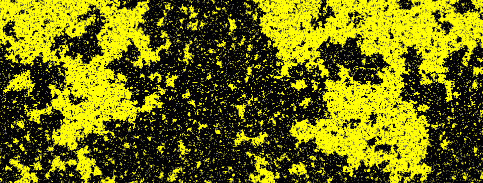
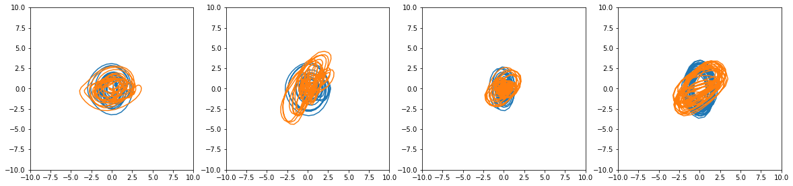

---
slides:
  # Choose a theme from https://github.com/hakimel/reveal.js#theming
  theme: white
  # Choose a code highlighting style (if highlighting enabled in `params.toml`)
  #   Light style: github. Dark style: dracula (default).
  highlight_style: github
scripts: []
---

$$
\nonumber
\newcommand{\br}{\mathbf{r}}
\newcommand{\bp}{\mathbf{p}}
\newcommand{\bk}{\mathbf{k}}
\newcommand{\bq}{\mathbf{q}}
\newcommand{\bv}{\mathbf{v}}
\newcommand{\bx}{\mathbf{x}}
\newcommand{\bz}{\mathbf{z}}
$$

---

## Hamiltonian Neural Networks

### Austen Lamacraft

- _Learning Symmetries of Classical Integrable Systems_, Roberto Bondesan & AL [arXiv:1906.04645](https://arxiv.org/abs/1906.04645)
- _Hamiltonian Neural Networks_, Greydanus _et al._ [arXiv:1906.01563](https://arxiv.org/abs/1906.01563)
- _Equivariant Hamiltonian Flows_, Rezende _et al._ [arXiv:1909.13739](https://arxiv.org/abs/1909.13739)
- _Hamiltonian Generative Networks_, Toth _et al._ [arXiv:1909.13789](https://arxiv.org/abs/1909.13789)
- _Neural Canonical Transformation with Symplectic Flows_, Li _et al._ [arXiv:1910.00024](https://arxiv.org/abs/1910.00024)

---

## Outline

- Hamiltonians in physics
- ML background
- Learning dynamics
- Learning canonical transformations

---

## Hamiltonians in Physics

---
### Hamilton's Equations

- Newton's law 2nd order  in $\mathbb{R}^N$

`$$
\begin{aligned}
\dot \bq &=\frac{\partial H}{\partial \bp}\\
\dot \bp &=-\frac{\partial H}{\partial \bq}
\end{aligned}
$$`

-  1st order equations in __phase space__ $\mathbb{R}^{2N}$
- Flow along vector field $\bv(\bq,\bp)=(\dot\bq,\dot\bp)$.
- Trajectories are __integral curves__ of $\bv(\bq,\bp)$.

---

### Simple Harmonic Motion

- Newton tells us $\ddot x = - \omega^2 x$

- General solution $x(t) = A\cos \omega t + B \sin \omega t$

---

### Phase Space

- One 2nd order equation $\longrightarrow$ two 1st order equations

`$$
\begin{aligned}
\dot x &= p\\
\dot p &= -x
\end{aligned}
$$`

- Observe energy $E=\frac{1}{2}\left[p^2+x^2\right]$ constant

---

### Pendulum

- Newton says

$$
\ddot \theta = -\frac{g}{l}\sin\theta
$$

---

### Pendulum in Phase Space

- $\theta\to x$

`$$
\begin{aligned}
\dot x &= p\\
\dot p &= -\sin x
\end{aligned}
$$`

---

 

---

### Hamilton's equations

- For `$(\mathbf{q}, \mathbf{p})\in\mathbb{R}^{2n}$`, __Hamiltonian__ `$H:\mathbb{R}^{2n}\to \mathbb{R}$` defines dynamics via

`$$
\begin{aligned}
\dot \bq &= \frac{\partial H}{\partial \bp}\\
\dot \bp &= -\frac{\partial H}{\partial \bq}
\end{aligned}
$$`

- The examples we've seen so far have

$$
H(\mathbf{q},\mathbf{p}) = \frac{1}{2}\mathbf{p}^2 + V(\mathbf{q})
$$

- And $H$ is the energy

---

### Geometrical Meaning

- Phase plane velocity `$(\dot\bq,\dot\bp)$` perpendicular to $\nabla H$ ($H$ conserved)

`$$
(\dot\bq,\dot\bp)\cdot (\nabla_\bq H, \nabla_\bp H) =
(\nabla_\bp H,-\nabla_\bq H)\cdot (\nabla_\bq H, \nabla_\bp H) = 0
$$`

- Velocity is __divergenceless__

`$$
\nabla\cdot\bv=\frac{\partial \bv_\bq}{\partial \bq}+\frac{\partial \bv_\bp}{\partial \bp}=\frac{\partial^2 H}{\partial \bq\partial \bp}-\frac{\partial^2 H}{\partial \bp\partial \bq} = 0
$$``

- Flow __preserves volume__

---

### Chaos

- For $N=1$ motion on the contours of $H$ fixes trajectories

---

- For $N\geq 2$ visualize by taking a __Poincaré section__

- Generically regions of __regular__ and __chaotic__ motion will occur

---

### Canonical Transformations

- Write $x=(\mathbf{q}, \mathbf{p})\in \mathbb{R}^{2N}$

- Hamiltonian evolution on $t\in[0,T]$ with $x'=x(T)$, $x=x(0)$

- Example of __canonical (symplectic) transformation__. What's special?

---

### Hamilton's equations

`$$
\begin{aligned}
\dot \bq &= \frac{\partial H}{\partial \bp}\\
\dot \bp &= -\frac{\partial H}{\partial \bq}\\
\dot{x} &= \Omega \nabla_x H\, ,\quad
\Omega =
\begin{pmatrix}
  0 & \mathbb{1}_n\\
  -\mathbb{1}_n & 0
\end{pmatrix}
\end{aligned}
$$`

---

- Hamilton's equations $\longrightarrow$ Jacobian $J=\partial x'/\partial x$ satisfies

`$$
J^T\Omega J_f = \Omega
$$`

- $J(x)\in\text{Sp}_{2n}(\mathbb{R})$ is member of linear symplectic group

- Simplest case $n=1$

`$$
J = \begin{pmatrix}
a & b \\
c & d
\end{pmatrix}\longrightarrow ad-bc=1
$$`

- $J\in SL(2,\mathbb{R})$. Rotate / shear / squeeze

---

$$
J^T\Omega J_f = \Omega
$$

- Since $\det(J_f) = +1$ $\longrightarrow$ volume is conserved

- More: the sum of (signed) areas in each $q_j-p_j$ plane is preserved

- Canonical transformations __preserve form__ of Hamilton's equations

---

## ML background

---

### Generative Models

Sample from a multivariate distribution

---

### Default approach in physics

`$$
P(\{\sigma_i\}) = Z^{-1} \exp\left(-\beta\sum_{i,j}J_{ij}\sigma_i\sigma_j\right)
$$`

Use MCMC to sample from distribution, calculate expectations, etc.

---

### The Idea (Rezende & Mohamed, 2015)

- Given bijection $\mathbf{f}:\mathbf{x}\mapsto\mathbf{z}$ we have
`$$
p_\mathbf{X}(\mathbf{x}) = p_{\mathbf{Z}}(f(\mathbf{x}))\left|\frac{\partial \mathbf{f}}{\partial \mathbf{x}}\right|
$$`
- Rich $\mathbf{f}$ can yield complex `$p_\mathbf{X}$` from simple `$p_{\mathbf{Z}}$` (e.g. Gaussian)
- Parameterize $\mathbf{f}$ with (deep) neural network
- Compose many bijectors `$\mathbf{f}_L\circ \mathbf{f}_{L-1}\cdots \circ \mathbf{f}_1$`
- Train by maximizing log-likelihood of data

---

### Application 1: Generation

- Sample: $\mathbf{x}=\mathbf{f}^{-1}(\mathbf{z})$ for $\mathbf{z}\sim p_{\mathbf{Z}}$ (requires invertible $\mathbf{f}$)

<video data-autoplay class="stretch" data-src="glow-movie.mp4" width=400></video>

- __Glow__, Diederik P. Kingma, Prafulla Dhariwal, [arXiv:1807.03039](https://arxiv.org/abs/1807.03039)

---

### Application 2: Density Estimation

- Given $\mathbf{x}$ find $\log p_X(\mathbf{x})$

- Hyunsun Choi & Eric Jang, [arXiv:1810.01392](https://arxiv.org/abs/1810.01392)

---

### The Challenge

`$$
p_\mathbf{X}(\mathbf{x}) = p_{\mathbf{Z}}(f(\mathbf{x}))\left|\frac{\partial \mathbf{f}}{\partial \mathbf{x}}\right|
$$`

- For $\mathbf{x},\mathbf{x}\in\mathbb{R}^D$ computation of determinant is $O(D^3)$
- Prohibitive for training of large models.

---

### Two Solutions

1. Choose $\mathbf{f}_j$ to have tractable jacobian
2. _Continuous_ limit  

$$
\mathbf{f}(\mathbf{x}) = \mathbf{x}+\epsilon \mathbf{g}(\mathbf{x})
$$
$$
\left|\frac{\partial \mathbf{f}}{\partial \mathbf{x}}\right|\sim 1 +\epsilon \textrm{tr}\left[\frac{\partial \mathbf{g}}{\partial \mathbf{x}}\right]
$$

 (Chen _et al._, [arXiv:1806.07366](https://arxiv.org/abs/1806.07366)
) 

- Let's look at some examples of the first approach

---

### Example 1: Real NVP (Dinh _et al_, 2016)

- Divide the variables $\mathbf{x}$ into two groups `$x_{1:d}$` and `$x_{d+1:D}$`

`$$
\begin{aligned}
z_j &= x_j e^{\alpha_j(x_{d+1:D})} + \mu_j(x_{d+1:D}), \qquad j=1,\ldots, d \\
z_j &= x_j \qquad j=d+1,\ldots, D\\
\left|\frac{\partial \mathbf{f}}{\partial \mathbf{x}}\right| &= \prod_{j=1}^d e^{\alpha_i(x_{d+1:D})}
\end{aligned}
$$
`

- Parameterize __scale__ `$e^{\alpha_j(x_{d+1:D})}$` and __shift__ `$\mu_j(x_{d+1:D})$` by NN

- Compose many bijections

  1. Alternating between two sets of variables, or
  2. Linear orthogonal transformations (c.f. Glow)

---

### Example 2: Autoregressive models

- Exploit __chain rule__ of probability: `$p(\mathbf{x}) = \prod_j p(x_j|x_{1:x_{j-1}})$`

`$$
x_j = z_j e^{\alpha_j(x_{1:j-1})} + \mu_j(x_{1:j-1})
$$`

- See [Eric Jang's blog posts](https://blog.evjang.com/2018/01/nf1.html)

---

## Learn dynamics

- _Hamiltonian Neural Networks_, Greydanus _et al._ [arXiv:1906.01563](https://arxiv.org/abs/1906.01563)
- _Hamiltonian Generative Networks_, Toth _et al._ [arXiv:1909.13789](https://arxiv.org/abs/1909.13789)

---

### Greydanus _et al._ [arXiv:1906.01563](https://arxiv.org/abs/1906.01563)

---

### Loss function

`$$
\operatorname*{argmin}_\theta \bigg \Vert \frac{d\mathbf{q}}{dt} - \frac{\partial \mathcal{H_{\theta}}}{\partial \mathbf{p}} \bigg \Vert^2 + \bigg \Vert \frac{d\mathbf{p}}{dt} + \frac{\partial \mathcal{H_{\theta}}}{\partial \mathbf{q}} \bigg \Vert^2
$$`

- $\mathcal{H_{\theta}}(\bq,\bp)$ parameterized by NN; gradients from AD

---

### Simple tasks

---

### What if you just had an _image_ of the motion?

- Map pairs of images `$\left[\bx_{t}, \bx_{t+1} \right]$` to a "latent" phase space $\bz=\left[q_t,p_t\right]$
- Correct dimensionality assumed known

- Toth _et al._ [arXiv:1909.13789](https://arxiv.org/abs/1909.13789) refinement: model the initial point in phase space by an encoder network $\bz\sim q(\cdot|\bx_0,\ldots,\bx_T)$

---

## Neural Canonical Transformations

- _Learning Symmetries of Classical Integrable Systems_, Roberto Bondesan & AL [arXiv:1906.04645](https://arxiv.org/abs/1906.04645)
- _Neural Canonical Transformation with Symplectic Flows_, Li _et al._ [arXiv:1910.00024](https://arxiv.org/abs/1910.00024)

---

### How do we choose the right variables?

---

### Generating Functions

- 'Type 2' canonical transformation

`$$
\mathbf{q}'=\mathbf{q}, \qquad
\mathbf{p}'=\mathbf{p}-\nabla F(\mathbf{q})
$$`

- c.f. leapfrog, real NVP

`$$
z_j = x_j e^{\alpha_j(x_{d+1:D})} + \mu_j(x_{d+1:D}), \qquad j=1,\ldots, d
$$`

- __Differences__:
  1. Only canonical if $\partial_j \mu_k = \partial_k \mu_j$
  2. No scale ('NICE')

---

### Parameterizing shift

  1. $F(\mathbf{q})\sim \textsf{NN}(\mathbf{q})$ and get $\nabla F(\mathbf{q})$ from autodiff

    __Problem__: $O(m^2)$ in training network of $m$ layers.

  2. __Irrotational MLP__: $\partial_j \mu_k = \partial_k \mu_j$ if

$$
\mu(\mathbf{q}) = W_1^T\sigma(W_2 \sigma(W_1\mathbf{q})), \qquad W_2 \text{ diagonal}
$$

- $\mathbf{q}$ unchanged. More complicated transformations?

---

### Linear layers

- Linear layer to mix $p,q$ so that deeper additive couplings act
on all phase space coordinates (c.f. Glow)

- To parametrize $S\in \text{Sp}_{2n}(\mathbb{R})$
`$$
\begin{aligned}
  S =
  NAK=
  \begin{pmatrix}
    \mathbf{1} & 0 \\
    M & \mathbf{1}
  \end{pmatrix}
  \begin{pmatrix}
    L^\top & 0 \\
    0 & L^{-1}
  \end{pmatrix}
  \begin{pmatrix}
    X & -Y \\
    Y & X
  \end{pmatrix}
  \, ,
\end{aligned}
$$`
with
`$$
\begin{aligned}
  &M = M^\top
  \,,\quad
  &X^\top Y = Y^\top X \, ,\quad
  X^\top X + Y^\top Y = \mathbf{1}\,.
\end{aligned}
$$`

---

$$
K =  \begin{pmatrix}
    X & -Y \\
    Y & X
  \end{pmatrix}
  \, ,
$$

- Write in terms of unitary $X + iY$ as product of
Householder reflections
$$
  R_v = \mathbb{1} - 2 \frac{v v^\dagger}{||v||^2}\in {\rm U}_n\,,
$$
and a diagonal matrix of phases

$$
U = \text{diag}(e^{i\phi_i})\,.
$$

---

### Zero Center (c.f. Batch Norm)

$$
\begin{aligned}
  \begin{cases}
    Q = q - \mu^q  + \alpha\\
    P = p - \mu^p  + \beta
  \end{cases}\, ,
\end{aligned}
$$

- __Training__: $\mu$ is batch mean during training

- __Testing__: weighted moving average accumulated during training

- Full version of batch norm not canonical

---

### Stack together

---

### Liouville-Arnold Theorem

- __Integrable__ means $N$ conserved phase space functions $I_j$:  

- Canonical transformations generated by each (as Hamiltonian) __commute__

- Submanifold of phase space at fixed `$\left\{I_{i}\right\}$` is $N$-Torus `$\mathbb{T}^{N}$`

---

### Transformed Hamiltonian

- Transformation $\mathcal{T}$ to __action-angle__ coordinates,

`$$
\begin{aligned}
  \dot{\varphi} = \partial_IK = \text{const.}\,,\quad
  \dot{I} = -\partial_\varphi K = 0
\end{aligned}
$$`

- The transformed Hamiltonian $K = H \circ \mathcal{T}$ is independent of the angles

---

### Example: Kepler Hamiltonian

$$
H_{\text{K}} = \tfrac{1}{2}\sum p_i^2 + \frac{k}{r}\,,
\quad r = \sqrt{\sum q_i^2}.
$$

- $H_\text{K}$ and angular momentum $\mathbf{L}=\mathbf{q}\times\mathbf{p}$ conserved

- Additional conserved quantity __Laplace--Runge--Lenz vector__
$$
  \mathbf{A} = \mathbf{p}\times\mathbf{L} + k \frac{\mathbf{q}}{r}.
$$

- Total of 7 conserved quantities. But phase space only 6D!

----

- Two relations

$$
\begin{aligned}
\mathbf{A}\cdot \mathbf{L}&=0\qquad
\mathbf{A}^2 &= k^2 + 2H_\text{K} \mathbf{L}^2
\end{aligned}
$$

- Trajectories __close__. This  is called __superintegrability__

---

### Loss function

- Learn the canonical transformation $T$

$$
  T : (\hat{q}, \hat{p}) \mapsto (q, p) \,.
$$

`$$
\begin{aligned}
  \ell =
  \frac{1}{n \tau}
  \sum_{k=1}^{\tau}
  || r_{k} - r_{k+1} ||^2\,,\quad
  r_{k} =
  \hat{q}(t_k)^2 +
  \hat{p}(t_k)^2 \,.
\end{aligned}
$$`

- Not canonical: could minimize loss by collapsing the trajectories

1. Find trajectories from equations of motions (RK)

2. SGD (Adam)

3. Shuffle the trajectories at every epoch

---

### Learning transformation for Kepler Model

---

### Outlook

- Continuous canonical transformations (c.f. neural ODE)

- Convolutional bijectors, identical particles. etc.

- See _Neural Canonical Transformation with Symplectic Flows_, Li _et al._ [arXiv:1910.00024](https://arxiv.org/abs/1910.00024) for recent developments

---

### Fermi--Pasta--Ulam--Tsingou problem

`$$
H = \sum_{i=1}^N \frac{1}{2} [p_i^2 + (q_{i} - q_{i+1})^2] + \frac{\alpha}{3} (q_{i} - q_{i+1})^3 + \frac{\beta}{4} (q_{i} - q_{i+1})^4
$$
`

---

### Transform Normal Modes

- $N=5$ sites, 4 nonzero modes

​
