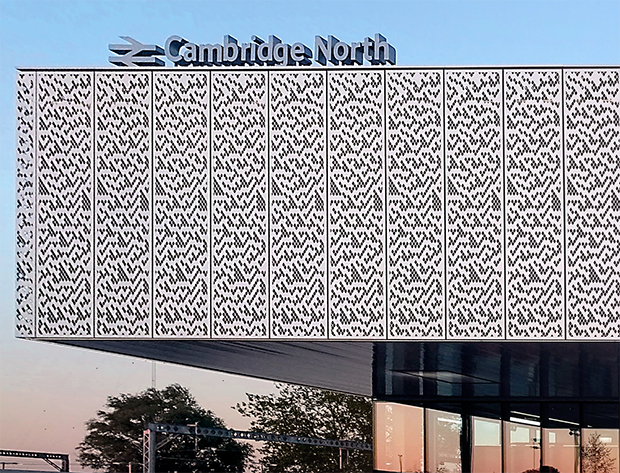

---
slides:
  # Choose a theme from https://github.com/hakimel/reveal.js#theming
  theme: white
  # Choose a code highlighting style (if highlighting enabled in `params.toml`)
  #   Light style: github. Dark style: dracula (default).
  highlight_style: github``
  reveal_options:
    hash: true
    mathjax3:
      loader:
        load: ['[tex]/noerrors', '[tex]/physics']
      tex:
        packages: 
          '[+]': ['noerrors', 'physics']
scripts: ['https://cdn.jsdelivr.net/npm/p5@1.4.1/lib/p5.js']
---

# New Rules:
## Quantum Circuits, Cellular Automata, Complexity and Chaos
[austen.uk/slides/new-rules](austen.uk/slides/new-rules)

Austen Lamacraft, University of Cambridge 

---

## Conway's Game of Life

---

## Cellular Automata

Dynamical system where space, time, and the local variables are *all discrete*

---

## Quantum Circuits

Basis of quantum supremacy work by Google and others

---

## This talk

- What are the similarities and differences?
- What can we learn about dynamics more generally?
- Is it any use?

---

## General definition

---

## Wolfram's Rules 

A convenient way to enumerate all possible CAs with given neighborhood 

---

## CAs in the wild

[Discussed here](https://writings.stephenwolfram.com/2017/06/oh-my-gosh-its-covered-in-rule-30s/)

---

## Rule 30

Nice demo

https://editor.p5js.org/lemonsquares/sketches/XtLvUvgAF

All the rules

https://editor.p5js.org/steinlav/sketches/7NVUVHTjk

https://carrot.whitman.edu/P5JS/wolfram-rule/

---

## Rule 150

https://github.com/david-kishi/wolfram-rule-150-demo

---

## Rule 54

---

Wolfram's A New Kind of Science is 20 years old

Anderson's review

---

## Multidomain automata

https://slackermanz.com/

---

## Pokemon

- Pokemon CA: https://twitter.com/matthen2/status/1543226572592783362

- Rock paper scissors: https://twitter.com/AndrewM_Webb/status/1236274167437197320

---

## CAs as model physics

- Causal 'light cone'
- What are the possible behaviours: chaos, periodicity, ...
- Wolfram has four classes of behavior including
  - Class 2 where differences die out
  - Class 3 where differences grow

---

## Chaos

Notion of Hamming distance

(fun: difference pattern in Rule 150 gives Sierpinski)

---

## Theory?

- What tools do we have? Have no chance of solving the dynamics of any one CA
- If we are looking for *generic* properties, natural to consider *ensembles*
  
  - Of initial conditions
  - Of rules

---

## Probabilistic CA

Introduce ensembles: choose rule randomly each time!

---

---

## Markov chain on differences

---

## Applications

Hashing, cryptography

https://www.wolframscience.com/nks/p603--cryptography-and-cryptanalysis/

Used as RNG in Wolfram: https://mathworld.wolfram.com/Rule30.html

---

## Synchronization

http://www.scholarpedia.org/article/Synchronization_of_extended_chaotic_systems

---

## Coalescence

Simulation of two 2D CAs, and an illustration of convergence of Hamming distance

---

## Directed Percolation

Occurrence in turbulence
Still not understood!

---

## Reversibility 

Undecidability of reversibility above one (space) dimension

Contrast rule 30 and 15 (one of the reversible ones)

Wang tiles

https://editor.p5js.org/golan/sketches/vUSpJuD6f

---

## Block Cellular Automata

Pic from Wikipedia

---

---

## 24 reversible models

Special cases

SWAP, integrable

---

---

<blockquote class="twitter-tweet">
given these four jigsaw pieces, there is only one way to fill in the rest of the puzzle. The solution ends up drawing a Sierpinski triangle. Can you see why? <a href="https://t.co/OvxVz2oehy">pic.twitter.com/OvxVz2oehy</a>
&mdash; Matt Henderson (@matthen2) <a href="https://twitter.com/matthen2/status/1529552315337818112?ref_src=twsrc%5Etfw">May 25, 2022</a>

---

## Self assembly 

https://journals.plos.org/plosbiology/article?id=10.1371/journal.pbio.0020424

---

## Billiard ball computer

---

## Self-dual models

Notion of space-time duality

---

## Random self-dual maps

Back to sim

---

## Mutual information

Simple picture of Bell pairs and SWAPS

---

## Summary so far

- CAs as dynamical systems: chaos and integrability
- Special maps are "maximally chaotic"
- Illustrates: *causality, duality, ensembles, chaos, information*

**How can we extend these ideas to quantum systems?**

---

## What is a quantum circuit?

- A way to describe operations on quantum state, usually consisting of several __qubits__ (spin 1/2 subsystems)

- $f$ acts on top five qubits, then $g$ acts on lower seven

---

## [Possible operations](https://en.wikipedia.org/wiki/Quantum_logic_gate)

<figure align="center">

<figcaption>Source: <a href="https://en.wikipedia.org/wiki/Quantum_circuit">Wikipedia</a> </figcaption>
</figure>

1. $H$ (a [Hadamard gate](https://en.wikipedia.org/wiki/Quantum_logic_gate#Hadamard_gate)) is a __single qubit unitary__ 

2. Also __two qubit unitary gates__ (CNOT here)

3. Measurements 

---

## Why consider circuits?

- Model of universal quantum computation 
  - How to generate an arbitrary quantum state
  - One of several options e.g. measurement-based

- Example of discrete time, many body dynamics

--- 

## Unitary circuits

- (Mostly) concerned with __unitary circuits__ made from __unitary gates__

- Gate is $n$-qubit unitary $U_{s_1\ldots s_n,s'_1,\ldots, s'_n}$

`$$
\sum_{s_1'\ldots s_N'}U_{s_1\ldots s_n,s'_1,\ldots, s'_n} U^\dagger_{s'_1\ldots s'_n,s''_1,\ldots, s''_n}=\delta_{s_1,s_1''}\ldots \delta_{s_N,s_N''}
$$`

---

## Everything is a tensor

- State of $N$ qubits expressed in product basis
  
`$$
\ket{\Psi} = \sum_{s_{1:N}\in \{0,1\}^N} \Psi_{s_1\ldots s_N}\ket{s_1}_1\ket{s_2}_2\cdots \ket{s_N}_N
$$`

- Write `$\ket{s_1}_1\ket{s_2}_2\cdots \ket{s_N}_N =\ket{s_1\cdots s_N}=\ket{s_{1:N}}$` for brevity 

- Operator on $N$ qubits has matrix elements

`$$
\mathcal{O}_{s_{1:N},s'_{1:N}} = \bra{s_{1:N}}\mathcal{O}\ket{s'_{1:N}}
$$`

---

## Graphical notation

<figure align="center">

<figcaption>See <a href="https://github.com/ey3lock3r/MPS-Tutorial">Pan Zhang's tutorial</a> </figcaption>
</figure>

---

## Unitary gates: one qubit

- Multiplication by a Pauli matrix: $X$, $Y$, or $Z$.

- General case $U = a_0\mathbb{1} + \mathbf{a}\cdot(X,Y,Z)$ with $|a_0|^2+|\mathbf{a}|^2=1$

- Other special cases used in quantum information e.g. [Hadamard gate](https://en.wikipedia.org/wiki/Quantum_logic_gate#Hadamard_gate)
`$$
H = \frac{1}{\sqrt{2}}\begin{pmatrix}
1 & 1 \\
1 & -1
\end{pmatrix}
$$`

---

## Two qubits

- Usually write in *computational basis* $\ket{00}$, $\ket{01}$, $\ket{10}$, $\ket{11}$

- Simplest example: [SWAP gate](https://en.wikipedia.org/wiki/Quantum_logic_gate#Swap_gate)
`$$
\operatorname{SWAP}=\left[\begin{array}{llll}
1 & 0 & 0 & 0 \\
0 & 0 & 1 & 0 \\
0 & 1 & 0 & 0 \\
0 & 0 & 0 & 1
\end{array}\right]
$$`

- Takes product state to product state

$$
\operatorname{SWAP}\ket{10} = \ket{01}
$$

---

## Square root of SWAP

`$$
\sqrt{\operatorname{SWAP}}=\left[\begin{array}{cccc}
1 & 0 & 0 & 0 \\
0 & \frac{1}{2}(1+i) & \frac{1}{2}(1-i) & 0 \\
0 & \frac{1}{2}(1-i) & \frac{1}{2}(1+i) & 0 \\
0 & 0 & 0 & 1
\end{array}\right]
$$`

- Generates _entanglement_ (non product state)

$$
\sqrt{\operatorname{SWAP}}\ket{10} = \frac{1}{2}\left[(1+i)\ket{10}+(1-i)\ket{01}\right]
$$

- Conserves number of 1s and 0s (in fact fully rotationally invariant)

- $\sqrt{\operatorname{SWAP}}$ and single qubit unitaries are __universal gate set__

---

## Gate notation

<object data="assets/matrix_elements.svg" type="image/svg+xml"></object>

---

## Unitary condition

<figure align="center">

</figure>

---

## Locality as a feature of real circuits

- [Google Sycamore processor](https://en.wikipedia.org/wiki/Sycamore_processor)

---

## Hype

- Sampling from circuits basis of [Google's "quantum supremacy"](https://www.nature.com/articles/s41586-019-1666-5)
 

---

## Brickwork unitary circuits

- Have __causality__ built in
- Quantum analog of (block) CAs

---

- More complicated tensor networks &rarr; more complicated spacetimes (black holes, AdS, etc.)

<figure align="center">

<figcaption> Source: <a href="https://quantumfrontiers.com/2015/06/26/holography-and-the-mera/">Quantum Frontiers</a> </figcaption>
</figure>

---

## Computational complexity

- Normally matrix-vector multiplication is $O(\operatorname{dim}^2)=2^{2N}$

- Gates are _sparse_ so $O(\operatorname{dim})=2^{N}$, but _still exponentially hard_

- For low depth $T<N$ move _horizontally_ instead

---

## Expectation values

- Evaluate $\bra{\Psi}\mathcal{O}\ket{\Psi}=\bra{\Psi_0}U^\dagger\mathcal{O}U\ket{\Psi_0}$ for local $\mathcal{O}$

- If $\Psi_0$ is product state $\ket{Z_1\cdots Z_N}$ top and bottom indices match
 

 
<object data="assets/expectation.svg" type="image/svg+xml" width='600'></object>

---

## Unitary condition

<figure align="center">

</figure>

---

## Folded picture

<figure align="center">

</figure>

- After folding, lines correspond to two indices / 4 dimensions 

---

## Unitarity in folded picture

- Semicircle denotes $\delta_{ab}$

<figure align="center">

</figure>

<object data="assets/folded.svg" type="image/svg+xml" width='2000'></object>

---

## $\bra{\Psi}\mathcal{O}\ket{\Psi}$ in folded picture

- Emergence of "light cone"

<object data="assets/folded-expectation.svg" type="image/svg+xml"></object>

---

## Reduced density matrix

$$
\rho_A = \operatorname{tr}_B\left[\ket{\Psi}\bra{\Psi}\right]=\operatorname{tr}_B\left[U\ket{\Psi_0}\bra{\Psi_0}U^\dagger\right]
$$

<object data="assets/reduced-density-matrix.svg" type="image/svg+xml"></object>

---

## [Schmidt decomposition](https://en.wikipedia.org/wiki/Schmidt_decomposition)

- In `$\mathcal{H}=\mathcal{H}_A\otimes\mathcal{H}_B$` any state `$\Psi_{AB}$` can be written

`$$
\ket{\Psi_{AB}} = \sum_{\alpha=1}^{\min(\operatorname{dim} \mathcal{H}_A, \operatorname{dim} \mathcal{H}_B)} \lambda_\alpha \ket{u_\alpha}_A\otimes\ket{v_\alpha}_B
$$`

- $\ket{u_\alpha}$ and $\ket{v_\alpha}$ orthonormal; $\lambda_\alpha\geq 0$

- $\lambda_\alpha$ quantify _entanglement_ between A and B

---

## Apply to reduced density matrix

`$$
\begin{align}
\rho_A &= \operatorname{tr}_B\left[\ket{\Psi}\bra{\Psi}\right] \\
&= \sum_\alpha \lambda_\alpha^2 \ket{u_\alpha}\bra{u_\alpha}
\end{align}
$$`

- $p_\alpha\equiv \lambda_\alpha^2$ are the eigenvalues of $\rho_A$

---

## Schmidt rank

- $\operatorname{rank}=\min(\operatorname{dim} \mathcal{H}_A, \operatorname{dim} \mathcal{H}_B)=2^{\min(2t-2, N_A)}$

- Here $t=4$, $N_A=4$
<object data="assets/contracted-density-matrix.svg" type="image/svg+xml"></object>

---

## Entanglement entropy

- von Neumann entropy of $\rho_A$

`$$
\begin{align}
S_A &= -\operatorname{tr}\left[\rho_A\log \rho_A\right]\\
&=-\sum_\alpha p_\alpha \log p_\alpha
\end{align}
$$`

- Maximum value for equal probabilities $p_\alpha = \frac{1}{2^{\min(2t-2, N_A)}}$

$$
S_A \leq \min(2t-2, N_A)\log 2
$$

---

## Maximum entropy growth?

Bell pairs and SWAPs

---

## Dual unitarity

Includes the dual models we discussed so far in classical case

---

## Thermalization

To infinite temperature at long enough times

---

## Operator spreading

Introduce operator expansion

---

## OTOC

In terms of operator expansion

---

## Maximal velocity circuits

How does it look for dual unitaries?

---

## Google OTOC experiment

---

## What's so hard about quantum mechanics?

- Can understand the average OTOC 

---

## Curved space?

Higher dimensions, AdS, etc.

---

## Concrete model: kicked Ising

---

## Horizon effect

Entanglement velocity and quasiparticle picture

---

## Maximal entangling states

---

## Maximal entanglement velocity implies dual unitarity

---

## Higher dimensions?

---

## Measurements and purification

Resemblance to CA models with directed percolation

---

Applications: VQA ?

