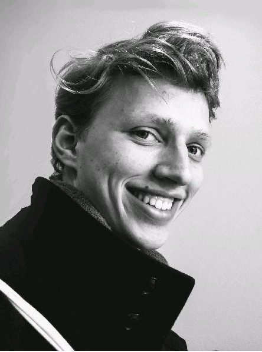
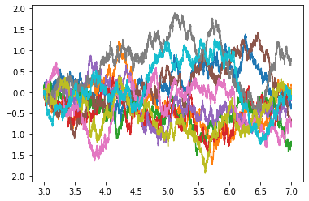
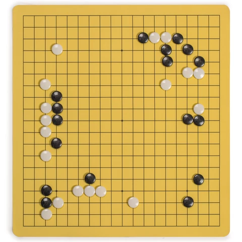

---
slides:
  # Choose a theme from https://github.com/hakimel/reveal.js#theming
  theme: white
  # Choose a code highlighting style (if highlighting enabled in `params.toml`)
  #   Light style: github. Dark style: dracula (default).
  highlight_style: github
scripts: []
---

$$
\nonumber
\newcommand{\br}{\mathbf{r}}
\newcommand{\bR}{\mathbf{R}}
\newcommand{\bp}{\mathbf{p}}
\newcommand{\bk}{\mathbf{k}}
\newcommand{\bq}{\mathbf{q}}
\newcommand{\bv}{\mathbf{v}}
\newcommand{\bx}{\mathbf{x}}
\newcommand{\bz}{\mathbf{z}}
\DeclareMathOperator*{\E}{\mathbb{E}}
$$

---

## Quantum Ground States from Reinforcement Learning

Work with Ariel Barr and Willem Gispen

&nbsp;&nbsp;&nbsp;&nbsp;&nbsp;&nbsp;&nbsp;&nbsp;&nbsp;&nbsp;
&nbsp;&nbsp;&nbsp;&nbsp;&nbsp;&nbsp;&nbsp;&nbsp;&nbsp;&nbsp;

---

## Schrödinger Equation: 1 Particle

- __Schrödinger picture__: basic object is _wavefunction_ $\psi(\br)$

$$
\overbrace{\left[-\frac{\nabla^2}{2m}+V(\br_i)\right]}^{\equiv H\text{, Hamiltonian}}\psi(\br) = E\psi(\br)
$$

- Discretize on real-space grid $L\times L\times L$

---

## Schrödinger Equation: N Particles

- Wavefunction now has $N$ variables: $\Psi(\br_1,\ldots \br_N)$

`$$
\overbrace{\left[\sum_i\left(-\frac{\nabla_i^2}{2m_i}+V(\br_i)\right)+\sum_{i<j}U(\br_i-\br_j)\right]}^{\equiv H}\Psi(\br_1,\ldots \br_N) = E\Psi(\br_1,\ldots \br_N)
$$`

- Requires grid in $3N$ dimensions of $L^{3N}$ points!
- __Atoms / molecules__ are hard; __matter__ ($N\sim N_\text{A}$) is _impossible_!

---

## Variational Principle

- For _approximate_ $\Psi$ can upper bound _ground state_ $E_0$

`$$
\begin{align}
E_0 &\leq \inf_{\lVert\Psi\rVert=1} \langle \Psi\lvert H\rvert\Psi\rangle\\
\langle \Psi\lvert H\rvert\Psi\rangle &= \int d\br_1\cdots d\br_N \Psi^*(\br_1,\ldots,\br_N)\left[H \Psi\right](\br_1,\ldots,\br_N)
\end{align}
$$`

Challenges

1. Form of $\Psi$
2. Expectation evaluation
3. Optimization

---

## Form of $\Psi$ ('Feature Engineering')

Wavefunctions of restricted form

- Factorized, leading to __Hartree--Fock__ method

$$
\Psi(\br_1,\ldots,\br_N)=\psi_1(\br_1)\ldots \psi_N(\br_N).
$$

- __Jastrow factors__ include pair correlations

`$$
\Psi(\br_1,\ldots,\br_N)\to \Psi(\br_1,\ldots,\br_N)\exp\left(\sum_{i<j}\phi(\br_i-\br_j)\right)
$$`

- Many more...

---

## Expectation evaluation

$|\Psi(\br_1,\ldots,\br_N)|^2$ a probability distribution, so evaluate

`$$
\frac{\langle \Psi\lvert H\rvert\Psi\rangle}{\langle\Psi \vert\Psi\rangle}
 =\int d\bR\,|\Psi(\bR)|^2\frac{\left[H \Psi\right](\bR)}{\Psi(\bR)}
$$`

by Monte Carlo sampling. This is __Variational Monte Carlo (VMC)__

---

## Neural Approaches

$\Psi(\bR)\sim \textsf{NN}(\bR)$ and optimize!

- Carleo and Troyer (2017): lattice models (more later)

- many more...  

- Pfau _et al._ (2019): Fermi Net

---

## TL;DR

- $\exists$ other formulations of QM including __Feynman's path integral__

- Let's learn the path integral instead!

---

## Outline

- The path integral
- Quantum mechanics and optimal control
- Learning the ground state process
- First experiments
- Next directions

---

## Path integral

- Solution of _time-dependent_ Schrödinger equation

`$$
\begin{align}
i\frac{\partial \psi}{\partial t} &= H\psi\\
\psi(\br_2,t_2) &= \int d\br_1 \mathcal{K}(\br_2,t_2;\br_1,t_1)\psi(\br_1,t_1),\\
  \mathcal{K}(\br_2,t_2;\br_1,t_1) &= \int_{\br(t_1)=\br_1 \atop \br(t_2)=\br_2} \mathcal{D}\br(t)\exp\left(i\int_{t'}^t L(\br(t),\dot{\br})\right)
\end{align}
$$`

- $L(\br,\bv) = \frac{1}{2}\bv^2 - V(\br)$ is the classical Lagrangian

>  My machines came from too far away

---

## Trouble with Feynman?

- "Integration over paths" has never been defined

- Kac (1949) found a workaround for heat-type equations

\begin{align}
  \frac{\partial\psi(\br,t)}{\partial t} = \left[\frac{\nabla^2}{2}-V(\br_i)\right]\psi(\br,t)
\end{align}

- "Imaginary time" Schrödinger. Exponent in PI becomes real

$$
\exp\left(-\int_{t'}^t \left[\frac{1}{2}\dot\br^2 + V(\br)\right]\right)
$$

---

## Feynman--Kac (FK) Formula

...expresses $\psi(\br,t)$ as expectation...

`$$
  \psi(\br_2,t_2) =  \E_{\br(t)}\left[\exp\left(-\int_{t_1}^{t_2}V(\br(t))dt\right)\psi(\br(t_1),t_1)\right]
$$`

...over Brownian paths finishing at $\br_2$ at time $t_2$.

---

## Ground State from PI

- For $t\to\infty$ only _ground state_ contributes

- Spectral representation in terms of $H\varphi_n = E_n\varphi_n$

`\begin{align}
  K(\br_2,t_2;\br_1,t_1) &= \sum_n \varphi_n(\br_2)\varphi^*_n(\br_1)e^{-E_n(t_2-t_1)}\\
  &\longrightarrow \varphi_0(\br_2)\varphi^*_0(\br_1)e^{-E_0(t_2-t_1)} \qquad \text{ as } t_2-t_1\to\infty.
\end{align}`

---

## Bosons and Fermions

---

## Path integral Monte Carlo

  [Ceperley, RMP (1995)](https://journals.aps.org/rmp/abstract/10.1103/RevModPhys.67.279)

---

## The Path Measure

- Relative weight of FK paths given by _Radon-Nikodym derivative_

`$$
  \frac{d\mathbb{P}_\text{FK}}{d\mathbb{P}_\text{B}} = \mathcal{N}\exp\left(-\int_{t_1}^{t_2}V(\br(t))dt\right)
$$
`

- $\mathcal{N}$ is a normalization factor. $\mathcal{N}\sim e^{E_0 (t_2-t_1)}$ for $t_2\gg t_1$

- More time in $V(\br)<0$ regions; less in $V(\br)>0$.

__pic__

---

## Born Rule in PI?

- $|\psi(\br)|^2$ is probability distribution. Connection to path measure?

- Consider path passing through `$(\br_-,-T/2)$`, $(\br,0)$ and `$(\br_+,T/2)$`

- Overall propagator is

`$$
  K(\br_+,T/2;\br,0)K(\br,0;\br_-,-T/2;)\sim  |\varphi_0(\br)|^2\varphi_0(\br_+)\varphi^*_0(\br_-)e^{-E_0T}.
$$`

- Sample from FK measure &harr; sample from $|\varphi_0(\br)|^2$

__pic__

---

## Schrödinger Problem (1931)

-  Diffusion between two distributions $p_{\pm T/2}(\br)$ ?

- Solution written `$p_t(\br) = \varphi_\text{F}(\br,t)\varphi_\text{B}(\br,t)$`

- $\varphi_\text{F/B}(\br,t)$ obeys forward / backward heat equation

- Jamison (1974): process is _Markov_

$$
d\br_t = d\mathbf{B}_t + \bv(\br_t,t)dt,
$$

- Drift $\mathbf{v}(\br_t,t)$ determined by potential `$V(\br)$` and `$p_{\pm T/2}(\br)$`

---

## Optimal Control Formulation

- Cost function

$$
  C_T[\mathbf{v}] = \frac{1}{T}\E\left[\int_0^T\left[\frac{1}{2}(\mathbf{v}(\br_t,t))^2 + V(\br_t)\right]dt\right],
$$

- Holland (1977) showed that

`$$
E_0 = \lim_{T\to\infty} \min_{\bv} C_T[\bv(\br)]
$$`

---

## Probabilistic interpretation

`$$
C_T[\mathbf{v}]-E_0  = \lim_{T\to\infty} \frac{1}{T} \E_{\mathbb{P}_\bv}\left[\log\left(\frac{d\mathbb{P}_\bv}{d\mathbb{P}_\text{FK}}\right)\right] = \lim_{T\to\infty} \frac{1}{T} D_\text{KL}(\mathbb{P}_\bv\lvert\rvert \mathbb{P}_\text{FK})
$$`

- When $C_T[\mathbf{v}]/T=E_0$, SDE samples from the FK path measure!

- Don't just get $E_0$, but samples from $|\varphi_0|^2$

---

## Proof Sketch

- We have seen

`$$
  \frac{d\mathbb{P}_\text{FK}}{d\mathbb{P}_\text{B}} = \mathcal{N}\exp\left(-\int_{t_1}^{t_2}V(\br(t))dt\right)
$$
`

$\mathcal{N}\sim e^{E_0 (t_2-t_1)}$ for $t_2\gg t_1$

`

- __Girsanov theorem__ tells us

`$$
  \frac{d\mathbb{P}_\bv}{d\mathbb{P}_{\text{B}}}=\exp\left(\int v(X_t)dX_t - \frac{1}{2}\int |v(X_t)|^2 dt\right).
$$`

---

Evaluate the KL divergence

`$$
\begin{align}
  \E_{\mathbb{P}_\bv}\left[\log\left(\frac{d\mathbb{P}_\bv}{d\mathbb{P}_\text{FK}}\right)\right]&=\E_{\mathbb{P}_v}\left[\int v(X_t)dX_t+\int dt\left(-\frac{1}{2}|v(X_t)|^2+V(X_t)\right)\right] - E_0 T\\
  &=\E_{\mathbb{P}_v}\left[\int v(X_t)dW_t+\int dt\left(\frac{1}{2}|v(X_t)|^2+V(X_t)\right)\right] - E_0 T\\
  &=\E_{\mathbb{P}_v}\left[\int dt\left(\frac{1}{2}|v(X_t)|^2+V(X_t)\right)\right] - \lambda T\\
  &\geq 0
\end{align}
$$`

[Boué and Dupuis (1998)](https://projecteuclid.org/euclid.aop/1022855876)

---

## Fokker--Planck

- Consider SDE with drift $v(x) = -U'(x)$

$$
dx_t = dB_t + v(X_t)dt
$$

- Fokker--Planck equation describing probability density

$$
  \frac{\partial\rho}{\partial t} =\frac{\partial}{\partial x}\left[\frac{1}{2}\frac{\partial \rho}{\partial x} + U'(x)\rho\right].
$$

- Stationary state is Boltzmann distribution

$$
  \rho_0(x) \propto \exp(-2U(x)).
$$

---

## Schrödinger &harr; Fokker--Planck

$$
  \psi(x,t) = \frac{\rho(x,t)}{\sqrt{\rho_0(x)}},
$$

...satisfies the (imaginary time) Schrödinger equation with Hamiltonian

`$$
  H = -\frac{1}{2}\frac{\partial^2}{\partial x^2}+ \overbrace{\frac{U'^2- U''}{2}}^{\equiv V(x)}.
$$`

- Zero energy ground state $\varphi_0(x) = \sqrt{\rho_0(x)}\propto \exp(-U(x))$

- Drift $v(x) = \varphi_0'(x)/\varphi_0(x)$

---

## Examples

---

## Oscillator = Ornstein--Uhlenbeck

$$
H = \frac{1}{2}\left[-\frac{d^2}{dx^2} + x^2\right]
$$

- Ground state `$\varphi_0(x)=\pi^{-1/4}e^{-x^2/2}$`; `$E_0=1/2$`

- Drift $v(x) = - x$ gives OU process

---

## Calogero = Dyson BM

`$$
H = \sum_i \frac{1}{2}\left[-\frac{\partial^2}{\partial x_i^2}+x^2\right] + \lambda(\lambda-1)\sum_{i<j} \frac{1}{(x_i-x_j)^2}
$$`

- Ground state _exactly_ of Jastrow form

`$$
\Phi_0(x_1,\ldots x_N) = \prod_{i<j}|x_i-x_j|^{\lambda}\exp\left(-\frac{1}{2}\sum_i x_i^2\right)
$$`

- Drift is $v_i = \partial_i \log\Phi_0$

`$$
v_i = - x_i + \lambda \sum_{j\neq i} \frac{1}{x_i-x_j}
$$`

---

- Particles drift away from each other

- But of course we don't usually know the wavefunction...

---

## Reinforcement Learning

- Recall cost

$$
  C_T[\mathbf{v}] = \frac{1}{T}\E\left[\int_0^T\left[\frac{1}{2}(\mathbf{v}(\br_t,t))^2 + V(\br_t)\right]dt\right],
$$

- Suggests strategy:

  1. Represent `$\bv_\theta(\br) = \textsf{NN}_\theta(\br)$`
  2. Integrate batch of SDE trajectories
  3. Backprop through the (MC estimated) cost

---

## Drift Representation

- For identical particles require _permutation equivariance_

`$$
 \bv_{i,\theta}(\br_1,\ldots,\br_N = \bv_{P(i),\theta}(\br_{P(1)},\ldots,\br_{P(N)})
$$`

...for any permutation $P$

- Numerous recent proposals e.g. [Deep Sets](https://arxiv.org/abs/1703.06114) (Zaheer _et al._, 2017)

- Propose equivariant layer

Deep Sets, Gutenberg

---

## Integrate SDE

- Simplest scheme is _Euler--Maruyama_

`$$
    \br_{t+1} = \br_{t+1} + \Delta\mathbf{B}_t + \bv_\theta(\br_t)\Delta t,
$$`

- $\Delta\mathbf{B}_t\sim \mathcal{N}(0,t)$

- We use [SOSRA](https://arxiv.org/abs/1804.04344) (Rackaukas and Nie, 2018)

- Can regard as (recurrent) resnet [Neural ODE](https://arxiv.org/abs/1806.07366), (Chen _et al._, 2018)

- Evolve batch of trajectories from final state of previous batch

- Batch tracks stationary state of current $\bv_\theta$

---

## Stochastic Backprop

$$
  C_T[\mathbf{v}] = \frac{1}{T}\E\left[\int_0^T\left[\frac{1}{2}(\mathbf{v}(\br_t,t))^2 + V(\br_t)\right]dt\right],
$$

- Monte Carlo estimate from batch of $B$ trajectories

`$$
    C_T[\bv_\theta] \approx \frac{1}{B T} \sum_{b,t}\left[\frac{1}{2}\bv_\theta\left(\br^{(b)}_t\right)^2 + V\left(\br^{(b)}_t\right)\right].
$$`

- $\br^{b}_{t}$ from SDE discretization. Analogous to the reparameterization trick in deep latent Gaussian models (\cite{Rezende:2014aa}) or variational autoencoders (\cite{Kingma:2013aa}).

---

## Experiments

1. Hydrogen
2. Helium
3. Hydrogen molecule
4. Bosons in 2D Gaussian potential

---

## Hydrogen

---

## Helium

Point is that ground state has zero spin, so that spatial wavefunction is symmetric

---

## Hydrogen Molecule

- Electron density
- Exchange?

Pics [here](https://webhome.weizmann.ac.il/home/orcohen/dft_vis/h2.html)

---

<video width="500" autoplay loop>
  <source data-src="assets/h2-scatter.mp4" type="video/mp4">
</video>

---

## 2D Bosons

<video width="500" autoplay loop>
  <source data-src="assets/bosons.mp4" type="video/mp4">
</video>

---

## Critique

- Why model the drift not the wavefunction? Is calculating gradients better?
- Is sampling better (not just MC)

## Any prospect for excited states?

Initial state dynamics

Angular momentum states

Sign Problem

---

## Next: Lattice Models

---

## XY model

- On chain / square / cubic lattice

`$$
\begin{align}
\partial_t \Psi_{\Huge\circ\Huge\bullet\Huge\circ} &= \Psi_{\Huge\bullet\Huge\circ\Huge\circ}+\Psi_{\Huge\circ\Huge\circ\Huge\bullet}\\
&=\overbrace{ \Psi_{\Huge\bullet\Huge\circ\Huge\circ}+\Psi_{\Huge\circ\Huge\circ\Huge\bullet}-2\Psi_{\Huge\circ\Huge\bullet\Huge\circ}}^{\text{master / forward eq.}} +2 \Psi_{\Huge\circ\Huge\bullet\Huge\circ}
\end{align}
$$`

- c.f. imaginary time Schrödinger

$$
  \frac{\partial\psi(\br,t)}{\partial t} = \left[\frac{\nabla^2}{2}-V(\br_i)\right]\psi(\br,t)
$$

- $\exists$ Feynamn--Kac representation!

---

## Todorov's Linearly Solvable MDPs

Todorov: linearly solvable MDPs

Describe XY model
