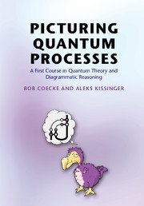
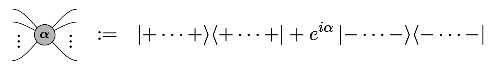
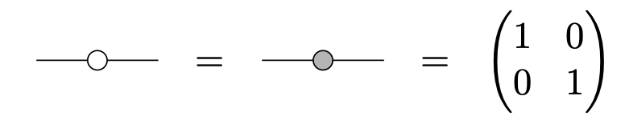
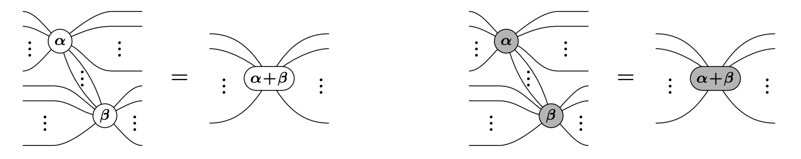
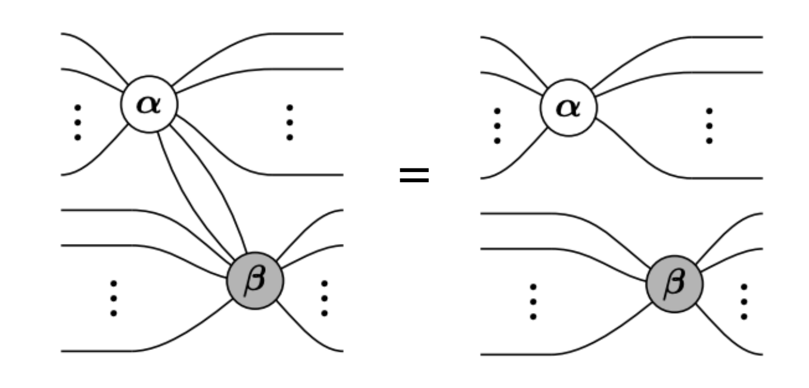
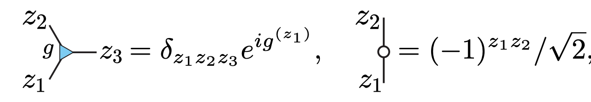
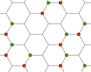
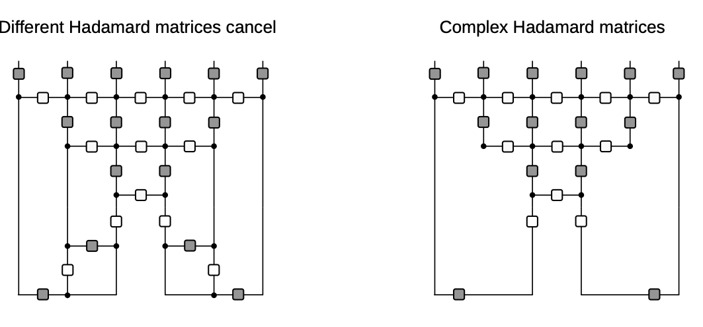

---
slides:
  # Choose a theme from https://github.com/hakimel/reveal.js#theming
  theme: white
  math_renderer: katex
  reveal_options: {
    hash: true,
    katex: {
      macros: {
        "\\abs" : "\\left|#1\\right|",
        "\\tr" : "\\operatorname{tr}",
        "\\sgn" : "\\operatorname{sgn}",
      },
      throwOnError: false,
    }
  }
scripts: ['https://cdn.jsdelivr.net/npm/p5@1.6.0/lib/p5.js', 'https://cdn.jsdelivr.net/npm/mathjs@11.7.0/lib/browser/math.min.js']
---

## Space-time dual quantum circuits

Austen Lamacraft (Cambridge) and Pieter Claeys (Dresden)

[austen.uk/#talks](https://austen.uk/#talks) for slides

---

### Motivation: kicked Ising model

- Time dependent Hamiltonian with kicks at $t=0,1,2,\ldots$

`$$
\begin{aligned}
H_{\text{KIM}}(t) = H_\text{I}[\mathbf{h}] + \sum_{m}\delta(t-n)H_\text{K}\\
H_\text{I}[\mathbf{h}]=\sum_{j=1}^L\left[J Z_j Z_{j+1} + h_j Z_j\right],\qquad H_\text{K} &= b\sum_{j=1}^L X_j
\end{aligned}
$$`

- "Stroboscopic" form of $U(t)=\mathcal{T}\exp\left[-i\int^t H_{\text{KIM}}(t') dt'\right]$

`$$
\begin{aligned}
  U(n_+) &= \left[U(1_+)\right]^n,\qquad U(1_-) = K I_\mathbf{h}\\
  I_\mathbf{h} &= e^{-iH_\text{I}[\mathbf{h}]}, \qquad K = e^{-iH_\text{K}}
\end{aligned}
$$`

---

### Unitary circuit

- Another class of discrete time dynamics

<figure align="center">

</figure>

---

### KIM as a circuit

`$$
\begin{aligned}
  \mathcal{K} &= \exp\left[-i b X\right]\\
  \mathcal{I} &= \exp\left[-iJ Z_1 Z_2 -i \left(h_1 Z_1 + h_2 Z_2\right)/2\right]
\end{aligned}
$$`

---

### Expectation values

- Evaluate $\bra{\Psi}\mathcal{O}\ket{\Psi}=\bra{\Psi_0}\mathcal{U}^\dagger\mathcal{O}\mathcal{U}\ket{\Psi_0}$ for local $\mathcal{O}$

 

 
<object data="../new-rules-tum/assets/expectation.svg" type="image/svg+xml" width='600'></object>

---

### Folded picture

<figure align="center">

</figure>

- After folding, lines correspond to two indices / 4 dimensions 

---

### Unitarity in folded picture

- Circle denotes $\delta_{ab}$

<figure align="center">

</figure>

---

### $\bra{\Psi}\mathcal{O}\ket{\Psi}$ in folded picture

- Emergence of "light cone"

<object data="../new-rules-tum/assets/folded-expectation.svg" type="image/svg+xml"></object>

---

### Reduced density matrix

- Expectation values in region $A$ evaluated using *reduced density matrix*

$$
\rho_A = \operatorname{tr}\_{\bar A}\left[\ket{\Psi}\bra{\Psi}\right]=\operatorname{tr}_{\bar A}\left[\mathcal{U}\ket{\Psi_0}\bra{\Psi_0}\mathcal{U}^\dagger\right]
$$

<object data="../new-rules-tum/assets/reduced-density-matrix.svg" type="image/svg+xml"></object>

---

### Toy model: SWAP circuit 

<figure align="center">

</figure>

- For a Bell pair consisting of qubits at sites $m$ and $n$:

  - If $n\in A$, $m\in\bar A$, $\rho_A$ has factor $\mathbb{1}_n$. 

  - If $m, n\in A$ they contribute a factor $\ket{\Phi^+}\_{nm}\bra{\Phi^+}\_{nm}$ (pure)

- Only first case contributes to `$
 S_A = \min(4\lfloor t/2\rfloor, |A|) 
$` bits

---
  

### Dual unitary gates

- Impose additional restriction

<figure align="center">

</figure>

- [Gopalakrishnan and Lamacraft (2019)](https://journals.aps.org/prb/abstract/10.1103/PhysRevB.100.064309), [Bertini, Kos, and Prosen (2019)](https://journals.aps.org/prl/abstract/10.1103/PhysRevLett.123.210601)

---

### $\rho_A$ via dual unitarity

- 8 sites; 4 layers; Bell pair initial state

<object data="../new-rules-tum/assets/A-entropy-quantum.svg" type="image/svg+xml"></object>

- $\rho_A$ is unitary transformation of
  
$$
  \mathbb{1}\otimes\mathbb{1}\otimes\mathbb{1}\otimes\mathbb{1}\otimes\mathbb{1}\otimes\mathbb{1}\otimes\mathbb{1}\otimes\mathbb{1}
$$

---

### Shallower...

<object data="../new-rules-tum/assets/A-entropy-quantum-shallower.svg" type="image/svg+xml"></object>

- $\rho_A$ is unitary transformation of 
  
$$
\mathbb{1}\otimes\mathbb{1}\ket{\Phi^+}\bra{\Phi^+}\otimes\ket{\Phi^+}\bra{\Phi^+}\otimes\mathbb{1}\otimes\mathbb{1}
$$

---

### General case

- RDM is unitary transformation of 

$$
\rho_0=\overbrace{\frac{\mathbb{1}}{2}\otimes \frac{\mathbb{1}}{2} \cdots }^{t-1} \otimes\overbrace{\ket{\Phi^+}\bra{\Phi^+} \cdots }^{N_A/2-t+1 } \otimes \overbrace{\frac{\mathbb{1}}{2}\otimes \frac{\mathbb{1}}{2} \cdots }^{t-1}
$$

- RDM has $2^{\min(2t-2,N_A)}$ non-zero eigenvalues all equal to $\left(\frac{1}{2}\right)^{\min(2t-2,N_A)}$

- Converse – maximal entanglement growth implies dual unitary gates – recently proved by [Zhou and Harrow (2022)](https://arxiv.org/abs/2204.10341)

---

### Thermalization

- After $N_A/2 + 1$ steps, reduced density matrix is $\propto \mathbb{1}$

- All expectations (with $A$) take on infinite temperature value

---

### The dual unitary family

- $4\times 4$ unitaries are 16-dimensional

- Family of dual unitaries is 14-dimensional
 
- Includes *kicked Ising model* at particular values of couplings
  
- Dual unitaries not "integrable" (except at special points) but have enough structure to allow many calculations

---

### Entanglement Growth for Self-Dual KIM

- [Bertini, Kos, Prosen (2019)](https://journals.aps.org/prx/abstract/10.1103/PhysRevX.9.021033) found that when $|J|=|b|=\pi/4$

$$
\lim_{L\to\infty} S_A =\min(2t-2,N_A)\log 2,
$$

- __Any $h_j$__; initial $Z_j$ product state

---

### 'KIM' property

- ($q=2$ here) Not satisfied by e.g. $\operatorname{SWAP}$

- Maps product states to maximally entangled (Bell) states

- Product initial states also work for KIM!

- [Piroli _et al_ (2020)](https://journals.aps.org/prb/abstract/10.1103/PhysRevB.101.094304) studied more general initial states

---

### Correlation functions

- Infinite temperature correlator $\tr\left[\sigma^\alpha_x(x,t)\sigma^\beta(y,0)\right]$

<figure align="center">

</figure>

- [Bertini, Kos, and Prosen (2019)](https://journals.aps.org/prl/abstract/10.1103/PhysRevLett.123.210601): dual unitarity means correlations vanish _inside_ light cone!

---

### Quantinuum experiment

- Correlations measured in SDKIM by [Chertkov _et al._ (2022)](https://www.nature.com/articles/s41567-022-01689-7)

<figure align="center">

</figure>

---

## Outline

- New directions:

  - Space-time dual models from ZX calculus and Hadamards

  - Cat maps, Clifford gates and the classical limit

- Curiosity: 

  - Discrete Lorentz invariance

---

## ZX Calculus

- Calculus of "special" tensors

<figure align="center">

</figure>

- See also [van der Wetering (2020)](https://arxiv.org/abs/2012.13966)

---

### Basic ingredients: Z and X tensors ("spiders")

<figure align="center">

<figcaption>
Source:  <a href="https://arxiv.org/abs/2012.13966">van der Wetering (2020)</a> 
<figcaption>
</figure>

`$$
|0\rangle=\left(\begin{array}{l}
1 \\
0
\end{array}\right) \quad|1\rangle=\left(\begin{array}{l}
0 \\
1
\end{array}\right) \quad|+\rangle=\frac{1}{\sqrt{2}}\left(\begin{array}{l}
1 \\
1
\end{array}\right) \quad|-\rangle=\frac{1}{\sqrt{2}}\left(\begin{array}{c}
1 \\
-1
\end{array}\right)
$$`

---

### Simplest examples

- Identity

- CNOT

---

### Colour changing with Hadamards

---

### Spider fusion

- Follows that $n$-leg spider is *isometry*: $\mathbb{C}^2\longrightarrow \mathbb{C}^{2^{n-1}}$

- Contract $n-1$ legs of $\alpha$ and $\beta=-\alpha$

---

### Hopf rule aka "leg chopping"

---

### Example: [Liu and Ho (2023)](https://arxiv.org/abs/2312.12239)

---

### Rewrite in ZX language

<figure align="center">

</figure>

- CNOTs (East model, [Bertini _et al._ (2023)](https://arxiv.org/abs/2310.06128)) + phases on each spider

---

### Unitarity of Liu–Ho gate

- Spider fusion: 🟢—🟢 = 🟢 and 🔴—🔴 = 🔴 then leg chopping

---

- _Not_ dual unitary but overall circuit triunitary ([Jonay _et al._ (2021)](https://journals.aps.org/prresearch/abstract/10.1103/PhysRevResearch.3.043046))

<figure align="center">

</figure>

---

### Three light rays / null directions

<figure align="center">

<figcaption>
Source:  <a href="https://journals.aps.org/prresearch/abstract/10.1103/PhysRevResearch.3.043046">Jonay <it>et al.</it> (2021)</a> 
<figcaption>
</figure>

- Correlations nonzero in three directions!

---

- Apply to 🟢 🔴 🟢 🔴 🟢 🔴 initial state

<figure align="center">

</figure>

- Spider fusion

---

<figure align="center">

</figure>

- Isometries along bottom are origin of solvability
- See [Liu and Ho (2023)](https://arxiv.org/abs/2312.12239) for much more!

---

## Circuits based on Hadamard gates

---

- Recall KIM has circuit representation

`$$
\begin{aligned}
  \mathcal{K} &= \exp\left[-i b X\right]\\
  \mathcal{I} &= \exp\left[-iJ Z_1 Z_2 -i \left(h_1 Z_1 + h_2 Z_2\right)/2\right]
\end{aligned}
$$`

- At $|J|=|b|=\pi/4$ model is dual unitary

---

### "Seeing" dual unitarity

- At the dual unitary point $b=\pm i\pi/4$

`$$
  \mathcal{K} = \exp\left[\pm i \frac{\pi}{4} X\right]=\frac{1}{\sqrt{2}}\begin{pmatrix}
  1 & \pm i \\ 
  \pm i & 1
  \end{pmatrix}
$$`

- Is $\propto$ Hadamard matrix: $|H_{ij}|=1$ with $H^\dagger H = d\mathbb{1}$

- Can be interpreted as diagonal phases when "viewed sideways"

<figure align="center">

</figure>

---

- Back to lattice spin model picture

<figure align="center">

</figure>

---

<figure align="center">

</figure>

`$$
U = \mathcal{N}\sum_{z_i\in \mathbb{Z}_d}\prod_{<i,j>} u_{ij}(z_i, z_j)
$$`

- $u_{ij}(z_i, z_j): \mathbb{Z}_d\times \mathbb{Z}_d\longrightarrow U(1)$ 

- $z_i=\omega_d^{n_i}$ for $n_i=0,\ldots d-1$, with $\omega_d = \exp(2\pi i/d)$ 

---

`$$
U = \mathcal{N}\sum_{z_i\in \mathbb{Z}_d}\prod_{<i,j>} u_{ij}(z_i, z_j)
$$`

- When does this describe unitary evolution (vertically)?

- Single row $U_{\text{row }t}$ corresponds to diagonal operator

<figure align="center">

</figure>

$$
  \braket{z_{1:N,t}|U_{\text{row }t}|z_{1:N,t}} = \prod_{x=1}^N u_\text{H}(z_{x,t},z_{x+1,t})
$$

- Unitary since $u_\text{H}$ are phases

---

<figure align="center">

</figure>

- Vertical bonds correspond to operators $u_\text{V}$ with matrix elements

$$
u_\text{V}(z_i,z_j)=\braket{z_i|u_\text{V}|z_j}
$$

- Also unitary up to a multiplicative factor i.e. $u_\text{V}$ is *Hadamard*!

---

<figure align="center">

</figure>

- In the same way, *space-like* evolution is unitary if $u_\text{H}$ is Hadamard

- If *both* $u_\text{V}$ and $u_\text{H}$ are Hadamard (e.g. SKDI): unitary evolution in both space and time or *space-time duality* ([Gutkin *et al.* (2020)](https://journals.aps.org/prb/abstract/10.1103/PhysRevB.102.174307))

---

### Hadamard matrices

- Simple and important example is Fourier matrix (performs DFT)

$$
\left(F_d\right)_{jk} = \exp\left(2\pi ijk/d\right)\qquad j,k=0,\ldots, d-1
$$

- $H$ and `$H'$` are equivalent if
`$$
H' = D_1P_1 H P_2 D_2
$$`

- $D_{1,2}$ are diagonal unitaries and $P_{1,2}$ permutations 

- If $D_1=D_2=\mathbb{1}$ $H$ and `$H'$` are *permutation equivalent*

---

- *Dephased form* of a Hadamard matrix has first row and column all 1

- Two Hadamard matrices with same dephased form are equivalent

`$$
\begin{align*}
H_\text{deph} &= D_1 H D_2\\
D_1&= \operatorname{diag}(\bar H_{11},\bar H_{21},\ldots \bar H_{d1})\\ 
D_2&= \operatorname{diag}(1,H_{11}\bar H_{12},\ldots H_{11}\bar H_{1d}) 
\end{align*}
$$`

---

- $d=2,3$ and $5$: all complex Hadamard matrices equivalent to $F_d$
`$$
F_2 = \begin{pmatrix}
1 & 1 \\
1 & -1
\end{pmatrix}
$$`

- Equivalent to self-dual Ising kick matrix

`$$
  K_{2} =\begin{pmatrix}
  1 & i \\
  i & 1
  \end{pmatrix}= \begin{pmatrix}
  1 & 0\\
  0 & i
  \end{pmatrix} F_2\begin{pmatrix}
  1 & 0\\
  0 & i
  \end{pmatrix}
$$`

- As a phase function

$$
  K_{2}(z_i, z_j) = e^{i\pi/4}\exp\left(-\frac{i\pi}{4} z_i z_j\right)
$$
$$
  F_{2}(z_i, z_j) = e^{i\pi/4}\exp\left(\frac{i\pi}{4} \left[z_i z_j-z_i-z_j\right]\right)
$$

---

- For $d=3$

`$$
  F_3 = \begin{pmatrix}
    1 & 1 & 1 \\
    1 & \omega_3 & \omega_3^2 \\
    1 & \omega_3^2 & \omega_3
  \end{pmatrix}
$$`

- Equivalent to

`$$
 K_3 = \begin{pmatrix}
  1 & \omega_3 & \omega_3 \\
  \omega_3 & 1 & \omega_3 \\
  \omega_3 & \omega_3 & 1 \\
 \end{pmatrix}
$$`

---

- Tensor product of Hadamards is Hadamard e.g.

`$$
F_2\otimes F_2 = \begin{pmatrix}
1 & 1 & 1 & 1 \\
1 & -1 & 1 & -1 \\
1 & 1 & -1 & -1 \\
1 & -1 & -1 & 1
\end{pmatrix}
$$`

- Permutation inequivalent to $F_4$. Full orbit of inequivalent Hadamards

`$$
  F_4^{(1)}(a)=\left[\begin{array}{cccc}
    1 & 1 & 1 & 1 \\
    1 & i  e^{i a} & -1 & -i  e^{i a} \\
    1 & -1 & 1 & -1 \\
    1 & -i  e^{i a} & -1 & i  e^{i a}
    \end{array}\right]\qquad a \in [0,\pi)
$$`

- $F_4^{(1)}(0)=F_4$ and $F_4^{(1)}(\pm\pi/4)$ is perm equivalent to $F_2\otimes F_2$

---

## Cat maps, Clifford gates and the classical limit

---

### Generalized Pauli matrices

`$$
\begin{align*}
Z_d = \begin{pmatrix}
1 & 0 & 0 & \cdots & 0\\
0 & \omega_d & 0 & \cdots & 0\\
\cdots & \cdots & \cdots & \cdots & \cdots \\
0 & 0 & 0 & \cdots & \omega_d^{d-1}
\end{pmatrix}\\ 
X_d = \begin{pmatrix}
  0 & 1 & 0 & \cdots & 0\\
  0 & 0 & 1 & \cdots & 0\\
  \cdots & \cdots & \cdots & \cdots & \cdots \\
  1 & 0 & 0 & \cdots & 0
  \end{pmatrix}
  \end{align*}
$$`

- Satsify $Z_d^d=X_d^d=\mathbb{1}$ and  Weyl relation $X_d Z_d = \omega_d Z_d X_d$

- $Z^a X^b$ with $a,b=0,\ldots d-1$ form basis for local operators

---

- Quantum mechanical analogue of phase space torus
$$
  Z= e^{2\pi i q}\qquad X=e^{2\pi ip}
$$

- Conjugating by Fourier matrix
$$
F Z^a X^b F^\dagger = X^{a}Z^{-b}
$$
like $-\pi/2$ rotation of torus: $(q,p)\longrightarrow (p,-q)$

---

### Cat maps

$$
C_{jk}(\alpha,\delta)\equiv  \exp\left(\frac{2\pi i}{d}\left[\frac{\alpha j^2}{2} + jk + \frac{\delta k^2}{2}\right]\right)\qquad \alpha,\delta\in \mathbb{Z}
$$

- Area preserving (symplectic) linear map on torus
`$$
\begin{align*}
\begin{pmatrix}
  q \\
  p
\end{pmatrix}&\longrightarrow
\begin{pmatrix}
  q' \\
  p'
\end{pmatrix} = T
\begin{pmatrix}
  q \\
  p
\end{pmatrix}\qquad \mod 1\nonumber\\
T &= \begin{pmatrix}
\alpha & \beta \\
\gamma & \delta
\end{pmatrix}\qquad \alpha,\beta,\gamma,\delta\in\mathbb{Z},\qquad \alpha\delta-\beta\gamma=1
\end{align*}
$$`

- $C_{jk}(\alpha,\delta)$ has $\beta=1$ and is *Clifford*: `$Z^a X^b\longrightarrow Z^{a'} X^{b'}$`

- *Quantum cat maps* first studied by [Hannay and Berry (1980)](https://www.sciencedirect.com/science/article/abs/pii/0167278980900263) as quantum analogs of classical [Arnold cat maps](https://en.wikipedia.org/wiki/Arnold%27s_cat_map) 

---

### Arnold's cat map

`$$
T:\begin{pmatrix}
q \\
p
\end{pmatrix}\longrightarrow
\begin{pmatrix}
    \alpha & 1 \\
    \alpha\delta - 1 & \delta
    \end{pmatrix}
\begin{pmatrix}
    q \\
    p
    \end{pmatrix}\qquad \mod 1
$$`

- Chaotic when one Lyapunov exponent exceeds one for $|\alpha+\delta|>2$.

<figure align="center">

<figcaption>
Cat map for $\alpha=2$, $\delta=1$. Source:  <a href="https://en.wikipedia.org/wiki/Arnold%27s_cat_map">Wikipedia</it></a> 
<figcaption>
</figure>

---

<figure align="center">

</figure>

---

`$$
\begin{align*}
  T &= \begin{pmatrix}
    2 & 1 \\
    3 & 2
    \end{pmatrix}: C_{jk}(2,2) = \exp\left(\frac{2\pi i}{d}\left[j^2+k^2+jk\right]\right)\text{ (hyperbolic)}\nonumber\\  
T &= \begin{pmatrix}
-1 & 1 \\
0 & -1
\end{pmatrix}: C_{jk}(-1,-1) = \exp\left(-\frac{i\pi}{d}\left[j-k\right]^2\right)
\text{ (parabolic)}
\end{align*}
$$`

---

- Find update of general Pauli

$$
\prod_{x=1}^N Z^{a_{x,t}}X^{b_{x,t}}\qquad a_{x,t}, b_{x,t}\in \mathbb{Z}_d.
$$

- Taking $u_\text{H}=F$ and $u_\text{V}=C(\alpha,\delta)$  (H then V)

`$$
\begin{align*}
a_{x,t+1} &= \alpha(a_{x,t}-b_{x-1,t}-b_{x+1,t}) + (\alpha\delta -1)b_{x,t}\nonumber\\
b_{x,t+1} &= a_{x,t} - b_{x-1,t} - b_{x+1,t}+\delta b_{x,t}
\end{align*}\mod d
$$`

- "Hamiltonian" form of equations of motion

---

- Second difference "Lagrangian" formulation

`$$
\begin{align*}
\left[\Delta b\right]_{x,t} &= (\alpha + \delta - 4)b_{x,t}\qquad \mod d\nonumber\\
\left[\Delta b\right]_{x,t} &\equiv  b_{x,t+1} + b_{x+1,t-1} + b_{x+1,t} + b_{x-1,t} - 4b_{x,t}
\end{align*}
$$`

- Symmetry between space and time is evident 

- Taking $u_\text{H}=F^\dagger$ and $u_\text{V}=C(\alpha,\delta)$  

`$$
\begin{align*}
  \left[\square b\right]_{x,t} &= (\alpha + \delta)b_{x,t}\qquad \mod d\nonumber\\
  \left[\square b\right]_{x,t} &\equiv b_{x,t+1} + b_{x+1,t-1} - b_{x+1,t} - b_{x-1,t}
  \end{align*}
$$`

---

- For $\alpha=\delta=0$ particularly simple form

`$$
\begin{align*}
  \left[\square b\right]_{x,t} &= 0
  \end{align*}
$$`

- Left and right propagating solutions

`$$
\begin{align*}
a^R_{x,t} &= r_{x-t} \qquad b^R_{x,t} = -r_{x-t-1}\nonumber\\
a^L_{x,t} &= l_{x+t} \qquad b^L_{x,t} = -l_{x+t+1}
\end{align*}
$$`

---

- General case: ([Gütschow *et al.* (2010)](https://pubs.aip.org/aip/jmp/article/51/1/015203/231697/Time-asymptotics-and-entanglement-generation-of))

- Fourier transform of equation of motion

`$$
 M(u, u^{-1}) = \begin{pmatrix}
 \alpha & (\alpha\delta - 1) + \alpha(u + u^{-1}) \\
 1 & \delta + u + u^{-1}
 \end{pmatrix}
$$`

- $\operatorname{tr}M = \alpha + \delta + u + u^{-1}$ determines behaviour

- $\alpha+\delta=0$: *glider* automaton otherwise *fractal*

---

- Example: $d=3$,  $u_\text{V}=C(1,0)$

<figure align="center">

</figure>

- Local correlations vanish quickly!

---

### Spatiotemporal cat

- [Gutkin and Osipov (2016)](https://iopscience.iop.org/article/10.1088/0951-7715/29/2/325) define map on $N$ copies of torus

- Coupling between sites via
`$$
\begin{align*}
x_{n}&\longrightarrow x_n \\
y_{n}&\longrightarrow y_n - x_{n-1} - x_{n+1} - V'(x_n)
\end{align*}\qquad \mod 1
$$`
- Generated by Hamiltonian (NB $V(x)$ periodic)
$$
H_\text{c} = \sum_n \left[x_{n} x_{n+1} + V(x_n)\right]
$$

- Alternate with cat maps $\mathcal{K}_n$ on each site

---

### Lagrangian picture

 - "Momenta" $y_n$ can be eliminated to give two-step (Lagrangian) recurrence for $x_{n,t}$:
`$$
[\Delta x]_{n,t} = (a+b-4)x_{n,t} - V'(x_{nt})-m_{n,t} \mod 1
$$`
winding numbers $m_{n,t}$ chosen to ensure $x_{n,t}$ stays in the unit interval and $\Delta$ is the 2D Laplacian

---

### Correlations

- [Hu and Rosenhaus (2022)](https://arxiv.org/abs/2204.13655),  [Fouxon and Gutkin (2022)](https://iopscience.iop.org/article/10.1088/1751-8121/aca730/meta): explicit results for two and three site correlations. 

- Correlations vanish for $t>\ell$, support of observable

- [Christopoulos *et al.* (2023)](https://arxiv.org/abs/2307.01786) and [Lakshminarayan (2023)](https://arxiv.org/abs/2307.04950) for correlations in other models 

---

### [Lotkov *et al.* (2022)](https://journals.aps.org/prb/abstract/10.1103/PhysRevB.105.144306)

- Floquet dynamics for $d=3$
`$$
\begin{align*}
H_1 &= \sum_{j=1}^{2N-1}\left(X_j^{\dagger}X_{j+1}+X_j X^{\dagger}_{j+1}\right)\\
H_2 &= \sum_{j=1}^{2N}\left(Z_j+Z_j^{\dagger}\right)\\
U_F &= e^{ifTH_2}e^{iJTH_1}
\end{align*}
$$`
- Integrability conjectured for $fT = JT = \alpha_m$, with $\alpha_m = \frac{2\pi}{9}(2\ell-m)$, with $m=\pm 1$ and $\ell \in \mathbb{Z}$.

- Integrability subsequently established by [Miao and Vernier (2023)](https://arxiv.org/abs/2302.12675)

---

- Long range entanglement generation in integrable case

<figure align="center">

</figure>

---

- Integrable case corresponds to 

`$$
\begin{align*}
v_\text{H} = \begin{pmatrix}
1 & \omega & \omega \\
\omega & 1 & \omega \\
\omega & \omega  & 1
\end{pmatrix} \qquad
v_\text{V} =
\begin{pmatrix}
1 & \omega^2 & \omega^2 \\
\omega^2 & 1 & \omega^2 \\
\omega^2 & \omega^2  & 1
\end{pmatrix}=\bar v_\text{H}
\end{align*}
$$`

- $v_\text{H}$ dephases to $F$, so this is equivalent to $v_\text{H}=F$, $v_\text{V}=F^\dagger$

- Hence, *ballistic* propagation of operators

---

### Diagrammatic derivation of rainbow state

<figure align="center">

</figure>

---

<figure align="center">

</figure>

---

<figure align="center">

</figure>

---

<figure align="center">

</figure>

---

- Nonintegrable case 

`$$
v_\text{H} = v_\text{V} = \begin{pmatrix}
1 & \omega & \omega \\
\omega & 1 & \omega \\
\omega & \omega  & 1
\end{pmatrix}
$$`

<figure align="center">

</figure>

- Fractal operator dynamics

---

### Three dimensions

<figure align="center">

</figure>

---

### Questions

1. Do integrable dual unitary circuits have "trivial" dynamics?

2. Is Fourier circuit model integrable in the usual sense (for $d>3$?)

3. Can we connect fractal behaviour of cats at finite $d$ to classical limit?

---

## Last thing: Lorentz symmetry

$$
\color{red}\Lambda\color{green}\mathcal{T} \color{black}=\color{green} \mathcal{T}\'\color{red}\Lambda
$$

$$
\color{red}\Lambda\color{green}\mathcal{T}\color{red}\Lambda^\dagger \color{black}=\color{green} \mathcal{T}\'
$$

- Masanes suggests ([arXiv:2301.02825](https://arxiv.org/abs/2301.02825)) DU circuits connected to CFTs

---

# Thank you!