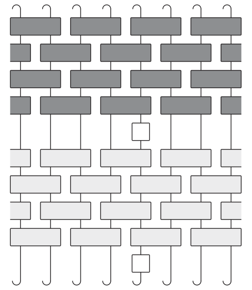
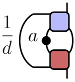

---
slides:
  # Choose a theme from https://github.com/hakimel/reveal.js#theming
  theme: white
  # Choose a code highlighting style (if highlighting enabled in `params.toml`)
  #   Light style: github. Dark style: dracula (default).
  highlight_style: github
scripts: []
---

# Circuit Models of Many Body Quantum Dynamics

## Austen Lamacraft
### [earlier work with Sarang Gopalakrishnan]
---

### Unitary Circuits

- Unitary transformation on many spins composed of unitaries on subsets.
- Introduced as model of quantum computation.

<p align="center">

</p>

---

### Brick Pattern Circuits

<p align="center">

</p>

- Some notion of locality built in!

- Gates operate on neighbouring pairs, triplets, etc.

---

### Model for Hamiltonian Dynamics

- Interested in $U(t)|\psi_0\rangle$ with $U(t) = e^{-iHt}$, where (say)

`$$
H = \sum_j \mathbf{s}_j\cdot \mathbf{s}_{j+1}
$$`

- For small $t$ can approximate `$U(t)\sim U_1(t)U_2(t)$` with `$U_{a}=e^{-iH_a t}$`

`$$
H_1 = \sum_j \mathbf{s}_{2j}\cdot \mathbf{s}_{2j+1},\qquad
H_2 = \sum_j \mathbf{s}_{2j}\cdot \mathbf{s}_{2j-1}
$$`

---

- Time evolution for $T=Nt$ is approximately

$$
U(T)\sim \left[U_1(t)U_2(t)\right]^N
$$

<p align="center">

</p>

---


### Another Example: Kicked Ising Model

- Time dependent Hamiltonian with kicks at $t=0,1,2,\ldots$.

`$$
\begin{aligned}
H_{\text{KIM}}(t) = H_\text{I}[\mathbf{h}] + \sum_{m}\delta(t-n)H_\text{K}\\
H_\text{I}[\mathbf{h}]=\sum_{j=1}^L\left[J Z_j Z_{j+1} + h_j Z_j\right],\qquad H_\text{K} &= b\sum_{j=1}^L X_j,
\end{aligned}
$$`

- "Stroboscopic" form of $U(t)=\mathcal{T}\exp\left[-i\int^t H_{\text{KIM}}(t') dt'\right]$

`$$
\begin{aligned}
  U(n_+) = \left[U(1_+)\right]^n,\qquad U(1_-) = K I_\mathbf{h}\\
  I_\mathbf{h} = e^{-iH_\text{I}[\mathbf{h}]}, \qquad K &= e^{-iH_\text{K}},
\end{aligned}
$$`

---

### KIM as a Unitary Circuit

<p align="center">

</p>

`$$
\begin{aligned}
  \mathcal{K} &= \exp\left[-i b X\right]\\
  \mathcal{I} &= \exp\left[-iJ Z_1 Z_2 -i \left(h_1 Z_1 + h_2 Z_2\right)/2\right].
\end{aligned}
$$`

---

### Unitary Circuits

Examples of gates

---


### More general

<p align="center">

</p>

- Disorder, MBL

- RUCs

- Motivation: "general" quantum dynamics (no Hamiltonian) with only constraint of locality.

---

### Graphical Representation

Relate tensors to diagrams  

U and Udagger colours

---

### Unitarity

- Has the graphical representation

<p align="center">

</p>

---

### Correlation Functions

- Graphical representation of the (infinite temperature) correlator [Chan, De Luca, Chalker (2018)]

`$$
C(x,y,t)=\mathop{\text{tr}}\left[O(x,t)O(y,0)\right]
$$`

<p align="center">

</p>


---

### Using Unitarity

<p align="center">

</p>

---

### "Folded" picture

<p align="center">

</p>

- Later point must be in "future light cone" of earlier

---

### On the Light Cone

<p align="center">

</p>

 - [Bertini, Kos, Prosen (2019)] for special models (see later)

 - In fact consequence of unitarity __only__

---

### Light Cone Quantum Channel

<p align="center">


</p>

`$$
\begin{align}
C_\nu^{\alpha\beta}(\nu t,t) = \frac{1}{d} {\rm tr}\left[\mathcal M_{\nu}^{2t}(a^\beta)a^\alpha\right]\\
\mathcal M_{+}(a) = \frac{1}{d} {\rm tr}_1\left[U^\dagger (a\otimes\mathbb{1}) U\right]
\end{align}
$$`

- Unitarity means map is __trace preserving__, __completely positive__ and __unital__ (identity is fixed point)


### Classification of Channels for Qubits

---

### Off the Light Cone

Bigger channel

---

### Dual Unitarity


---

## Example: Self Dual Kicked Ising

---

## Correlations on Light Cone Only

Bertini _et al._

---

## Reduced Density Matrix

---

## Entanglement in Dual Unitary Models

---

## Other Directions

- OTOCs
- Measurements (Skinner pix)
- Conserved quantities
- Entanglement (if we didn't have time)
- Classical model (Prosen this week)

---

## Further Reading

---

## Math

In-line math: $x + y = z$

Block math:

$$
f\left( x \right) = \;\frac{{2\left( {x + 4} \right)\left( {x - 4} \right)}}{{\left( {x + 4} \right)\left( {x + 1} \right)}} \\
= d
$$

---

## Fragments

Make content appear incrementally

```
{} One {}
{} **Two** {}
{} Three {}
```

Press `Space` to play!

{} One {}
{} **Two** {}
{} Three {}

---

A fragment can accept two optional parameters:

- `class`: use a custom style (requires definition in custom CSS)
- `weight`: sets the order in which a fragment appears

---

## Speaker Notes

Add speaker notes to your presentation

```markdown
{}
- Only the speaker can read these notes
- Press `S` key to view
{}
```

Press the `S` key to view the speaker notes!


- Only the speaker can read these notes
- Press `S` key to view


---

## Themes

- black: Black background, white text, blue links (default)
- white: White background, black text, blue links
- league: Gray background, white text, blue links
- beige: Beige background, dark text, brown links
- sky: Blue background, thin dark text, blue links

---

- night: Black background, thick white text, orange links
- serif: Cappuccino background, gray text, brown links
- simple: White background, black text, blue links
- solarized: Cream-colored background, dark green text, blue links

---



## Custom Slide

Customize the slide style and background

```markdown



```

---

## Custom CSS Example

Let's make headers navy colored.

Create `assets/css/reveal_custom.css` with:

```css
.reveal section h1,
.reveal section h2,
.reveal section h3 {
  color: navy;
}
```

---

# Questions?

[Ask](https://discourse.gohugo.io)

[Documentation](https://sourcethemes.com/academic/docs/)
